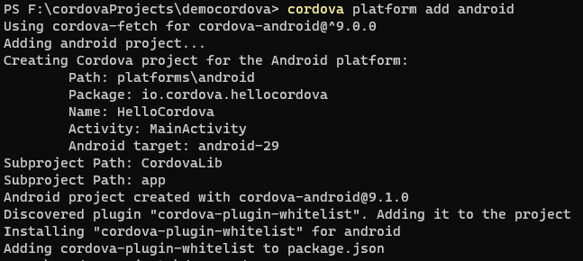

# cordova打包安卓apk

!安卓环境自行安装配置.

## 安装全局cordova工具

**安装cordova**
```shell
npm install cordova -g
```

**如果已经安装或不确定是否安装过,可以先查看下**
```shell
cordova -v
```
如果能正常显示版本号,说明全局已经安装了cordova, 我当前使用的是10.0.0, 最新版已经是11.0.0了.


## 创建cordova工程

**创建工程**
```shell
cordova create democordova
```
**工程目录结构**


## 添加平台

**添加安卓平台**
```shell
cordova platform add android
```


## 运行一下试试

将准备好的web项目拷贝到项目的 **www** 目录, 然后执行以下命令

```shell
cordova run android
```

### 运行时可能遇到的问题

1. no installed build tools found. install the android build tools version 19.1.0 or higher

如果运行失败,报以上错误,应该是android sdk环境配置有问题, cordova默认使用的环境变量名是 **ANDROID_SDK_ROOT** 或 **ANDROID_HOME**


2. installed build tools revision 31.0.0 is corrupted. remove and install again using the sdk manager.


以上问题说你的构建工具出问题了,需要重新安装下, 我本地安装的版本比较多, 直接删了 **31.0.0** 版本, 再次运行时用的是本地的 **30.0.0**版本, 成功运行起来了


成功运行后, 就已经产生了debug版本的apk文件(platforms/android/app/build/outputs/apk/debug/app-debug.apk)

## 打包apk

```shell
cordova build android --release
```


