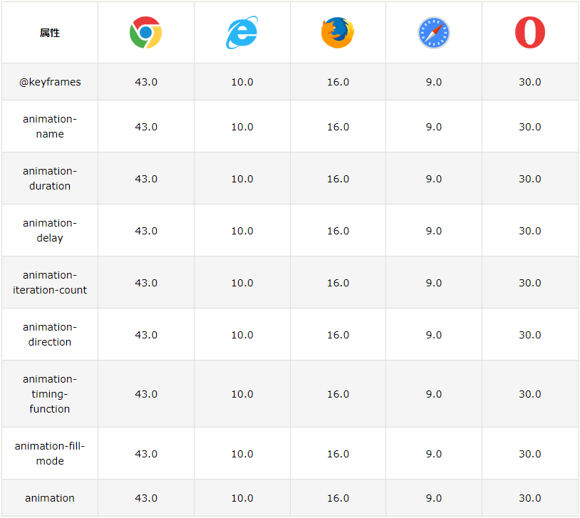
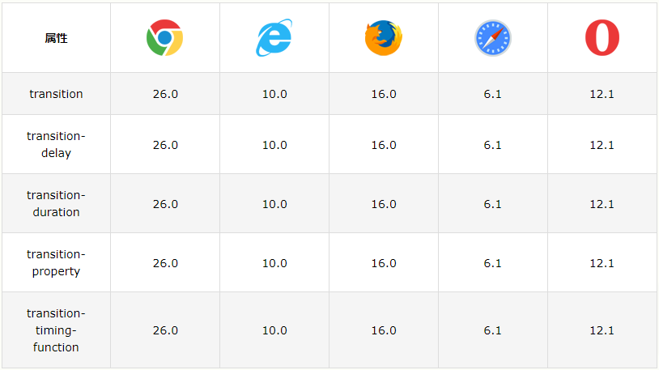

# CSS动画

CSS 中的动画类似于 flash 中的逐帧动画，表现细腻并且非常灵活，使用 CSS 中的动画可以取代许多网页中的动态图像、Flash 动画或者 JavaScript 实现的特殊效果。




## @keyframes 规则

规定动画模式, 如果您在 @keyframes 规则中指定了 CSS 样式，动画将在特定时间逐渐从当前样式更改为新样式。

要使动画生效，必须将动画绑定到某个元素。

```css
/* 动画代码 */
@keyframes animationName {
	from {
		properties: value;
	}
	percentage {
		properties: value;
	}
	to {
		properties: value;
	}
}
// 或者
@keyframes animationName {
	0% {
		properties: value;
	}
	percentage {
		properties: value;
	}
	100% {
		properties: value;
	}
}

/* 向此元素应用动画效果 */
div {
  width: 100px;
  height: 100px;
  background-color: red;
  animation-name: animationName;
  animation-duration: 4s;
}
```
* animationName：表示动画的名称；
* from：定义动画的开头，相当于 0%；
* percentage：定义动画的各个阶段，为百分比值，可以添加多个；
* to：定义动画的结尾，相当于 100%；
* properties：不同的样式属性名称，例如 color、left、width 等等。

## animation-name

设置需要绑定到元素的动画名称, 是某个@keyframes 动画的名称.

* keyframename:	要绑定到 HTML 元素的动画名称，可以同时绑定多个动画，动画名称之间使用逗号进行分隔
* none:	表示无动画效果

## animation-duration

属性定义需要多长时间才能完成动画。如果未指定 animation-duration 属性，则动画不会发生，因为默认值是 0s（0秒）.

## animation-delay

属性规定动画开始的延迟时间,负值也是允许的。如果使用负值，则动画将开始播放，如同已播放 N 秒.

## animation-iteration-count 

属性指定动画应运行的次数或infinite。

## animation-direction 

属性指定是向前播放、向后播放还是交替播放动画, 可接受的值: 

* normal: 动画正常播放（向前）。默认值
* reverse: 动画以反方向播放（向后）
* alternate: 动画先向前播放，然后向后
* alternate-reverse: 动画先向后播放，然后向前

## animation-timing-function 

属性规定动画的速度曲线, 可接受的值: 

* ease: 指定从慢速开始，然后加快，然后缓慢结束的动画（默认）
* linear: 规定从开始到结束的速度相同的动画
* ease-in: 规定慢速开始的动画
* ease-out: 规定慢速结束的动画
* ease-in-out: 指定开始和结束较慢的动画
* cubic-bezier(n,n,n,n): 运行您在三次贝塞尔函数中定义自己的值

## animation-fill-mode

CSS 动画不会在第一个关键帧播放之前或在最后一个关键帧播放之后影响元素。animation-fill-mode 属性能够覆盖这种行为。

在不播放动画时（在开始之前，结束之后，或两者都结束时），animation-fill-mode 属性规定目标元素的样式。

animation-fill-mode 属性可接受以下值：

* none: 默认值。动画在执行之前或之后不会对元素应用任何样式。
* forwards: 元素将保留由最后一个关键帧设置的样式值（依赖 animation-direction 和 animation-iteration-count）。
* backwards: 元素将获取由第一个关键帧设置的样式值（取决于 animation-direction），并在动画延迟期间保留该值。
* both: 动画会同时遵循向前和向后的规则，从而在两个方向上扩展动画属性。

## animation

动画简写模式

```css
animation-name: example;
  animation-duration: 5s;
  animation-timing-function: linear;
  animation-delay: 2s;
  animation-iteration-count: infinite;
  animation-direction: alternate;
```


# CSS 过渡

CSS 过渡允许您在给定的时间内平滑地改变属性值。如需创建过渡效果，必须明确两件事：

* 您要添加效果的 CSS 属性
* 效果的持续时间

注意：如果未规定持续时间部分，则过渡不会有效果，因为默认值为 0。



## transition	

简写属性，用于将四个过渡属性设置为单一属性。

```css
div {
  transition-property: width;
  transition-duration: 2s;
  transition-timing-function: linear;
  transition-delay: 1s;
}
```

## transition-delay	

规定过渡效果的延迟（以秒计）。

## transition-duration	

规定过渡效果要持续多少秒或毫秒。

## transition-property	

规定过渡效果所针对的 CSS 属性的名称。

## transition-timing-function	

规定过渡效果的速度曲线,可接受以下值：

* ease: 规定过渡效果，先缓慢地开始，然后加速，然后缓慢地结束（默认）
* linear: 规定从开始到结束具有相同速度的过渡效果
* ease-in: 规定缓慢开始的过渡效果
* ease-out: 规定缓慢结束的过渡效果
* ease-in-out: 规定开始和结束较慢的过渡效果
* cubic-bezier(n,n,n,n): 允许您在三次贝塞尔函数中定义自己的值