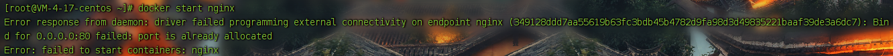
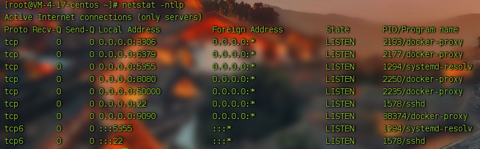

# port is already allocated

```markdown
Error response from daemon: driver failed programming external connectivity on endpoint nginx (349128ddd7aa55619b63fc3bdb45b4782d9fa98d3d49835221baaf39de3a6dc7): Bind for 0.0.0.0:80 failed: port is already allocated
Error: failed to start containers: nginx
```



使用 **docker ps** 查看,容器没有运行, 然后查看端口占用情况, 居然也没有占用



使用 **systemctl status docker** 查看docker状态也没有异常,没法了,先**重启下docker**试试. **居然好了**. 在这之前曾经在腾讯云上重启过服务器(我的docker是开机启动,nginx容器和其它几个容器是随docker启动一起启动的),之后就这样了, 不知道是不是这个原因.

