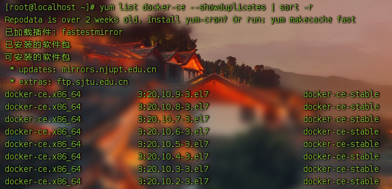

# CentOS Docker 安装

Docker支持64位CentOS7及以上版本系统.

## 使用官方安装脚本自动安装

```shell
curl -fsSL https://get.docker.com | bash -s docker --mirror Aliyun
```

## 使用国内 daocloud 一键安装命令

```shell
curl -sSL https://get.daocloud.io/docker | sh
```

## 手动安装

### 卸载旧版本
较旧的 Docker 版本称为 docker 或 docker-engine 。如果已安装这些程序，请卸载它们以及相关的依赖项。

```shell
yum remove docker docker-client docker-client-latest docker-common docker-latest docker-latest-logrotate docker-logrotate docker-engine
```

#### 使用 Docker 仓库进行安装

在新主机上首次安装 Docker Engine-Community 之前，需要设置 Docker 仓库。之后，您可以从仓库安装和更新 Docker。

#### 设置仓库

安装所需的软件包。yum-utils 提供了 yum-config-manager ，并且 device mapper 存储驱动程序需要 device-mapper-persistent-data 和 lvm2。

```shell
yum install -y yum-utils device-mapper-persistent-data lvm2
```

#### 设置稳定的仓库

1. 使用官方源地址（比较慢）
```shell
yum-config-manager --add-repo https://download.docker.com/linux/centos/docker-ce.repo
```

2. 可以选择国内的一些源地址
```shell
yum-config-manager --add-repo http://mirrors.aliyun.com/docker-ce/linux/centos/docker-ce.repo
```

```shell
yum-config-manager --add-repo https://mirrors.tuna.tsinghua.edu.cn/docker-ce/linux/centos/docker-ce.repo
```

### 安装 Docker Engine-Community
安装最新版本的 Docker Engine-Community 和 containerd，或者转到下一步安装特定版本：

```shell
yum install docker-ce docker-ce-cli containerd.io
```
如果提示您接受 GPG 密钥，请选是。


如果启用了多个 Docker 仓库，则没有在 **yum install** 或 **yum update** 命令中指定版本的情况下，进行的安装或更新将始终安装最高版本，这可能不适合您的稳定性需求。

Docker 安装完默认未启动。并且已经创建好 docker 用户组，但该用户组下没有用户。

## 要安装特定版本的 Docker Engine-Community，请在存储库中列出可用版本，然后选择并安装：

1. 列出并排序您存储库中可用的版本。此示例按版本号（从高到低）对结果进行排序。

```shell
yum list docker-ce --showduplicates | sort -r
```



2. 通过其完整的软件包名称安装特定版本，该软件包名称是软件包名称（docker-ce）加上版本字符串（第二列），从第一个冒号（:）一直到第一个连字符，并用连字符（-）分隔。例如：docker-ce-18.09.1。

```shell
yum install docker-ce-<VERSION_STRING> docker-ce-cli-<VERSION_STRING> containerd.io
```

# 启动 Docker

```shell
systemctl start docker
```


# Docker常用命令

## pull

从镜像仓库中拉取或者更新指定镜像，在未声明镜像标签时，默认标签为latest。

```markdown
Usage: docker pull [OPTIONS] NAME[:TAG|@DIGEST]
Options:
	-a 拉取某个镜像的所有版本
	--disable-content-trust 跳过校验，默认开启
```

## run

创建并启动一个容器

```markdown
Usage: docker run [OPTIONS] IMAGE [COMMAND] [ARG...]
Options:
	-d, --detach 后台运行容器，并输出容器ID
	-e, --env list 设置环境变量，该变量可以在容器内使用
	-h, --hostname string 指定容器的hostname
	-i, --interactive 以交互模式运行容器，通常与-t同时使用
	-l, --label list 给容器添加标签
	--name string 设置容器名称，否则会自动命名
	--network string 将容器加入指定网络
	-p, --publish list 设置容器映射端口
	-P,--publish-all 将容器设置的所有exposed端口进行随机映射
	--restart string 容器重启策略，默认为不重启
	on-failure[:max-retries]：在容器非正常退出时重启，可以设置重启次数。
	unless-stopped：总是重启，除非使用stop停止容器
	always：总是重启
	--rm 容器退出时则自动删除容器
	-t, --tty 分配一个伪终端
	-u, --user string 运行用户或者UID
	-v, --volume list 数据挂载
	-w, --workdir string 容器的工作目录
	--privileged 给容器特权
```

## build

通过 Dockerfile 构建镜像

```markdown
Usage: docker build [OPTIONS] PATH | URL | -
Options:
	-f, --file string 指定Dockerfile，默认为当前路径的Dockerfile
	-q, --quiet 安静模式，构建成功后输出镜像ID
	-t, --tag list 给镜像设置tag，name:tag
	commit
	通过容器创建一个新镜像
	Usage: docker commit [OPTIONS] CONTAINER [REPOSITORY[:TAG]]
	Options:
	-a, --author string 作者
	-m, --message string 提交信息
```

## cp

在容器和宿主机之间拷贝文件

```markdown
Usage:
	docker cp [OPTIONS] CONTAINER:SRC_PATH DEST_PATH|-
	docker cp [OPTIONS] SRC_PATH|- CONTAINER:DEST_PATH
Options:
	-a, --archive 保留文件权限
```

## exec

向正在运行的容器下发命令

```markdown
Usage: docker exec [OPTIONS] CONTAINER COMMAND [ARG...]
Options:
	-d, --detach 在后台运行命令
	-e, --env list 设置环境变量
	-i, --interactive 以交互模式运行
	-t, --tty 分配一个伪终端
	-u, --user string 执行命令的用户
	-w, --workdir string 工作目录
```

## export

将容器导出为一个tar包

```markdown
Usage: docker export [OPTIONS] CONTAINER
Options:
	-o, --output string tar包名称
```

## images

列出镜像

```markdown
Usage: docker images [OPTIONS] [REPOSITORY[:TAG]]
Options:
	-a, --all 显示所有镜像
	-f, --filter filter 使用过滤器过滤镜像
	dangling true or false, true列出没有标签的，false相反
	label (label=<key> or label=<key>=<value>)，如果镜像设置有label，则可以通过label过 滤
	before (<image-name>[:<tag>], <image id> or <image@digest>) - 某个镜像前的镜像
	since (<image-name>[:<tag>], <image id> or <image@digest>) - 某个镜像后的镜像
	reference (pattern of an image reference) - 模糊查询,例：--
	filter=reference='busy*:*libc'
	--format string 格式化输出
	.ID 镜像ID
	.Repository 镜像仓库
	.Tag 镜像tag
	.Digest Image digest
	.CreatedSince 创建了多久
	.CreatedAt 镜像创建时间
	.Size 镜像大小
	-q, --quiet 只显示镜像ID
```

## import

通过导入tar包的方式创建镜像

```markdown
Usage: docker import [OPTIONS] file|URL|- [REPOSITORY[:TAG]]
Options:
	-m, --message string 设置提交信息
```

## kill

杀死一个或多个容器

```markdown
Usage: docker kill [OPTIONS] CONTAINER [CONTAINER...]
```

## load

从tar包加载一个镜像

```markdown
Usage: docker load [OPTIONS]
Options:
	-i, --input string 指定tar包
	-q, --quiet 只显示ID
```

## login

登录Docker镜像仓库

```markdown
Usage: docker login [OPTIONS] [SERVER]
Options:
	-p, --password string 密码
	-u, --username string 账户
```

## logout

退出Docker镜像仓库

```markdown
Usage: docker logout [SERVER]
```

## logs

显示容器日志

```markdown
Usage: docker logs [OPTIONS] CONTAINER
Options:
	--details 显示详细日志
	-f, --follow 跟随日志输出
	--tail string 显示行数
	-t, --timestamps 显示时间戳
```

## ps

列出容器

```markdown
Usage: docker ps [OPTIONS]
Options:
	-a, --all 列出所有容器
	-f, --filter filter 使用过滤器过滤
	--format string 格式化输出
	-n, --last int 显示最后创建的n个容器
	-l, --latest 显示最后一个创建的容器
	-q, --quiet 只显示容器ID
	-s, --size 显示大小
```

## push

将容器推送到镜像仓库

```markdown
Usage: docker push [OPTIONS] NAME[:TAG]
```

## rename

给容器重命名

```markdown
Usage: docker rename CONTAINER NEW_NAME
```

## restart

重启一个或多个容器

```markdown
Usage: docker restart [OPTIONS] CONTAINER [CONTAINER...]
```

## rm

删除一个或多个容器

```markdown
Usage: docker rm [OPTIONS] CONTAINER [CONTAINER...]
Options:
	-f, --force 强制删除
	-v, --volumes 同时删除数据卷
```

## rmi

删除一个或多个镜像

```markdown
Usage: docker rmi [OPTIONS] IMAGE [IMAGE...]
Options:
	-f, --force 强制删除
```

## save

将一个或多个镜像保存为tar包

```markdown
Usage: docker save [OPTIONS] IMAGE [IMAGE...]
Options:
	-o, --output string tar包名称
```

## search

查找镜像

```markdown
Usage: docker search [OPTIONS] TERM
```

## start

启动一个或多个容器

```markdown
Usage: docker start [OPTIONS] CONTAINER [CONTAINER...]
```

## stats

显示容器资源使用情况

```markdown
Usage: docker stats [OPTIONS] [CONTAINER...]
Options:
	-a, --all 显示所有容器，默认只显示正在运行的容器
```

## stop

停止一个或多个容器

```markdown
Usage: docker stop [OPTIONS] CONTAINER [CONTAINER...]
```

## tag

给镜像设置新的tag

```markdown
Usage: docker tag SOURCE_IMAGE[:TAG] TARGET_IMAGE[:TAG]
```

## inspect

获取容器或镜像的元数据

```markdown
Usage: docker inspect [OPTIONS] NAME|ID [NAME|ID...]
```


# Dockerfile
Dockerfile 是一个用来构建镜像的文本文件，文本内容包含了一条条构建镜像所需的指令和说明。

## ARG

设置参数，该参数值可以从 --build-arg <varname>=<value> 接收值.

在FROM之前的ARG参数只在FROM语句中生效，若在FROM之后想要继续使用ARG，需要再次设置.

```markdown
Usage:
ARG <name>[=<default value>]
例：ARG version="1.0.0"
```

## FROM

指定基础镜像，FROM必须为Dockerfile非注释行的第一行。

```markdown
Usage:
FROM <image>
FROM <image>:<tag>
FROM <image>@<digest>
例：FROM ubuntu:14.04
```

## LABEL

设置镜像标签

```markdown
Usage:
LABEL <key>=<value> <key>=<value> <key>=<value> ...
例：LABEL maintainer="demo@demo.com"
```

## ENV

设置环境变量

建议：不论用哪种书写方式，在实际使用中，一行都只写一个环境变量，方便阅读。

特别地：在使用docker run命令添加参数 --env 时，若有相同的环境变量，以run命令为准。

```markdown
Usage:
ENV <key> <value>
ENV <key>=<value> ...
ENV <key> <value>此方法一次只能设置一个
ENV <key>=<value> ... 该方法一次可以设置多个环境变量
例：ENV JAVA_HOME=/home/jdk-8
```

## ADD

添加文件，将宿主机的文件添加到容器中。

```markdown
Usage:
ADD [--chown=<user>:<group>] <src>... <dest>
ADD [--chown=<user>:<group>] ["<src>",... "<dest>"]
例：ADD ${WORKSPACE}/target /usr/local/tomcat/webapps/ROOT
```

## COPY

添加文件，将宿主机的文件添加到容器中。

```markdown
Usage:
COPY [--chown=<user>:<group>] <src>... <dest>
COPY [--chown=<user>:<group>] ["<src>",... "<dest>"]
```

## USER

指定运行容器的用户

```markdown
Usage:
USER <user>[:<group>]
USER <UID>[:<GID>]
例：USER root
```

## WORKDIR

工作目录，进入容器后，以 WORKDIR 为当前路径

```markdown
Usage:
WORKDIR /workdir
例：WORKDIR /home
```

## EXPOSE

说明容器暴露的端口，默认协议为 tcp ，若是 udp 协议，则需要在后面添加 udp ，如 80/udp

```markdown
Usage:
EXPOSE <port> [<port>/<protocol>...]
例：EXPOSE 8080，表明容器在运行时提供8080端口，在启动该容器时需端口映射。
```

## VOLUME

设置挂载点，将容器内的路径挂载到宿主机，该挂载方式是将容器内的路径挂载到docker数据路径下

```markdown
Usage:
VOLUME <url>
例：VOLUME /var/log
```

## RUN

执行命令并创建新的镜像层，通常用于更新或安装软件。

```markdown
Usage:
RUN <command>
RUN ["executable", "param1", "param2"]
例：RUN yum -y install git
```

## CMD

设置容器启动后默认执行的命令，CMD命令会被docker run的参数覆盖。

```markdown
Usage:
CMD <command>
CMD ["executable","param1","param2"]
例：CMD systemclt start docker.service //启动容器时启动docker服务
```

## ENTRYPOINT

和CMD一样，设置容器启动后默认执行的命令，但是该命令不会被docker run覆盖，会始终执行，CMD会被docker run传入的命令覆盖。

```markdown
Usage:
ENTRYPOINT <command>
ENTRYPOINT ["executable", "param1", "param2"]
例：ENTRYPOINT /usr/local/apache-tomcat-8.5.33/bin/startup.sh
```

### Dockerfile Demo

```markdown
FROM tomcat:9.0
LABEL maintainer="demo@demo.com"
ADD ${WORKSPACE}/target/cip-file-1.0.0-SNAPSHOT /opt/apache-tomcat- 9.0.12/webapps/file
ENV LC_ALL en_US.UTF-8 EXPOSE 8080
ENTRYPOINT /opt/apache-tomcat-9.0.12/bin/startup.sh && tail -f /opt/apache- tomcat-9.0.12/logs/catalina.out
```


# docker-compose

docker-compose 是docker的原生编排技术，你可以定义一个或多个应用在 docker-compose.yaml 里面，然后使用 docker-compose 命令行来启动你的应用。

## 安装

使用以下命令安装指定版本的 docker-compose ，若下载太慢，可通过浏览器手动下载指定版本后添加到系统环境变量中。


GitHub地址： [docker-compose](https://github.com/docker/compose)

```markdown
sudo curl -L"https://github.com/docker/compose/releases/download/1.26.2/docker- compose-$(uname -s)-$(uname -m)" -o /usr/local/bin/docker-compose

sudo chmod +x /usr/local/bin/docker-compose
```


## 命令

```markdown
Usage:
docker-compose [-f <arg>...] [options] [COMMAND] [ARGS...]
docker-compose -h|--help
Options:
	-f, --file FILE 指定docker-compose.yaml，默认为当前路径下docker-compose.yaml
	-p, --project-name NAME 指定项目名称
```

## config

验证 docker-compose.yaml 文件编写是否正确

```markdown
Usage: config [options]
Options:
	-q, --quiet 安静模式，不输出任何信息，除非文件错误
	--services 显示服务名称
	--volumes 显示挂载卷名称
特别地：这个命令不能指定yaml文件，默认为docker-compose.yaml或docker-compose.yml
```

## down

停止容器并且删除容器，网络，数据卷，镜像

```markdown
Usage: down [options]
Options:
	--rmi type 删除镜像
	all：删除service用到的所有镜像
	local：只删除没有自定义标签的镜像
	-v, --volumes 删除volumes定义的数据卷
	--remove-orphans 删除未定义在docker-compose.yaml里面的容器
```

## pull

拉取 docker-compose.yaml 里面定义的镜像

```markdown
Usage: pull [options] [SERVICE...]
Options:
	--ignore-pull-failures 当有失败时，继续执行其它镜像拉取
	--parallel 开启并行拉取
	--no-parallel 禁止并行拉取
	-q, --quiet 安静模式
	--include-deps 拉取依赖项
```

## restart

重启一个或多个service

```markdown
Usage: restart [options] [SERVICE...]
```

## start

启动service

```markdown
Usage: start [SERVICE...]
```

## stop

停止service

```markdown
Usage: stop [options] [SERVICE...]
```

## up

构建，创建，启动某个service的容器

```markdown
Usage: up [options] [--scale SERVICE=NUM...] [SERVICE...]
Options:
	-d, --detach 后台运行
	--quiet-pull 安静模式 --force-recreate 重新创建容器，即使镜像没有任何改动
	--no-recreate 当容器存在时不重新创建
	--no-build 不要构建镜像，即使镜像不存在
	--no-start 创建之后不要启动service.
	--build 在启动容器前创建镜像
	--abort-on-container-exit 当有一个容器停止时，停止其他容器
	--remove-orphans 删除未定义在compose file中的容器
	--scale SERVICE=NUM 设置服务运行的容器个数
```