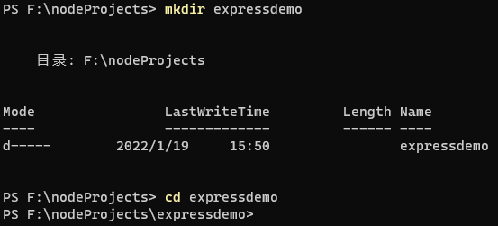
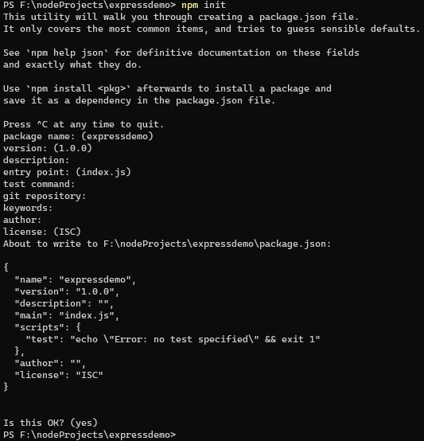
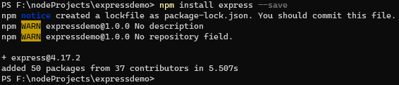
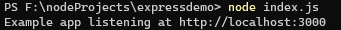
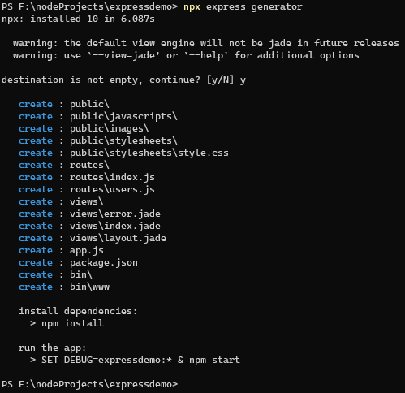
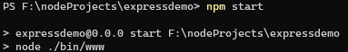

# 安装

## 创建项目目录并进入项目目录



### 创建package.json

通过 **npm init**命令,创建package.json文件, 根据提示修改信息或接受默认值



## 安装express依赖

```shell
npm install express --save
```



# 运行 hello word程序测试下

## 新建入口文件 index.js

```js
const express = require('express')
const app = express()
const port = 3000

app.get('/', (req, res) => {
    res.send('Hello World!')
})

app.listen(port, () => {
    console.log(`Example app listening at http://localhost:${port}`)
})
```

## 运行程序

```shell
node index.js
```



# express-generator应用程序生成器

通过应用生成器工具 express-generator 可以快速创建一个应用的骨架。

* 你可以通过 npx （包含在 Node.js 8.2.0 及更高版本中）命令来运行 Express 应用程序生成器。

```shell
npx express-generator
```



* 对于较老的 Node 版本，请通过 npm 将 Express 应用程序生成器安装到全局环境中并执行即可。

```shell
npm install -g express-generator
```

## 安装依赖

```shell
npm install
```

## 运行程序

* 直接运行 

```shell
npm start
```

* 在 MacOS 或 Linux 中，通过如下命令启动此应用：

```shell
DEBUG=expressdemo:* npm start
```
 
* 在 Windows 命令行中，使用如下命令：

```shell
set DEBUG=expressdemo:* & npm start
```
在 Windows 的 PowerShell 中，使用如下命令：

```shell
$env:DEBUG='expressdemo:*'; npm start
```



# 托管静态文件

为了提供诸如图像、CSS 文件和 JavaScript 文件之类的静态文件，请使用 Express 中的 express.static 内置中间件函数。

此函数特征如下：

```js
express.static(root, [options])
```

例如，通过如下代码就可以将 public 目录下的图片、CSS 文件、JavaScript 文件对外开放访问了：

```js
var express = require('express');
var app = express();
app.use(express.static(path.join(__dirname, 'public')));
```

如果要使用多个静态资源目录，请多次调用 express.static 中间件函数.

# 路由

## 路由方法

Express支持与所有HTTP请求方法相对应的方法:get、post等

```js
var express = require('express');
var app = express();
// GET method route
app.get('/', function (req, res) {
	res.send('GET request to the homepage')
})

// POST method route
app.post('/', function (req, res) {
	res.send('POST request to the homepage')
})
```

有一个特殊的路由方法app.all()，用于在所有HTTP请求方法的路径上加载中间件函数。例如，无论使用GET、POST、PUT、DELETE还是HTTP模块中支持的任何其他HTTP请求方法，对“/secret”路由的请求执行以下处理程序。

```js
var express = require('express');
var app = express();
app.all('/secret', function (req, res, next) {
    console.log('Accessing the secret section ...')
    next() // 将控制权传递给下一个处理程序
})
```

## 使用app.route()

为一个路由路径创建多个路由处理程序.

```js
var express = require('express');
var app = express();
app.route('/book')
	.get(function (req, res) {
		res.send('Get a random book')
	})
	.post(function (req, res) {
		res.send('Add a book')
	})
	.put(function (req, res) {
		res.send('Update the book')
	})
```

## express.Router

创建模块化的、可挂载的路由处理程序。一个Router实例是一个完整的中间件和路由系统;因此，它通常被称为“迷你应用”.

创建 demo.js路由配置文件

```js
var express = require('express')
var router = express.Router()

// 通用中间件,打印时间
router.use(function timeLog (req, res, next) {
    console.log('Time: ', Date.now())
    next()
})
// 首页路由
router.get('/', function (req, res) {
    res.send('Birds home page')
})
// about路径对应的路由
router.get('/about', function (req, res) {
    res.send('About birds')
})

module.exports = router
```

```js
var express = require('express');
var app = express();
var demo = require('./demo');
app.use('/demo', demo);
```

该应用现在将能够处理/demo/demo/about的请求。

# 使用中间件

## 应用程序中间件

通过使用app.use()和app.METHOD()函数将应用级中间件绑定到应用对象的一个实例上，其中METHOD是中间件函数处理的请求的HTTP方法(如小写的GET、PUT或POST)。

```js
var express = require('express')
var app = express()

app.use(function (req, res, next) {
    console.log('Time:', Date.now())
    next()
})
app.get('/user/:id', function (req, res, next) {
	res.send('USER')
})
```

## 路由中间件

路由器级中间件的工作方式与应用级中间件相同，只不过它绑定到了express.Router()上。

```js
var express = require('express')
var app = express()
var router = express.Router()

// 没有挂载路径的中间件函数。这段代码会针对每一个对路由器的请求执行
router.use(function (req, res, next) {
    console.log('Time:', Date.now())
    next()
})

// 一个中间件子栈显示了任何类型的HTTP请求到/user/:id路径的请求信息
router.use('/user/:id', function (req, res, next) {
    console.log('Request URL:', req.originalUrl)
    next()
}, function (req, res, next) {
    console.log('Request Type:', req.method)
    next()
})

// 一个中间件子栈，处理到/user/:id路径的GET请求
router.get('/user/:id', function (req, res, next) {
    // 如果用户ID为0，则跳转到下一个路由
    if (req.params.id === '0') next('route')
    // 否则将控制权传递给该堆栈中的下一个中间件函数
    else next()
}, function (req, res, next) {
    // 渲染 regular 页面
    res.render('regular')
})

// 处理 /user/:id 路径, 并渲染 special 页面
router.get('/user/:id', function (req, res, next) {
    console.log(req.params.id)
    res.render('special')
})

// 将路由关在到app上
app.use('/', router)
```

## 错误处理中间件

以与其他中间件函数相同的方式定义错误处理中间件函数，但是有四个参数:

```js
app.use(function (err, req, res, next) {
    console.error(err.stack)
    res.status(500).send('Something broke!')
})
```

## 内置中间件

从版本4开始。x, Express不再依赖Connect。以前包含在Express中的中间件函数现在位于独立的模块中,需要自行引入. Express包含以下内置的中间件:

* express.static 
* express.json 
* express.urlencoded

## 第三方中间件

第三方中间件需要自行安装并引入,例如 **cookie-parser**中间件

```shell
npm install cookie-parser
```

```js
var express = require('express')
var app = express()
var cookieParser = require('cookie-parser')

// 使用cookie-parser中间件
app.use(cookieParser())
```

# 使用模板引擎

express支持 Pug, Mustache,  EJS, Jade等模板引擎, express-generator默认使用的是jade模板.

## 安装模板引擎

```shell
npm install jade --save
```

## 使用模板引擎

```js
var express = require('express');
var app = express();
app.set('views', path.join(__dirname, 'views'));
app.set('view engine', 'jade');
```

# 调试

Express在内部使用**debug module**来记录关于路由匹配、正在使用的中间件函数、应用程序模式和请求-响应流的信息。

## 要查看Express中使用的所有内部日志，请在启动应用程序时将DEBUG环境变量设置为Express:*。

```shell
 DEBUG=express:* node index.js
```
Windows环境下使用

```shell
set DEBUG=express:* & node index.js
```

## express命令生成的应用程序也使用调试模块，其调试名称空间的作用域为应用程序的名称。

例如，如果你用命令 **express sample-app**生成了一个app，你可以用下面的命令启用调试:

```shell
DEBUG=sample-app:* node ./bin/www
```

你可以指定一个以上的调试命名空间，通过分配一个逗号分隔的名称列表:

```shell
DEBUG=http,mail,express:* node index.js
```

## 其它调试环境变量

* DEBUG: 启用/禁用特定的调试名称空间.
* DEBUG_COLORS:	是否在调试输出中使用颜色区分.
* DEBUG_DEPTH:	深度检查对象.
* DEBUG_FD:	输出的文件描述.
* DEBUG_SHOW_HIDDEN: 显示被检查对象上的隐藏属性.

# 设置代理

通过 **app.set('trust proxy', 代理配置) ** 来启用代理.

## 代理配置类型

1. Boolean
    * true: 客户端 IP 地址为为X-Forwarded-*报头中最左侧的条目.
    * false: 应用直接面向互联网，客户端 IP 地址从 req.connection.remoteAddress 得来，这是默认的设置.
2. IP 地址、子网或 IP 地址数组和可信的子网, 预配置的子网有:

   * loopback: 127.0.0.1/8, ::1/128
   * linklocal: 169.254.0.0/16, fe80::/10
   * uniquelocal: 10.0.0.0/8, 172.16.0.0/12, 192.168.0.0/16, fc00::/7

使用如下方式设置 IP 地址：
```js
app.set('trust proxy', 'loopback') // 指定唯一子网
app.set('trust proxy', 'loopback, 123.123.123.123') // 指定子网和 IP 地址
app.set('trust proxy', 'loopback, linklocal, uniquelocal') // 指定多个子网
app.set('trust proxy', ['loopback', 'linklocal', 'uniquelocal']) // 使用数组指定多个子网
```

3. Number

信任来自前端代理服务器的第n跳作为客户端.

4. Function

定制实现，只有在您知道自己在干什么时才能这样做。

```js
app.set('trust proxy', function (ip) {
    if (ip === '127.0.0.1' || ip === '123.123.123.123') return true; // 受信的 IP 地址
    else return false;
})
```

## 设置代理带来的影响

* 反向代理可能设置 X-Forwarded-Proto 来告诉应用使用 https 或简单的 http 协议。
* req.ip 和 req.ips 的值将会由 X-Forwarded-For 中列出的 IP 地址构成。

# 集成数据库

为 Express 应用添加连接数据库的能力，只需要加载相应数据库的 Node.js 驱动即可。

## 集成mysql

```shell
npm install mysql
```

```js
var mysql = require('mysql');
var connection = mysql.createConnection({
    host: 'localhost',
    user: 'dbuser',
    password : 's3kreee7'
});

connection.connect();

connection.query('SELECT 1 + 1 AS solution', function(err, rows, fields) {
    if (err) throw err;
    console.log('The solution is: ', rows[0].solution);
});

connection.end();
```

## 集成MongoDB

```shell
npm install mongoskin
```
```js
var db = require('mongoskin').db('localhost:27017/animals');

db.collection('mamals').find().toArray(function(err, result) {
    if (err) throw err;
    console.log(result);
});
```

# 示例代码

[https://gitee.com/fangrentian/express_gzh](https://gitee.com/fangrentian/express_gzh)