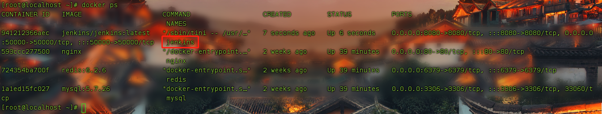
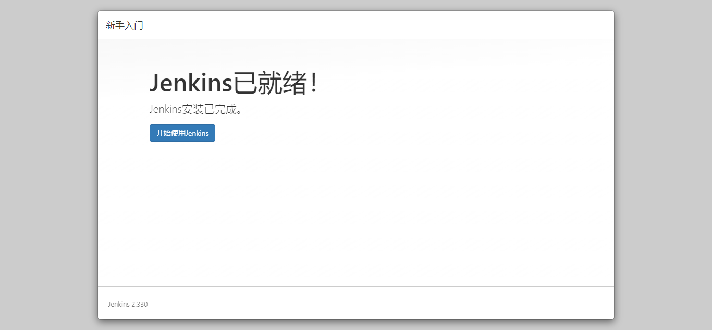
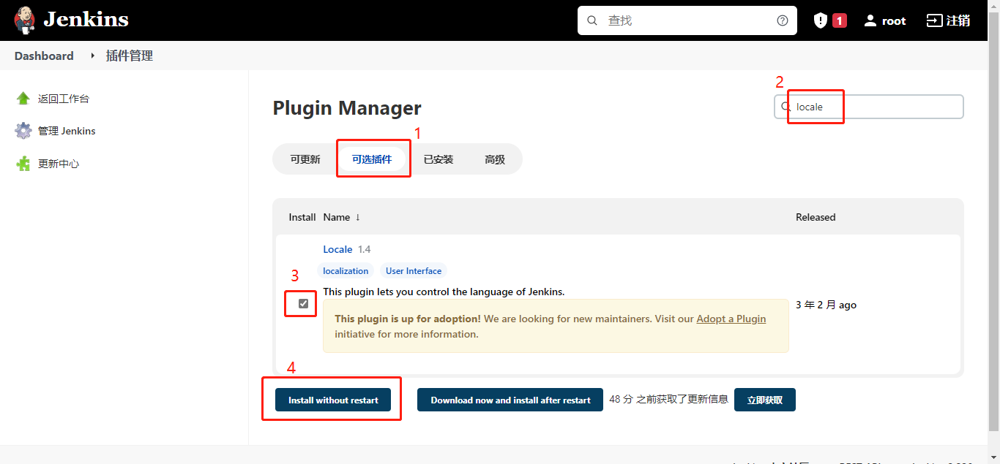

<!--
 * @author: ares
 * @date: 2022-01-14 13:13:52
 * @lastEditTime: 2022-01-14 15:28:35
 * @lastEditors: ares
 * @description: 
 * 
-->

# docker jenkins安装

## 拉取镜像

```shell
docker pull jenkins/jenkins
```

## 安装容器

```shell
docker run --name jenkins --restart=always -u root -p 8080:8080 -p 50000:50000 --env JAVA_OPTS="-Djava.util.logging.config.file=/var/jenkins_home/log.properties" --env JENKINS_OPTS="--prefix=/jenkins" -v /home/docker/jenkins:/var/jenkins_home -d jenkins/jenkins:latest
```

## 查看容器是否安装成功

```shell
docker ps
```



容器安装并启动成功, 容器名称为 **jenkins**

## 浏览器访问容器, 例如: http://192.168.1.163:8080/jenkins


## 根据提示, 找到初始化密码, 输入密码后继续

**注意:** 提示的密码文件地址 **/var/jenkins_home/secrets/initialAdminPassword**, 实际应该在你挂载的目录中查找

```shell
cat /home/docker/jenkins/secrets/initialAdminPassword
```


## 安装插件, 不知道怎么选择插件, 就直接安装推荐的插件


**插件安装中**


## 创建账号, 点 [保存并完成] 按钮


**也可以直接点击 [使用admin账户继续] 按钮**

### 注意

+ 全名不填写的话,默认使用的是用户名
+ 邮箱必须填写

## 配置url, 保持默认就行, 点击 [保存并完成] 按钮


## 初始化完成, 点击 [开始使用jenkins] 按钮



**初始化完成,进入首页**


# jenkins配置

## 界面汉化

**进入插件管理界面**


**在可选插件中搜索 [locale] 插件,并安装**


插件安装完成后,勾选 [安装完成后重启Jenkins(空闲时)] 选项的话, jenkins会自动重启
