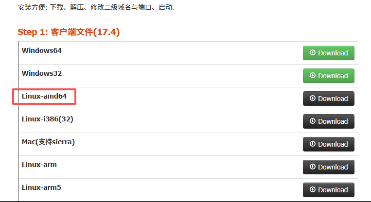

# 在 Anolis OS release 8.10 上使用ittun

## 下载Linux-amd64, 下载地址 [https://www.ittun.com](https://www.ittun.com)  



## 解压到opt目录并重命名
```shell
[ares@ares-test ~]$ sudo unzip linux64.zip -d /opt
[sudo] ares 的密码：
Archive:  linux64.zip
   creating: /opt/linux64/
  inflating: /opt/linux64/config.yml  
  inflating: /opt/linux64/ngrok      

[ares@ares-test ~]$ sudo mv /opt/linux64 /opt/ittun
[ares@ares-test ~]$ ls /opt
containerd  ittun  registry
```

## 配置ngrok隧道
```shell
server_addr: "ittun.com:36415"
tunnels:
    web:   
     subdomain: ares
     root: "/usr/share/nginx/html/"
     proto:
       http: "localhost:80"
       https: "localhost:80" 
```

## 配置为系统服务
```shell
[ares@ares-test ~]$ sudo vim /etc/systemd/system/ngrok.service
```
配置内容如下：
```shell
[Unit]
Description=ngrok service
After=network.target

[Service]
Type=simple
User=root
WorkingDirectory=/opt/ittun
ExecStart=/opt/ittun/ngrok -config=/opt/ittun/config.yml start web
Restart=always
RestartSec=5

[Install]
WantedBy=multi-user.target
```
## 重载 daemon, 设置开机启动, 启动ngrok服务
```shell
[ares@ares-test ~]$ sudo systemctl daemon-reload
[ares@ares-test ~]$ sudo systemctl enable ngrok.service
Created symlink /etc/systemd/system/multi-user.target.wants/ngrok.service → /etc/systemd/system/ngrok.service.
[ares@ares-test ~]$ sudo systemctl start ngrok.service
[ares@ares-test ~]$ sudo systemctl status ngrok.service
● ngrok.service - ngrok service
   Loaded: loaded (/etc/systemd/system/ngrok.service; enabled; vendor preset: disabled)
   Active: active (running) since Fri 2025-09-12 10:19:47 CST; 6s ago
 Main PID: 54137 (ngrok)
    Tasks: 8 (limit: 61640)
   Memory: 10.4M
   CGroup: /system.slice/ngrok.service
           └─54137 /opt/ittun/ngrok -config=/opt/ittun/config.yml start web

9月 12 10:19:47 ares-test systemd[1]: Started ngrok service.
```

测试 `curl https://ares.ittun.com` 和 `curl ares.ittun.com`均可以访问
