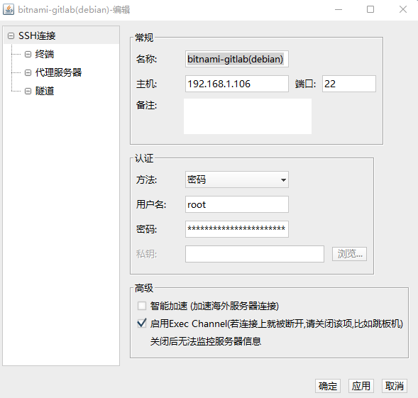

<!--
 * @author: ares
 * @date: 2022-01-13 16:00:08
 * @lastEditTime: 2022-01-13 16:58:41
 * @lastEditors: ares
 * @description: bitnami-gitlab虚拟机
 * 
-->

# bitnami-gitlab（debian）虚拟机安装及环境配置

## 下载地址[https://bitnami.com/stack/gitlab/virtual-machine](https://bitnami.com/stack/gitlab/virtual-machine)

## 在VirtualBox中导入下载的OVE文件，按提示完成导入

## 重置root账户密码

### 修改参数
启动虚拟机，在下图界面是按键盘上的 `E` 键


进入下图界面


移动光标到quiet后面，追加代码
```shell
init=/bin/bash
```
按 `Ctrl+X` 或 按 `F10` 重启虚拟机

### 修改 `root` 账户密码
重启虚拟机后进入如下界面


直接使用 `passwd` 命令修改密码可能会报错，尝试如下方法
```shell
mount -rw -o remount /
```
然后在用 `passwd` 命令修改密码


提示密码修改成功， 重启虚拟机，使用 `root` 账户登录系统

## 启用SSH
```shell
rm -f /etc/ssh/sshd_not_to_be_run
systemctl enable ssh
systemctl start ssh
```

## 开启密码登录及`root`账户ssh远程登录
```shell
vim /etc/ssh/sshd_config
```
启用 `PasswordAuthentication` 和 `PermitRootLogin`
```shell
PasswordAuthentication yes
PermitRootLogin yes
```

## 重启ssh服务
```shell
systemctl restart ssh
```

## 测试ssh远程链接



