<!--
 * @author: ares
 * @date: 2022-01-13 16:00:08
 * @lastEditTime: 2022-01-13 16:58:41
 * @lastEditors: ares
 * @description: 
 * 
-->

# docker环境配置

## 查看内核版本 <Docker 要求 CentOS 系统的内核版本高于 3.10>

```shell
uname -r
```

## 把yum包更新到最新

```shell
sudo yum update
```

## 安装需要的软件包,`yum-util` 提供`yum-config-manager`功能，另外两个是`devicemapper`驱动依赖的

```shell
sudo yum install -y yum-utils device-mapper-persistent-data lvm2
```

## 设置yum源

```shell
sudo yum-config-manager --add-repo https://download.docker.com/linux/centos/docker-ce.repo
```

## 查看仓库中docker版本

```shell
yum list docker-ce --showduplicates | sort -r
```

## 安装docker

```shell
sudo yum install docker-ce
```

## 启动Docker|设置开机启动|停止Docker

```shell
sudo systemctl start docker
sudo systemctl enable docker
sudo systemctl stop docker
```

## 查看版本

```shell
docker version
```

## 试用 search 查一下

```shell
docker search mysql
```

## 查看状态

```shell
systemctl status docker.service
```

# 卸载Docker,对于旧版本没安装成功,需要卸载掉

## 查询安装过的包

```shell
yum list installed | grep docker
```

例如:本机安装过旧版本`docker.x86_64,docker-client.x86_64`,`docker-common.x86_64`

## 删除安装的软件包

```shell
yum -y remove docker.x86_64
yum -y remove docker-client.x86_64
yum -y remove docker-common.x86_64
```


# VirtualBox CentOs7虚拟机环境下安装docker

## 查看自己系统内核,据说Docker 要求 CentOS 系统的内核版本高于 3.10
```shell
[root@centos7full ~]# uname -r
3.10.0-1160.71.1.el7.x86_64
```

## 查看docker包
```shell
[root@centos7full ~]# yum list docker*
已加载插件：fastestmirror
Loading mirror speeds from cached hostfile
 * base: mirrors.nju.edu.cn
 * extras: mirrors.bfsu.edu.cn
 * updates: mirrors.bfsu.edu.cn
可安装的软件包
docker.x86_64                                                     2:1.13.1-209.git7d71120.el7.centos                               extras
docker-client.x86_64                                              2:1.13.1-209.git7d71120.el7.centos                               extras
docker-client-latest.x86_64                                       1.13.1-58.git87f2fab.el7.centos                                  extras
docker-common.x86_64                                              2:1.13.1-209.git7d71120.el7.centos                               extras
docker-distribution.x86_64                                        2.6.2-2.git48294d9.el7                                           extras
docker-latest.x86_64                                              1.13.1-58.git87f2fab.el7.centos                                  extras
docker-latest-logrotate.x86_64                                    1.13.1-58.git87f2fab.el7.centos                                  extras
docker-latest-v1.10-migrator.x86_64                               1.13.1-58.git87f2fab.el7.centos                                  extras
docker-logrotate.x86_64                                           2:1.13.1-209.git7d71120.el7.centos                               extras
docker-lvm-plugin.x86_64                                          2:1.13.1-209.git7d71120.el7.centos                               extras
docker-novolume-plugin.x86_64                                     2:1.13.1-209.git7d71120.el7.centos                               extras
docker-registry.x86_64                                            0.9.1-7.el7                                                      extras
docker-v1.10-migrator.x86_64                                      2:1.13.1-209.git7d71120.el7.centos                               extras
```

已经有可用软件包

## 安装
```shell
yum install docker
```

## 查看docker版本
```shell
[root@centos7full ~]# docker -v
Docker version 1.13.1, build 7d71120/1.13.1
```

## 设置开机启动
```shell
[root@centos7full ~]# systemctl enable docker
Created symlink from /etc/systemd/system/multi-user.target.wants/docker.service to /usr/lib/systemd/system/docker.service.
```

## 启动docker
```shell
systemctl start docker
```

## 查看docker状态
```shell
[root@centos7full ~]# systemctl status docker
● docker.service - Docker Application Container Engine
   Loaded: loaded (/usr/lib/systemd/system/docker.service; enabled; vendor preset: disabled)
   Active: active (running) since 三 2022-08-31 14:10:10 CST; 32s ago
     Docs: http://docs.docker.com
 Main PID: 11877 (dockerd-current)
   CGroup: /system.slice/docker.service
           ├─11877 /usr/bin/dockerd-current --add-runtime docker-runc=/usr/libexec/docker/docker-runc-current --default-runtime=docker...
           └─11882 /usr/bin/docker-containerd-current -l unix:///var/run/docker/libcontainerd/docker-containerd.sock --metrics-interva...

8月 31 14:10:09 centos7full dockerd-current[11877]: time="2022-08-31T14:10:09.004580510+08:00" level=info msg="libcontainerd: n...11882"
8月 31 14:10:10 centos7full dockerd-current[11877]: time="2022-08-31T14:10:10.067065322+08:00" level=info msg="Graph migration ...conds"
8月 31 14:10:10 centos7full dockerd-current[11877]: time="2022-08-31T14:10:10.068207551+08:00" level=info msg="Loading containe...tart."
8月 31 14:10:10 centos7full dockerd-current[11877]: time="2022-08-31T14:10:10.090561045+08:00" level=info msg="Firewalld running: true"
8月 31 14:10:10 centos7full dockerd-current[11877]: time="2022-08-31T14:10:10.197081714+08:00" level=info msg="Default bridge (...dress"
8月 31 14:10:10 centos7full dockerd-current[11877]: time="2022-08-31T14:10:10.270726264+08:00" level=info msg="Loading containe...done."
8月 31 14:10:10 centos7full dockerd-current[11877]: time="2022-08-31T14:10:10.279355673+08:00" level=info msg="Daemon has compl...ation"
8月 31 14:10:10 centos7full dockerd-current[11877]: time="2022-08-31T14:10:10.279369168+08:00" level=info msg="Docker daemon" c...1.13.1
8月 31 14:10:10 centos7full systemd[1]: Started Docker Application Container Engine.
8月 31 14:10:10 centos7full dockerd-current[11877]: time="2022-08-31T14:10:10.285597703+08:00" level=info msg="API listen on /v....sock"
Hint: Some lines were ellipsized, use -l to show in full.
```

docker已正常运行!


# webstorm使用docker

## 修改`docker.service`配置,开放一个远程访问端口
```shell
vi /lib/systemd/system/docker.service
```

`ExecStart`配置增加`-H tcp://0.0.0.0:2375 -H unix://var/run/docker.sock`
```
[Unit]
Description=Docker Application Container Engine
Documentation=http://docs.docker.com
After=network.target
Wants=docker-storage-setup.service
Requires=docker-cleanup.timer

[Service]
Type=notify
NotifyAccess=main
EnvironmentFile=-/run/containers/registries.conf
EnvironmentFile=-/etc/sysconfig/docker
EnvironmentFile=-/etc/sysconfig/docker-storage
EnvironmentFile=-/etc/sysconfig/docker-network
Environment=GOTRACEBACK=crash
Environment=DOCKER_HTTP_HOST_COMPAT=1
Environment=PATH=/usr/libexec/docker:/usr/bin:/usr/sbin
ExecStart=/usr/bin/dockerd-current -H tcp://0.0.0.0:2375 -H unix://var/run/docker.sock \
          --add-runtime docker-runc=/usr/libexec/docker/docker-runc-current \
          --default-runtime=docker-runc \
          --exec-opt native.cgroupdriver=systemd \
          --userland-proxy-path=/usr/libexec/docker/docker-proxy-current \
          --init-path=/usr/libexec/docker/docker-init-current \
          --seccomp-profile=/etc/docker/seccomp.json \
          $OPTIONS \
          $DOCKER_STORAGE_OPTIONS \
          $DOCKER_NETWORK_OPTIONS \
          $ADD_REGISTRY \
          $BLOCK_REGISTRY \
          $INSECURE_REGISTRY \
          $REGISTRIES
ExecReload=/bin/kill -s HUP $MAINPID
LimitNOFILE=1048576
LimitNPROC=1048576
LimitCORE=infinity
TimeoutStartSec=0
Restart=on-abnormal
KillMode=process

[Install]
WantedBy=multi-user.target
```

## 防火墙开放刚才配置的端口
```shell
[root@centos7full ~]# firewall-cmd --zone=public --add-port=2375/tcp --permanent
```

## 更新防火墙
```shell
[root@centos7full ~]# firewall-cmd --reload
success
```

## webstorm连接远程docker

### 配置docker
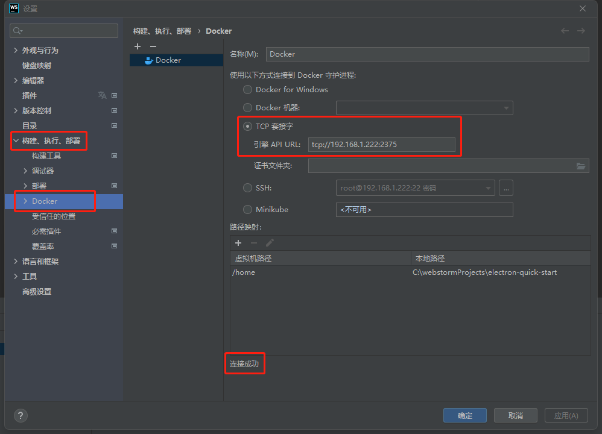

### 配置好docker后, webstorm底部工具栏多了一个`服务`标签, 里面已经有个Docker服务了,连接Docker服务就可以看到远程docker的镜像以及容器了
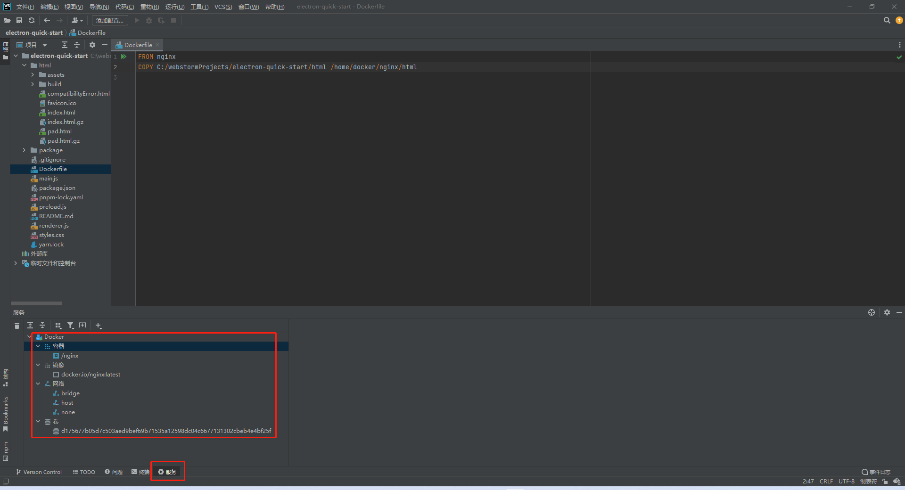

#### 新建的docker环境, webstorm服务里的Docker服务可能有异常,需要先创建一个挂载卷
```shell
docker volume create
```

## 配置 `Dockerfile` 类型启动器
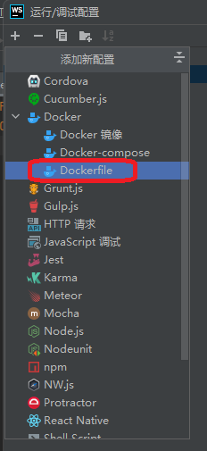

### 配置启动器
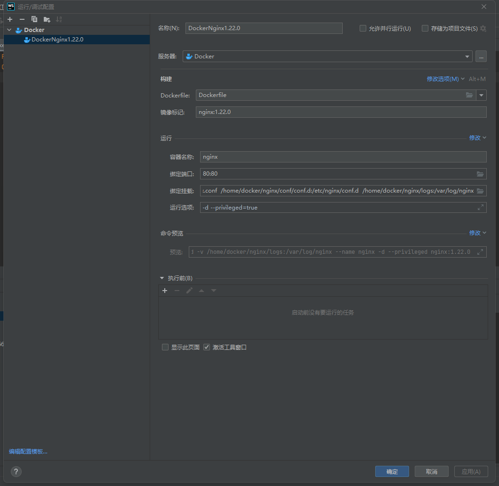

我用的是固定nginx版本1.22.0

#### 挂载卷配置
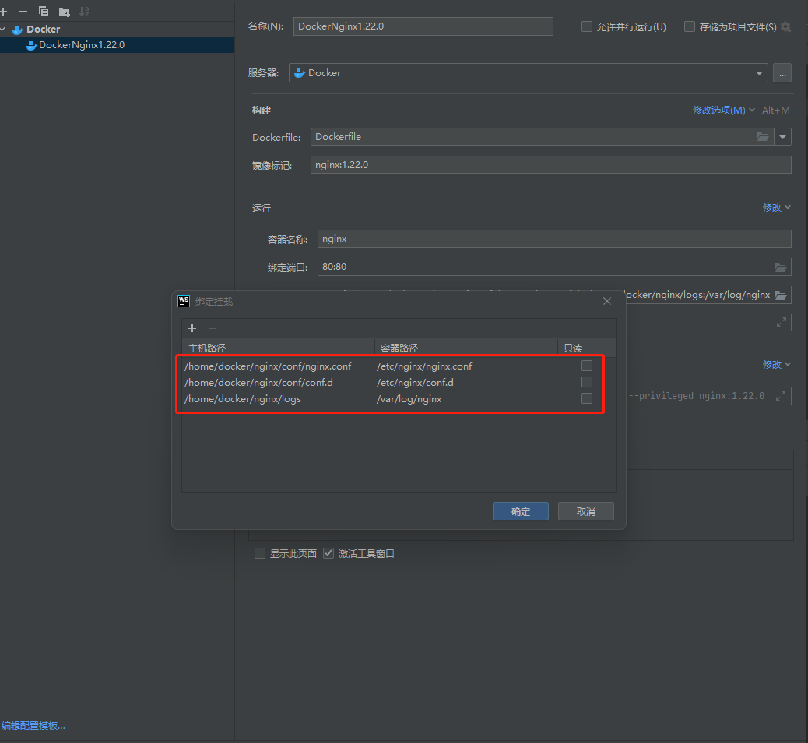

我只配置了nginx配置文件和日志的挂载卷, 静态资源在`Dockerfile`中做了配置,会从本地复制到新的容器中, 如果配置了静态资源挂载卷, `Dockerfile`中复制静态资源的语句好像失效了, 服务器上找不到相应的静态资源,导致网站不能正常访问.

## 配置`Dockerfile`

### 目录结构
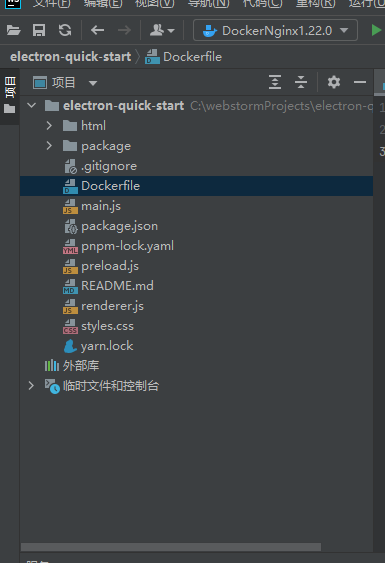

我这里就是个简单的前端项目,静态资源在`html`目录, 在根目录下创建`DockerFile`文件

### 配置`Dockerfile`文件
```
FROM nginx:1.22.0
COPY html/ /usr/share/nginx/html/
```
我只做了简单配置, 用`nginx:1.22.0`打包docker, 复制本地静态资源到docker容器中

## 部署
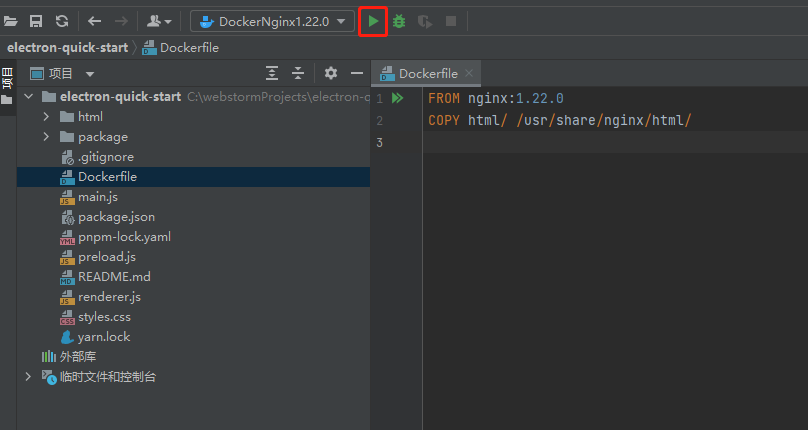

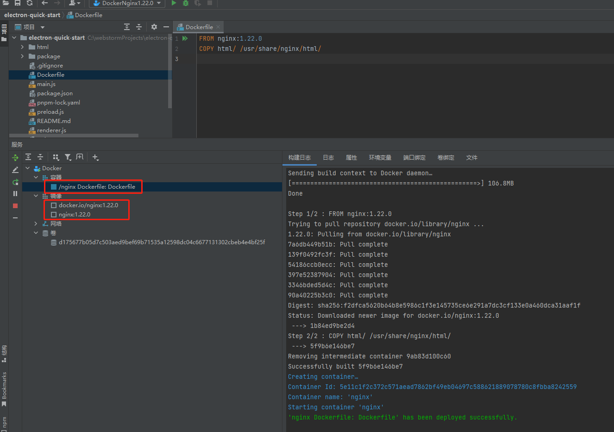


### 修改静态资源后重新发布
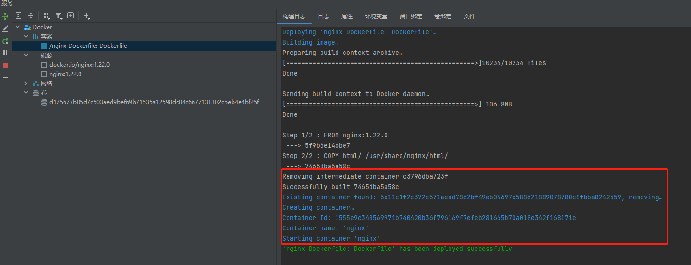

docker容器看似没变,实际删除了旧容器,重新生成了一个容器

## 配置的挂载卷是否生效

### 日志挂载卷
```shell
[root@centos7full ~]# ls /home/docker/nginx/logs
access.log  error.log
```
访问网站后,已经在挂载卷生成了访问日志

#### 修改配置文件

修改挂载卷下的`/home/docker/nginx/conf/conf.d/default.conf`配置文件, 打开日志记录功能
```
access_log  /var/log/nginx/host.access.log  main;
```

重新查看日志挂载卷
```shell
[root@centos7full ~]# ls /home/docker/nginx/logs
access.log  error.log  host.access.log
```

已经生成了新的日志文件, 说明挂载卷生效!!


**小贴士**: Docker另外一种远程发布,就是在服务器上配置好nginx的docker环境, 以后发布只将静态资源发布到docker环境nginx对应静态资源的挂载卷就行. 不用反复删除容器再重新生成容器!如下

## 安装docker环境
```shell
docker pull nginx:1.22.0
```

### 查看镜像
```shell
[root@centos7full ~]# docker images
REPOSITORY          TAG                 IMAGE ID            CREATED             SIZE
docker.io/nginx     1.22.0              1b84ed9be2d4        10 days ago         142 MB
```

## 生成容器
```shell
[root@centos7full ~]# docker run -p 80:80 --name nginx -v /home/docker/nginx/conf/nginx.conf:/etc/nginx/nginx.conf -v /home/docker/nginx/conf/conf.d:/etc/nginx/conf.d -v /home/docker/nginx/html:/usr/share/nginx/html -v /home/docker/nginx/logs:/var/log/nginx -d --privileged=true nginx:1.22.0
d7b82178461ca128f9a3901c9d5e974550009881bc24a872f2c5c3f9c9697a35
```

### 查看容器
```shell
[root@centos7full ~]# docker ps -a
CONTAINER ID        IMAGE               COMMAND                  CREATED             STATUS              PORTS                NAMES
d7b82178461c        nginx:1.22.0        "/docker-entrypoin..."   6 seconds ago       Up 6 seconds        0.0.0.0:80->80/tcp   nginx
```

这时候是个空的nginx环境, 以后只要远程将静态资源上传到`/home/docker/nginx/html`目录就行

## webstorm配置远程部署
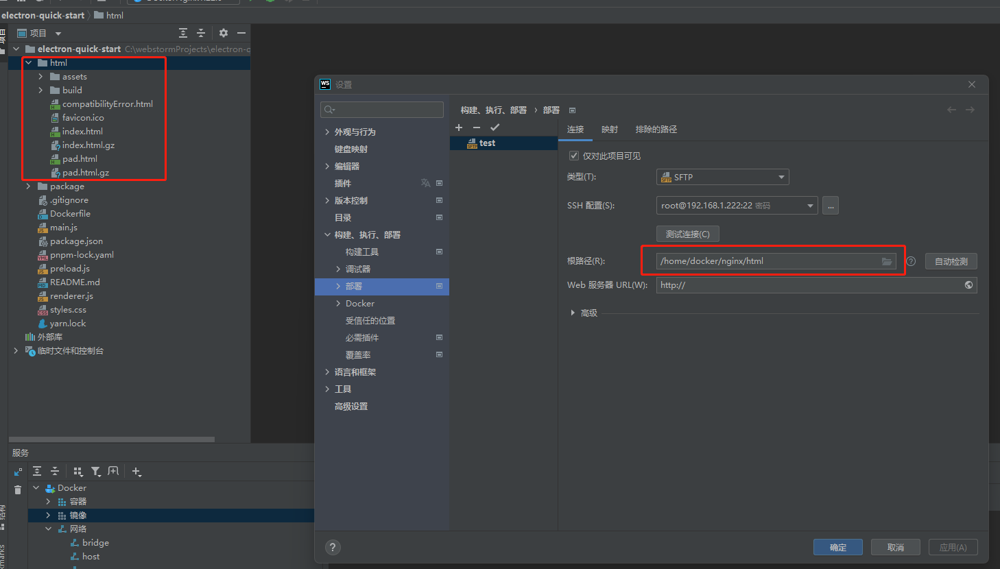

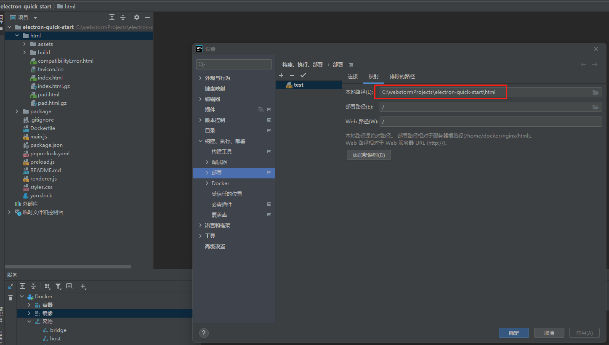

配置作用是部署时,将本地`html`文件夹下的文件上传到远程服务器的`/home/docker/nginx/html`目录

在配置的`html`目录上右键,选择`部署`, 上传或同步都可以
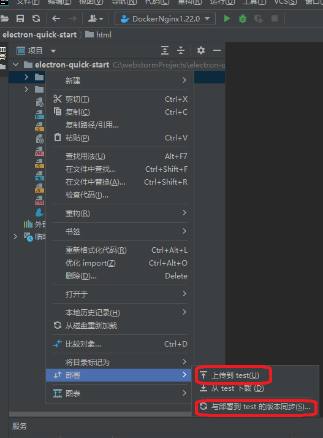

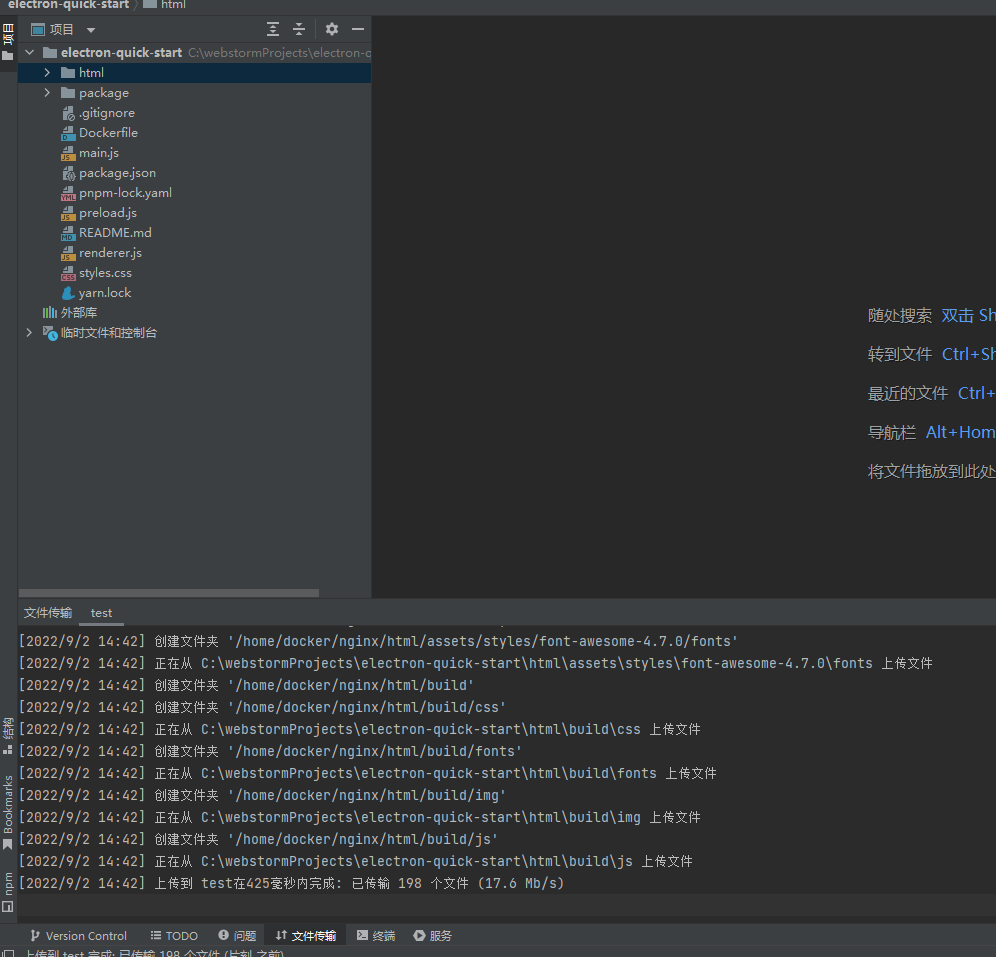

上传完成, 访问网站,已经部署成功!!

**小贴士**  在部署选项中可以设置自动部署
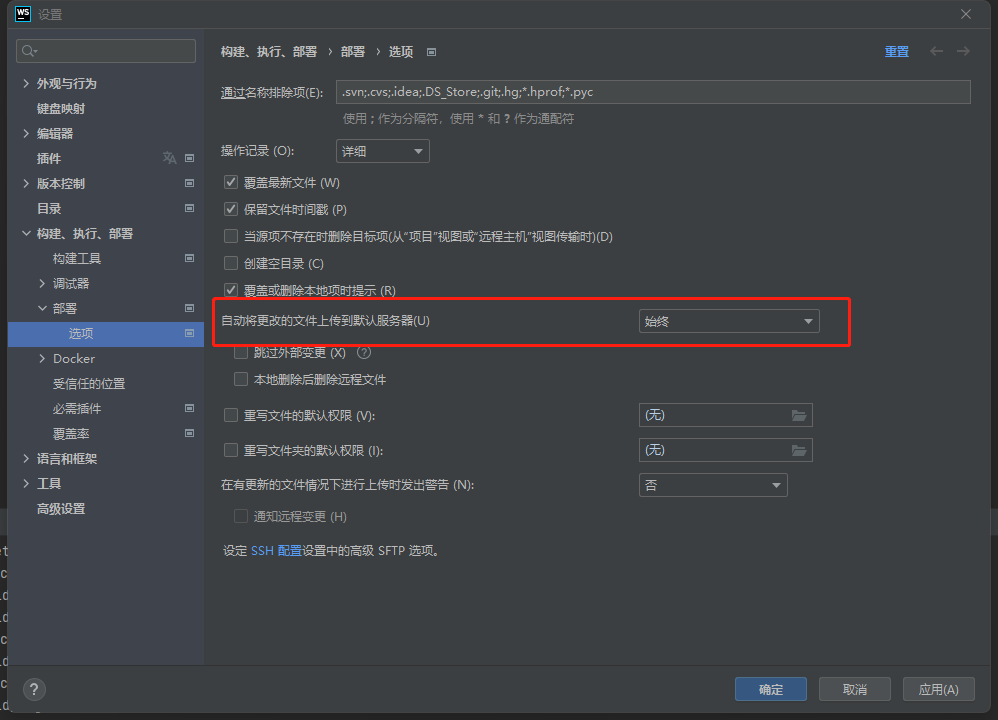
