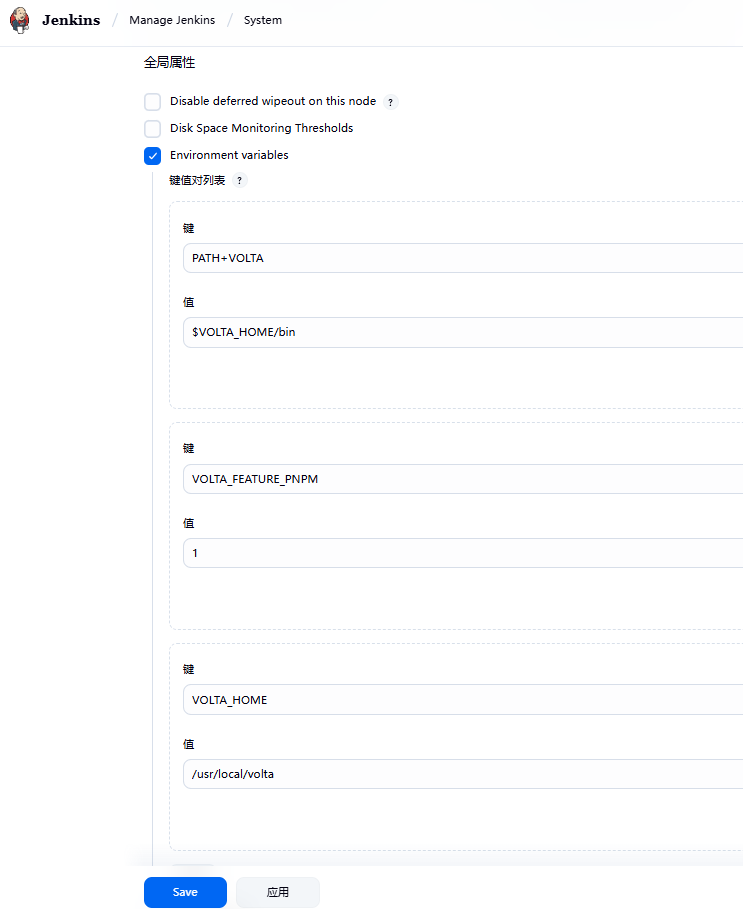
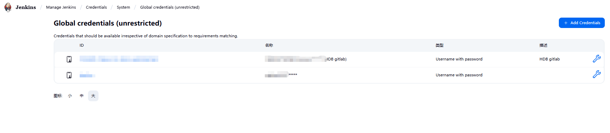
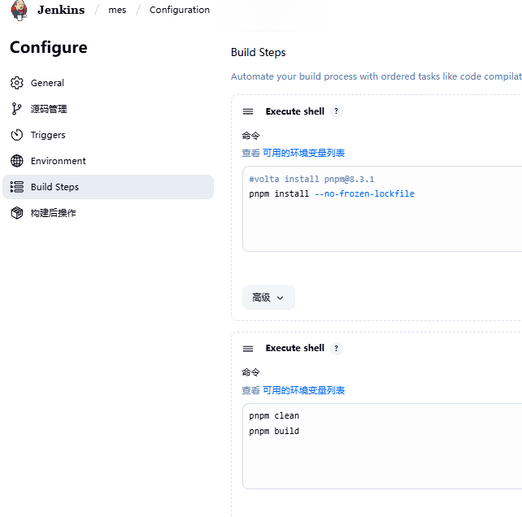

# VirtualBox CentOs7虚拟机环境下安装jenkins

## 安装方式一

### 下载需要的版本 [https://pkg.jenkins.io/](https://pkg.jenkins.io/)
```shell
wget https://pkg.jenkins.io/redhat-stable/jenkins-2.222.3-1.1.noarch.rpm
```
### 安装
```shell
rpm -ivh jenkins-2.222.3-1.1.noarch.rpm
```

## 安装方式二
### 配置源
```shell
[root@centos7full ~]# wget -O /etc/yum.repos.d/jenkins.repo https://pkg.jenkins.io/redhat-stable/jenkins.repo
--2022-08-31 16:03:45--  https://pkg.jenkins.io/redhat-stable/jenkins.repo
正在解析主机 pkg.jenkins.io (pkg.jenkins.io)... 151.101.2.133, 151.101.66.133, 151.101.130.133, ...
正在连接 pkg.jenkins.io (pkg.jenkins.io)|151.101.2.133|:443... 已连接。
已发出 HTTP 请求，正在等待回应... 200 OK
长度：85
正在保存至: “/etc/yum.repos.d/jenkins.repo”

100%[===============================================================================================>] 85          --.-K/s 用时 0s      

2022-08-31 16:03:46 (5.55 MB/s) - 已保存 “/etc/yum.repos.d/jenkins.repo” [85/85])
```

### 导入GPG-KEY
```shell
rpm --import https://pkg.jenkins.io/redhat-stable/jenkins.io.key
```

### 查询jenkins包
```shell
[root@centos7full ~]# yum list jenkins*
已加载插件：fastestmirror, product-id, search-disabled-repos, subscription-manager

This system is not registered with an entitlement server. You can use subscription-manager to register.

Loading mirror speeds from cached hostfile
 * base: mirrors.njupt.edu.cn
 * extras: mirrors.163.com
 * updates: mirrors.163.com
可安装的软件包
jenkins.noarch                                                    2.346.3-1.1                                                     jenkins
```

### 安装
```shell
yum install jenkins
```

## 配置开机启动
```shell
[root@centos7full ~]# systemctl enable jenkins
Created symlink from /etc/systemd/system/multi-user.target.wants/jenkins.service to /usr/lib/systemd/system/jenkins.service.
```

## 启动jenkins
```shell
systemctl start jenkins
```

## 查看jenkins状态
```shell
[root@centos7full ~]# systemctl status jenkins
● jenkins.service - Jenkins Continuous Integration Server
   Loaded: loaded (/usr/lib/systemd/system/jenkins.service; enabled; vendor preset: disabled)
   Active: active (running) since 三 2022-08-31 16:22:49 CST; 44s ago
 Main PID: 3625 (java)
   CGroup: /system.slice/jenkins.service
           └─3625 /usr/bin/java -Djava.awt.headless=true -jar /usr/share/java/jenkins.war --webroot=%C/jenkins/war --httpPort=8080

8月 31 16:22:34 centos7full jenkins[3625]: Jenkins initial setup is required. An admin user has been created and a password generated.
8月 31 16:22:34 centos7full jenkins[3625]: Please use the following password to proceed to installation:
8月 31 16:22:34 centos7full jenkins[3625]: e240319584aa431d82af06372310971a
8月 31 16:22:34 centos7full jenkins[3625]: This may also be found at: /var/lib/jenkins/secrets/initialAdminPassword
8月 31 16:22:34 centos7full jenkins[3625]: *************************************************************
8月 31 16:22:34 centos7full jenkins[3625]: *************************************************************
8月 31 16:22:34 centos7full jenkins[3625]: *************************************************************
8月 31 16:22:49 centos7full jenkins[3625]: 2022-08-31 08:22:49.315+0000 [id=27]        INFO        jenkins.InitReactorRunner$1...ization
8月 31 16:22:49 centos7full jenkins[3625]: 2022-08-31 08:22:49.361+0000 [id=20]        INFO        hudson.lifecycle.Lifecycle#...running
8月 31 16:22:49 centos7full systemd[1]: Started Jenkins Continuous Integration Server.
Hint: Some lines were ellipsized, use -l to show in full.
```

## 防火墙开放`8080`端口
```shell
[root@centos7full ~]# firewall-cmd --zone=public --add-port=8080/tcp --permanent
success
```

## 更新防火墙
```shell
[root@centos7full ~]# firewall-cmd --reload
success
```

## 重新查看开放端口
```shell
[root@centos7full ~]# firewall-cmd --zone=public --list-ports
3306/tcp 80/tcp 6379/tcp 8080/tcp
```

访问jenkins项目地址, 可以正常访问了!!!


# VirtualBox Debian虚拟机环境下安装指定版本jenkins

## 添加源
```shell
wget -q -O - https://pkg.jenkins.io/debian/jenkins.io.key | sudo apt-key add -
sudo sh -c 'echo deb http://pkg.jenkins.io/debian-stable binary/ > /etc/apt/sources.list.d/jenkins.list'
sudo apt update
```

## 查询Jenkins可安装版本
```shell
apt-cache madison jenkins
```

## 安装指定版本Jenkins
```shell
apt-get install -y jenkins=2.346.1
```
    2.346.1支持Java 8, Java 11, or Java 17 2.164.1支持Java 8, Java 11

# VirtualBox Anolis OS release 8.10虚拟机环境下jenkins2.516.3前端项目配置

## 安装volta工具
```shell
mkdir /usr/local/volta
sudo chmod 777 /usr/local/volta/
curl https://get.volta.sh | bash
```

## 安装nodejs和pnpm(根据需要安装对应版本)
```shell
volta install node@19.9.0
volta install pnpm@8.3.1
```

## 给jenkins账户添加volta目录读权限
```shell
sudo chown -R jenkins:jenkins /usr/local/volta/
```

## 设置pnpm镜像
```shell
pnpm config set registry https://registry.npmmirror.com/
```

## 配置 Jenkins 全局变量, 增加volta配置


## 配置凭证


## freestyle项目配置


## pipeline项目配置
```shell
pipeline {
    agent any

    environment {
        BASTION_HOST = 'xxx.aliyuncs.com'  // 堡垒机地址
        BASTION_USER = 'username'               // 堡垒机用户名
        BASTION_PORT = '61122'                  // 堡垒机SSH端口
        INTERNAL_IP = '172.16.0.5'        // 内部服务器IP
        INTERNAL_USER = 'root'               // 内部服务器用户名
        LOCAL_DIR = 'public/'    // 本地文件夹路径(必须存在)
        REMOTE_DIR = '/usr/share/nginx/html/test/'            // 内部服务器目标路径(必须存在)
        TUNNEL_PORT = '2222'                // 本地转发端口(使用非特权端口 2222 替代端口 22，避免权限问题)
    }
    
    stages {
        stage('Checkout') {
            steps {
                git branch: 'master',
                    url: '项目地址',
                    credentialsId: 'jenkins中创建的git凭证ID'
            }
        }
        
        stage('Install Dependencies') {
            steps {
                sh '''
                    pnpm install
                '''
            }
        }
        
        stage('Build Project') {
            steps {
                sh '''
                    pnpm build
                '''
            }
        }
        
        stage('Deploy') {
            steps {
                withCredentials([usernamePassword(
                  credentialsId: 'jenkins中创建的堡垒机凭证ID',
                  usernameVariable: 'SSH_USER',
                  passwordVariable: 'SSH_PASS'
                )]) {
                      sh '''
                        # 将凭据保存到文件而不是在命令行中传递
                        echo "$SSH_PASS" > /tmp/ssh_pass_file
                        chmod 600 /tmp/ssh_pass_file
                        
                        # 使用高权限端口(避免使用1-1024端口)
                        TUNNEL_PORT=${TUNNEL_PORT}
                        
                        # 建立SSH隧道
                        sshpass -f /tmp/ssh_pass_file ssh -o StrictHostKeyChecking=no \\
                          -o PreferredAuthentications=password \\
                          -o PubkeyAuthentication=no \\
                          -L ${TUNNEL_PORT}:${INTERNAL_IP}:22 \\
                          ${SSH_USER}@${BASTION_HOST} -p ${BASTION_PORT} -Nf -M -S /tmp/ssh_tunnel_socket &
                        
                        # 等待隧道建立
                        sleep 5
                        
                        # 通过隧道上传文件
                        sshpass -p "" scp -o StrictHostKeyChecking=no -P ${TUNNEL_PORT} \\
                          -r ${LOCAL_DIR}/* root@127.0.0.1:${REMOTE_DIR} || {
                            echo "SCP failed, listing directory contents for debugging:"
                            ls -la ${LOCAL_DIR}
                            exit 1
                          }
                          
                        # 关闭SSH隧道
                        ssh -S /tmp/ssh_tunnel_socket -O exit ${SSH_USER}@${BASTION_HOST} 2>/dev/null || true
                        
                        # 清理临时文件
                        rm -f /tmp/ssh_pass_file
                    '''
                    }
            }
        }
    }
}
```
