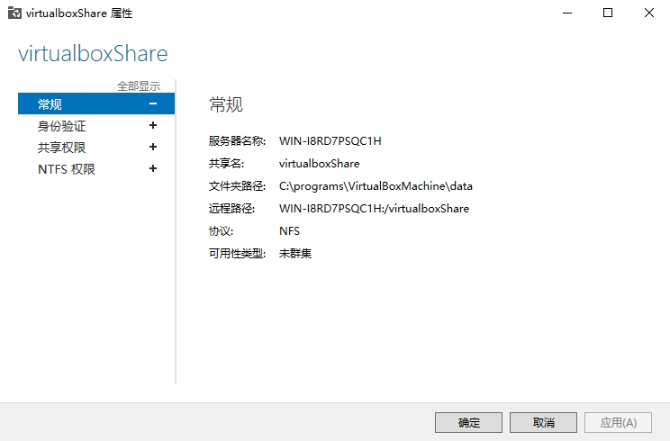
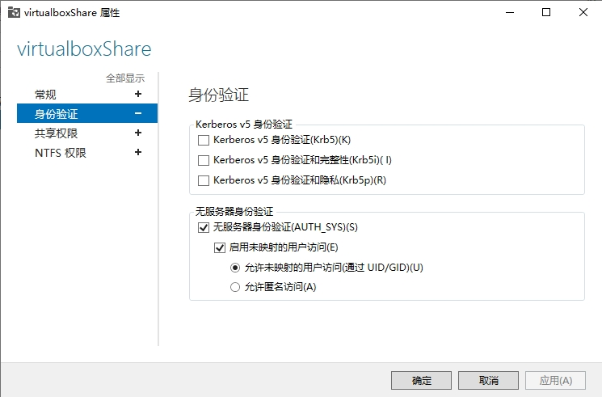
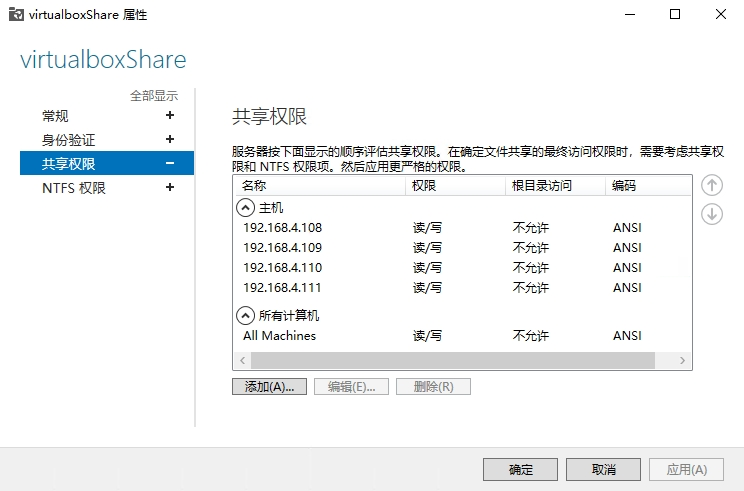
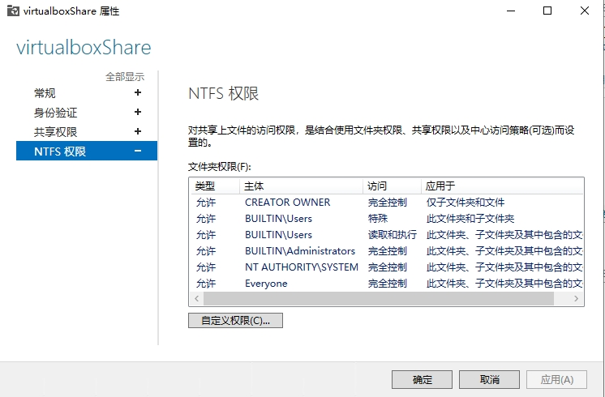

# k8s(1.33)环境配置

## 设备信息

### master
> IP: 192.168.4.108   主机名: ares-master   系统: AnolisOS-8.10-x86_64
### slave
> IP: 192.168.4.109   主机名: ares-slave    系统: AnolisOS-8.10-x86_64
### slave1
> IP: 192.168.4.110   主机名: ares-slave1   系统: AnolisOS-8.10-x86_64

## 查看系统及内核版本 <k8s 1.33 要求系统的内核版本高于 5.13>

```shell
[ares@ares-master ~]$ uname -r
5.10.134-18.an8.x86_64
[ares@ares-master ~]$ cat /etc/anolis-release
Anolis OS release 8.10
```

## 使用 ELRepo 仓库升级内核
> [参照清华大学开源软件镜像站](https://mirrors.tuna.tsinghua.edu.cn/help/elrepo/)
### 导入 ELRepo 仓库的公共密钥
```shell
[ares@ares-master ~]$ sudo rpm --import https://www.elrepo.org/RPM-GPG-KEY-elrepo.org
```
### 安装对应版本的 ELRepo
```shell
[ares@ares-master ~]$ sudo yum install https://www.elrepo.org/elrepo-release-8.el8.elrepo.noarch.rpm
上次元数据过期检查：0:03:55 前，执行于 2025年07月07日 星期一 13时04分20秒。
elrepo-release-8.el8.elrepo.noarch.rpm                                                                                 12 kB/s |  19 kB     00:01    
依赖关系解决。
======================================================================================================================================================
 软件包                               架构                         版本                                      仓库                                大小
======================================================================================================================================================
安装:
 elrepo-release                       noarch                       8.4-2.el8.elrepo                          @commandline                        19 k

事务概要
======================================================================================================================================================
安装  1 软件包

总计：19 k
安装大小：8.3 k
确定吗？[y/N]： y
下载软件包：
运行事务检查
事务检查成功。
运行事务测试
事务测试成功。
运行事务
  准备中  :                                                                                                                                       1/1 
  安装    : elrepo-release-8.4-2.el8.elrepo.noarch                                                                                                1/1 
  验证    : elrepo-release-8.4-2.el8.elrepo.noarch                                                                                                1/1 

已安装:
  elrepo-release-8.4-2.el8.elrepo.noarch                                                                                                              

完毕！
```

### 备份 elrepo
```shell
[ares@ares-master ~]$ sudo cp /etc/yum.repos.d/elrepo.repo /etc/yum.repos.d/elrepo.repo.bak
```

### 编辑elrepo配置

然后编辑 `/etc/yum.repos.d/elrepo.repo` 文件，在 `mirrorlist=` 开头的行前面加 # 注释掉；并将 `http://elrepo.org/linux` 替换为`https://mirrors.tuna.tsinghua.edu.cn/elrepo`

### 重新建立 `yum`缓存
```shell
[ares@ares-master ~]$ sudo yum makecache
[sudo] ares 的密码：
AnolisOS-8 - AppStream                                                                                                 81 kB/s | 4.3 kB     00:00    
AnolisOS-8 - BaseOS                                                                                                    41 kB/s | 4.3 kB     00:00    
AnolisOS-8 - Extras                                                                                                    80 kB/s | 3.0 kB     00:00    
AnolisOS-8 - PowerTools                                                                                                93 kB/s | 4.3 kB     00:00    
AnolisOS-8 - Kernel 5.10                                                                                              119 kB/s | 4.3 kB     00:00    
ELRepo.org Community Enterprise Linux Repository - el8                                                                588 kB/s | 223 kB     00:00    
元数据缓存已建立。
```

### 查看可用内核
```shell
[ares@ares-master ~]$ sudo yum list available --disablerepo='*' --enablerepo=elrepo-kernel
ELRepo.org Community Enterprise Linux Kernel Repository - el8                                                         2.4 MB/s | 2.2 MB     00:00    
上次元数据过期检查：0:00:01 前，执行于 2025年07月07日 星期一 13时24分22秒。
可安装的软件包
kernel-lt.x86_64                                                           5.4.295-1.el8.elrepo                                          elrepo-kernel
kernel-lt-core.x86_64                                                      5.4.295-1.el8.elrepo                                          elrepo-kernel
kernel-lt-devel.x86_64                                                     5.4.295-1.el8.elrepo                                          elrepo-kernel
kernel-lt-doc.noarch                                                       5.4.295-1.el8.elrepo                                          elrepo-kernel
kernel-lt-headers.x86_64                                                   5.4.295-1.el8.elrepo                                          elrepo-kernel
kernel-lt-modules.x86_64                                                   5.4.295-1.el8.elrepo                                          elrepo-kernel
kernel-lt-modules-extra.x86_64                                             5.4.295-1.el8.elrepo                                          elrepo-kernel
kernel-lt-tools.x86_64                                                     5.4.295-1.el8.elrepo                                          elrepo-kernel
kernel-lt-tools-libs.x86_64                                                5.4.295-1.el8.elrepo                                          elrepo-kernel
kernel-lt-tools-libs-devel.x86_64                                          5.4.295-1.el8.elrepo                                          elrepo-kernel
kernel-ml.x86_64                                                           6.15.4-1.el8.elrepo                                           elrepo-kernel
kernel-ml-core.x86_64                                                      6.15.4-1.el8.elrepo                                           elrepo-kernel
kernel-ml-devel.x86_64                                                     6.15.4-1.el8.elrepo                                           elrepo-kernel
kernel-ml-doc.noarch                                                       6.15.4-1.el8.elrepo                                           elrepo-kernel
kernel-ml-headers.x86_64                                                   6.15.4-1.el8.elrepo                                           elrepo-kernel
kernel-ml-modules.x86_64                                                   6.15.4-1.el8.elrepo                                           elrepo-kernel
kernel-ml-modules-extra.x86_64                                             6.15.4-1.el8.elrepo                                           elrepo-kernel
kernel-ml-tools.x86_64                                                     6.15.4-1.el8.elrepo                                           elrepo-kernel
kernel-ml-tools-libs.x86_64                                                6.15.4-1.el8.elrepo                                           elrepo-kernel
kernel-ml-tools-libs-devel.x86_64                                          6.15.4-1.el8.elrepo                                           elrepo-kernel
perf.x86_64                                                                6.15.4-1.el8.elrepo                                           elrepo-kernel
python3-perf.x86_64  
```

> 常见选项：
> - kernel-ml: 最新主线稳定版（推荐）
> - kernel-lt: 长期维护版

### 安装 `kernel-ml`最新版内核
```shell
[ares@ares-master ~]$ sudo yum install --enablerepo=elrepo-kernel kernel-ml
[sudo] ares 的密码：
上次元数据过期检查：0:05:05 前，执行于 2025年07月07日 星期一 13时24分22秒。
依赖关系解决。
======================================================================================================================================================
 软件包                                 架构                        版本                                     仓库                                大小
======================================================================================================================================================
安装:
 kernel-ml                              x86_64                      6.15.4-1.el8.elrepo                      elrepo-kernel                      154 k
安装依赖关系:
 kernel-ml-core                         x86_64                      6.15.4-1.el8.elrepo                      elrepo-kernel                       67 M
 kernel-ml-modules                      x86_64                      6.15.4-1.el8.elrepo                      elrepo-kernel                       62 M

事务概要
======================================================================================================================================================
安装  3 软件包

总下载：129 M
安装大小：175 M
确定吗？[y/N]： y
下载软件包：
(1/3): kernel-ml-6.15.4-1.el8.elrepo.x86_64.rpm                                                                       602 kB/s | 154 kB     00:00    
(2/3): kernel-ml-core-6.15.4-1.el8.elrepo.x86_64.rpm                                                                  5.8 MB/s |  67 MB     00:11    
(3/3): kernel-ml-modules-6.15.4-1.el8.elrepo.x86_64.rpm                                                               2.9 MB/s |  62 MB     00:21    
------------------------------------------------------------------------------------------------------------------------------------------------------
总计                                                                                                                  6.0 MB/s | 129 MB     00:21     
ELRepo.org Community Enterprise Linux Kernel Repository - el8                                                         1.6 MB/s | 1.7 kB     00:00    
file:///etc/pki/rpm-gpg/RPM-GPG-KEY-elrepo.org 的 GPG 公钥(0xBAADAE52)已安装
ELRepo.org Community Enterprise Linux Kernel Repository - el8                                                         3.0 MB/s | 3.1 kB     00:00    
导入 GPG 公钥 0xEAA31D4A:
 Userid: "elrepo.org (RPM Signing Key v2 for elrepo.org) <secure@elrepo.org>"
 指纹: B8A7 5587 4DA2 40C9 DAC4 E715 5160 0989 EAA3 1D4A
 来自: /etc/pki/rpm-gpg/RPM-GPG-KEY-v2-elrepo.org
确定吗？[y/N]： y
导入公钥成功
运行事务检查
事务检查成功。
运行事务测试
事务测试成功。
运行事务
  准备中  :                                                                                                                                       1/1 
  安装    : kernel-ml-core-6.15.4-1.el8.elrepo.x86_64                                                                                             1/3 
  运行脚本: kernel-ml-core-6.15.4-1.el8.elrepo.x86_64                                                                                             1/3 
/usr/sbin/ldconfig: /usr/lib64/llvm15/lib/libclang.so.15 不是符号链接


  安装    : kernel-ml-modules-6.15.4-1.el8.elrepo.x86_64                                                                                          2/3 
  运行脚本: kernel-ml-modules-6.15.4-1.el8.elrepo.x86_64                                                                                          2/3 
  安装    : kernel-ml-6.15.4-1.el8.elrepo.x86_64                                                                                                  3/3 
  运行脚本: kernel-ml-core-6.15.4-1.el8.elrepo.x86_64                                                                                             3/3 
  运行脚本: kernel-ml-6.15.4-1.el8.elrepo.x86_64                                                                                                  3/3 
/sbin/ldconfig: /usr/lib64/llvm15/lib/libclang.so.15 不是符号链接


  验证    : kernel-ml-6.15.4-1.el8.elrepo.x86_64                                                                                                  1/3 
  验证    : kernel-ml-core-6.15.4-1.el8.elrepo.x86_64                                                                                             2/3 
  验证    : kernel-ml-modules-6.15.4-1.el8.elrepo.x86_64                                                                                          3/3 

已安装:
  kernel-ml-6.15.4-1.el8.elrepo.x86_64         kernel-ml-core-6.15.4-1.el8.elrepo.x86_64         kernel-ml-modules-6.15.4-1.el8.elrepo.x86_64        

完毕！
```
### 更新 `grub` 配置
```shell
[ares@ares-master ~]$ sudo grubby --set-default /boot/vmlinuz-$(rpm -q kernel-ml --last | head -n1 | awk '{print $2}')
[sudo] ares 的密码：
The param /boot/vmlinuz-2025年07月07日 is incorrect
[ares@ares-master ~]$ rpm -q kernel-ml --last | head -n1
kernel-ml-6.15.4-1.el8.elrepo.x86_64          2025年07月07日 星期一 14时02分35秒
[ares@ares-master ~]$ rpm -q kernel-ml --last | head -n1 | awk '{print $2}'
2025年07月07日
```
系统语言环境是中文（LANG=zh_CN.UTF-8),命令获取到的是日期,并赋值给grubby,导致错误,改用下面的命令
```shell
[ares@ares-master ~]$ sudo grubby --set-default /boot/vmlinuz-$(rpm -q kernel-ml --last | head -n1 | awk '{print $1}' | sed 's/^kernel-ml-//')
The default is /boot/loader/entries/ae98a3d5fd894cfdafe57f283ea0755e-6.15.4-1.el8.elrepo.x86_64.conf with index 0 and kernel /boot/vmlinuz-6.15.4-1.el8.elrepo.x86_64
```
重启系统后查看内核
```shell
[ares@ares-master ~]$ uname -r
6.15.4-1.el8.elrepo.x86_64
```
内核已经更新到`6.15.4-1.el8.elrepo.x86_64`

## DNS解析, 配置`hosts`
编辑`hosts`文件
```shell
127.0.0.1   localhost ares-master localhost.localdomain localhost4 localhost4.localdomain4
::1         localhost ares-master localhost.localdomain localhost6 localhost6.localdomain6
192.168.4.108 ares-master
192.168.4.109 ares-slave
192.168.4.110 ares-slave1
```

三台服务器相互用主机名`ping`一下看看上面的配置是否生效
```shell
[ares@ares-slave1 ~]$ ping ares-master
PING ares-master (192.168.4.108) 56(84) bytes of data.
64 bytes from ares-master (192.168.4.108): icmp_seq=1 ttl=64 time=1.94 ms
64 bytes from ares-master (192.168.4.108): icmp_seq=2 ttl=64 time=0.697 ms
64 bytes from ares-master (192.168.4.108): icmp_seq=3 ttl=64 time=0.898 ms
^C
--- ares-master ping statistics ---
3 packets transmitted, 3 received, 0% packet loss, time 2027ms
rtt min/avg/max/mdev = 0.697/1.178/1.940/0.545 ms
[ares@ares-slave1 ~]$ ^C
[ares@ares-slave1 ~]$ ping ares-slave1
PING ares-slave1(localhost (::1)) 56 data bytes
64 bytes from localhost (::1): icmp_seq=1 ttl=64 time=0.112 ms
64 bytes from localhost (::1): icmp_seq=2 ttl=64 time=0.063 ms
^C
--- ares-slave1 ping statistics ---
2 packets transmitted, 2 received, 0% packet loss, time 1055ms
rtt min/avg/max/mdev = 0.063/0.087/0.112/0.026 ms
```

## 关闭 SELinux
Kubernetes 组件与容器运行时（如 containerd / Docker）在 SELinux enforcing 模式下可能会遇到权限问题。
如果没有关闭, 采用下面的命令关闭 SELinux(我的系统默认已经关闭了SELinux,所以这里就不写了)
```shell
sudo setenforce 0
sudo sed -i 's/^SELINUX=enforcing/SELINUX=disabled/' /etc/selinux/config
```

##  关闭防火墙（firewalld）
```shell
[ares@ares-master ~]$ sudo systemctl stop firewalld
[ares@ares-master ~]$ sudo systemctl disable firewalld
Removed /etc/systemd/system/multi-user.target.wants/firewalld.service.
Removed /etc/systemd/system/dbus-org.fedoraproject.FirewallD1.service.
```

##  关闭Swap分区
Kubernetes 默认不允许节点启用 `Swap`。
```shell
[ares@ares-master ~]$ sudo swapoff -a
[ares@ares-master ~]$ sudo sed -i '/swap/d' /etc/fstab
```

## 同步时间（NTP）
确保所有节点时间一致，避免证书或调度异常。
```shell
[ares@ares-master ~]$ sudo yum install -y chrony
上次元数据过期检查：1:55:34 前，执行于 2025年07月07日 星期一 13时23分07秒。
软件包 chrony-4.5-2.0.1.an8.x86_64 已安装。
依赖关系解决。
无需任何处理。
完毕！
[ares@ares-master ~]$ sudo systemctl enable --now chronyd
[ares@ares-master ~]$ sudo timedatectl set-ntp true
[ares@ares-master ~]$ timedatectl
               Local time: 一 2025-07-07 15:19:44 CST
           Universal time: 一 2025-07-07 07:19:44 UTC
                 RTC time: 一 2025-07-07 07:19:44
                Time zone: Asia/Shanghai (CST, +0800)
System clock synchronized: yes
              NTP service: active
          RTC in local TZ: no
```

## 加载必要的内核模块
```shell
[ares@ares-master ~]$ sudo cat <<EOF | sudo tee /etc/modules-load.d/k8s.conf
> overlay
> br_netfilter
> EOF
[sudo] ares 的密码：
overlay
br_netfilter
[ares@ares-master ~]$ sudo modprobe overlay
[ares@ares-master ~]$ sudo modprobe br_netfilter
```

## 配置必要的 `sysctl` 参数
```shell
[ares@ares-master ~]$ sudo cat <<EOF | sudo tee /etc/sysctl.d/k8s.conf
> net.bridge.bridge-nf-call-ip6tables = 1
> net.bridge.bridge-nf-call-iptables = 1
> net.ipv4.ip_forward = 1
> EOF
net.bridge.bridge-nf-call-ip6tables = 1
net.bridge.bridge-nf-call-iptables = 1
net.ipv4.ip_forward = 1
[ares@ares-master ~]$ sudo sysctl --system
* Applying /usr/lib/sysctl.d/10-default-yama-scope.conf ...
kernel.yama.ptrace_scope = 0
* Applying /usr/lib/sysctl.d/50-coredump.conf ...
kernel.core_pattern = |/usr/lib/systemd/systemd-coredump %P %u %g %s %t %c %h %e
kernel.core_pipe_limit = 16
* Applying /usr/lib/sysctl.d/50-default.conf ...
kernel.sysrq = 16
kernel.core_uses_pid = 1
kernel.kptr_restrict = 1
net.ipv4.conf.all.rp_filter = 1
net.ipv4.conf.all.accept_source_route = 0
net.ipv4.conf.all.promote_secondaries = 1
net.core.default_qdisc = fq_codel
fs.protected_hardlinks = 1
fs.protected_symlinks = 1
* Applying /usr/lib/sysctl.d/50-libkcapi-optmem_max.conf ...
net.core.optmem_max = 81920
* Applying /usr/lib/sysctl.d/50-pid-max.conf ...
kernel.pid_max = 4194304
* Applying /usr/lib/sysctl.d/60-libvirtd.conf ...
fs.aio-max-nr = 1048576
* Applying /usr/lib/sysctl.d/60-qemu-postcopy-migration.conf ...
* Applying /etc/sysctl.d/99-sysctl.conf ...
* Applying /etc/sysctl.d/k8s.conf ...
net.bridge.bridge-nf-call-ip6tables = 1
net.bridge.bridge-nf-call-iptables = 1
net.ipv4.ip_forward = 1
* Applying /etc/sysctl.conf ...
```

## 容器运行时准备（containerd 推荐）

### 安装一些工具
```shell
[ares@ares-master ~]$ sudo yum install -y yum-utils device-mapper-persistent-data lvm2
[sudo] ares 的密码：
上次元数据过期检查：2:22:56 前，执行于 2025年07月07日 星期一 13时23分07秒。
软件包 device-mapper-persistent-data-0.9.0-7.0.1.an8.x86_64 已安装。
软件包 lvm2-8:2.03.14-14.0.1.an8.x86_64 已安装。
依赖关系解决。
======================================================================================================================================================
 软件包                                       架构                       版本                                        仓库                        大小
======================================================================================================================================================
安装:
 yum-utils                                    noarch                     4.0.21-25.an8                               BaseOS                      75 k
升级:
 device-mapper                                x86_64                     8:1.02.181-15.0.1.an8                       BaseOS                     378 k
 device-mapper-event                          x86_64                     8:1.02.181-15.0.1.an8                       BaseOS                     273 k
 device-mapper-event-libs                     x86_64                     8:1.02.181-15.0.1.an8                       BaseOS                     271 k
 device-mapper-libs                           x86_64                     8:1.02.181-15.0.1.an8                       BaseOS                     410 k
 lvm2                                         x86_64                     8:2.03.14-15.0.1.an8                        BaseOS                     1.7 M
 lvm2-libs                                    x86_64                     8:2.03.14-15.0.1.an8                        BaseOS                     1.2 M

事务概要
======================================================================================================================================================
安装  1 软件包
升级  6 软件包

总下载：4.2 M
下载软件包：
(1/7): yum-utils-4.0.21-25.an8.noarch.rpm                                                                             570 kB/s |  75 kB     00:00    
(2/7): device-mapper-event-libs-1.02.181-15.0.1.an8.x86_64.rpm                                                        784 kB/s | 271 kB     00:00    
(3/7): device-mapper-event-1.02.181-15.0.1.an8.x86_64.rpm                                                             562 kB/s | 273 kB     00:00    
(4/7): device-mapper-1.02.181-15.0.1.an8.x86_64.rpm                                                                   362 kB/s | 378 kB     00:01    
(5/7): device-mapper-libs-1.02.181-15.0.1.an8.x86_64.rpm                                                              684 kB/s | 410 kB     00:00    
(6/7): lvm2-2.03.14-15.0.1.an8.x86_64.rpm                                                                             938 kB/s | 1.7 MB     00:01    
(7/7): lvm2-libs-2.03.14-15.0.1.an8.x86_64.rpm                                                                        937 kB/s | 1.2 MB     00:01    
------------------------------------------------------------------------------------------------------------------------------------------------------
总计                                                                                                                  1.8 MB/s | 4.2 MB     00:02     
AnolisOS-8 - BaseOS                                                                                                   3.0 MB/s | 3.0 kB     00:00    
导入 GPG 公钥 0x4873F7C5:
 Userid: "Anolis OS <os@openanolis.org>"
 指纹: F87D B652 2967 855E 986F 840C 6191 4008 4873 F7C5
 来自: /etc/pki/rpm-gpg/RPM-GPG-KEY-ANOLIS
导入公钥成功
运行事务检查
事务检查成功。
运行事务测试
事务测试成功。
运行事务
  准备中  :                                                                                                                                       1/1 
  运行脚本: device-mapper-libs-8:1.02.181-15.0.1.an8.x86_64                                                                                       1/1 
  升级    : device-mapper-libs-8:1.02.181-15.0.1.an8.x86_64                                                                                      1/13 
  升级    : device-mapper-8:1.02.181-15.0.1.an8.x86_64                                                                                           2/13 
  升级    : device-mapper-event-libs-8:1.02.181-15.0.1.an8.x86_64                                                                                3/13 
  升级    : device-mapper-event-8:1.02.181-15.0.1.an8.x86_64                                                                                     4/13 
  运行脚本: device-mapper-event-8:1.02.181-15.0.1.an8.x86_64                                                                                     4/13 
  升级    : lvm2-libs-8:2.03.14-15.0.1.an8.x86_64                                                                                                5/13 
  升级    : lvm2-8:2.03.14-15.0.1.an8.x86_64                                                                                                     6/13 
  运行脚本: lvm2-8:2.03.14-15.0.1.an8.x86_64                                                                                                     6/13 
  安装    : yum-utils-4.0.21-25.an8.noarch                                                                                                       7/13 
  运行脚本: lvm2-8:2.03.14-14.0.1.an8.x86_64                                                                                                     8/13 
  清理    : lvm2-8:2.03.14-14.0.1.an8.x86_64                                                                                                     8/13 
  运行脚本: lvm2-8:2.03.14-14.0.1.an8.x86_64                                                                                                     8/13 
  清理    : lvm2-libs-8:2.03.14-14.0.1.an8.x86_64                                                                                                9/13 
  运行脚本: device-mapper-event-8:1.02.181-14.0.1.an8.x86_64                                                                                    10/13 
  清理    : device-mapper-event-8:1.02.181-14.0.1.an8.x86_64                                                                                    10/13 
  清理    : device-mapper-event-libs-8:1.02.181-14.0.1.an8.x86_64                                                                               11/13 
  清理    : device-mapper-libs-8:1.02.181-14.0.1.an8.x86_64                                                                                     12/13 
  清理    : device-mapper-8:1.02.181-14.0.1.an8.x86_64                                                                                          13/13 
  运行脚本: device-mapper-8:1.02.181-14.0.1.an8.x86_64                                                                                          13/13 
/sbin/ldconfig: /usr/lib64/llvm15/lib/libclang.so.15 不是符号链接


  验证    : yum-utils-4.0.21-25.an8.noarch                                                                                                       1/13 
  验证    : device-mapper-8:1.02.181-15.0.1.an8.x86_64                                                                                           2/13 
  验证    : device-mapper-8:1.02.181-14.0.1.an8.x86_64                                                                                           3/13 
  验证    : device-mapper-event-8:1.02.181-15.0.1.an8.x86_64                                                                                     4/13 
  验证    : device-mapper-event-8:1.02.181-14.0.1.an8.x86_64                                                                                     5/13 
  验证    : device-mapper-event-libs-8:1.02.181-15.0.1.an8.x86_64                                                                                6/13 
  验证    : device-mapper-event-libs-8:1.02.181-14.0.1.an8.x86_64                                                                                7/13 
  验证    : device-mapper-libs-8:1.02.181-15.0.1.an8.x86_64                                                                                      8/13 
  验证    : device-mapper-libs-8:1.02.181-14.0.1.an8.x86_64                                                                                      9/13 
  验证    : lvm2-8:2.03.14-15.0.1.an8.x86_64                                                                                                    10/13 
  验证    : lvm2-8:2.03.14-14.0.1.an8.x86_64                                                                                                    11/13 
  验证    : lvm2-libs-8:2.03.14-15.0.1.an8.x86_64                                                                                               12/13 
  验证    : lvm2-libs-8:2.03.14-14.0.1.an8.x86_64                                                                                               13/13 

已升级:
  device-mapper-8:1.02.181-15.0.1.an8.x86_64                                   device-mapper-event-8:1.02.181-15.0.1.an8.x86_64                       
  device-mapper-event-libs-8:1.02.181-15.0.1.an8.x86_64                        device-mapper-libs-8:1.02.181-15.0.1.an8.x86_64                        
  lvm2-8:2.03.14-15.0.1.an8.x86_64                                             lvm2-libs-8:2.03.14-15.0.1.an8.x86_64                                  
已安装:
  yum-utils-4.0.21-25.an8.noarch                                                                                                                      

完毕！
```

### 添加阿里云docker镜像
```shell
[ares@ares-master ~]$ sudo yum-config-manager --add-repo https://mirrors.aliyun.com/docker-ce/linux/centos/docker-ce.repo
添加仓库自：https://mirrors.aliyun.com/docker-ce/linux/centos/docker-ce.repo
```

### 安装 containerd
```shell
[ares@ares-master ~]$ sudo yum install -y containerd.io
Docker CE Stable - x86_64                                                                                             506 kB/s |  66 kB     00:00    
错误：
 问题: 安装的软件包的问题 podman-4:4.9.4-20.0.1.module+an8.9.0+11309+b166eedd.x86_64
  - package podman-4:4.9.4-20.0.1.module+an8.9.0+11309+b166eedd.x86_64 from @System requires runc >= 1.0.0-57, but none of the providers can be installed
  - package podman-4:4.9.4-20.0.1.module+an8.9.0+11309+b166eedd.x86_64 from AppStream requires runc >= 1.0.0-57, but none of the providers can be installed
  - package containerd.io-1.6.32-3.1.el8.x86_64 from docker-ce-stable conflicts with runc provided by runc-1:1.1.12-6.0.1.module+an8.9.0+11309+b166eedd.x86_64 from @System
  - package containerd.io-1.6.32-3.1.el8.x86_64 from docker-ce-stable obsoletes runc provided by runc-1:1.1.12-6.0.1.module+an8.9.0+11309+b166eedd.x86_64 from @System
  - package containerd.io-1.6.32-3.1.el8.x86_64 from docker-ce-stable conflicts with runc provided by runc-1:1.1.12-6.0.1.module+an8.9.0+11309+b166eedd.x86_64 from AppStream
  - package containerd.io-1.6.32-3.1.el8.x86_64 from docker-ce-stable obsoletes runc provided by runc-1:1.1.12-6.0.1.module+an8.9.0+11309+b166eedd.x86_64 from AppStream
  - 无法为该任务安装最佳候选
  - package runc-1.0.0-66.rc10.module+an8.4.0+10551+0624d0f7.x86_64 from AppStream is filtered out by modular filtering
  - package runc-1.0.0-73.rc95.0.1.module+an8.7.0+11024+102aebd0.x86_64 from AppStream is filtered out by modular filtering
  - package runc-1:1.1.12-1.0.1.module+an8.9.0+11182+f2fff746.x86_64 from AppStream is filtered out by modular filtering
(尝试在命令行中添加 '--allowerasing' 来替换冲突的软件包 或 '--skip-broken' 来跳过无法安装的软件包 或 '--nobest' 来不只使用软件包的最佳候选)
```
上面报错提示安装 `containerd.io` 的时候，系统中已有的 `runc` 版本与 `containerd` 不兼容，并且和 `podman` 等组件有冲突。使用 `--allowerasing` 强制替换冲突的 `runc`

```shell
[ares@ares-master ~]$ sudo yum install -y containerd.io --allowerasing
上次元数据过期检查：0:03:12 前，执行于 2025年07月07日 星期一 15时49分37秒。
依赖关系解决。
======================================================================================================================================================
 软件包                          架构                 版本                                                       仓库                            大小
======================================================================================================================================================
安装:
 containerd.io                   x86_64               1.6.32-3.1.el8                                             docker-ce-stable                35 M
     替换  runc.x86_64 1:1.1.12-6.0.1.module+an8.9.0+11309+b166eedd
移除依赖的软件包:
 buildah                         x86_64               2:1.33.12-1.module+an8.9.0+11299+72deb0a4                  @AppStream                      31 M
 cockpit-podman                  noarch               84.1-1.module+an8.9.0+11261+8fb088a9                       @AppStream                     682 k
 containers-common               x86_64               2:1-82.0.1.module+an8.9.0+11261+8fb088a9                   @AppStream                     576 k
 podman                          x86_64               4:4.9.4-20.0.1.module+an8.9.0+11309+b166eedd               @AppStream                      53 M
 podman-catatonit                x86_64               4:4.9.4-20.0.1.module+an8.9.0+11309+b166eedd               @AppStream                     794 k

事务概要
======================================================================================================================================================
安装  1 软件包
移除  5 软件包

总下载：35 M
下载软件包：
containerd.io-1.6.32-3.1.el8.x86_64.rpm                                                                               1.6 MB/s |  35 MB     00:22    
------------------------------------------------------------------------------------------------------------------------------------------------------
总计                                                                                                                  1.6 MB/s |  35 MB     00:22     
Docker CE Stable - x86_64                                                                                              19 kB/s | 1.6 kB     00:00    
导入 GPG 公钥 0x621E9F35:
 Userid: "Docker Release (CE rpm) <docker@docker.com>"
 指纹: 060A 61C5 1B55 8A7F 742B 77AA C52F EB6B 621E 9F35
 来自: https://mirrors.aliyun.com/docker-ce/linux/centos/gpg
导入公钥成功
运行事务检查
事务检查成功。
运行事务测试
事务测试成功。
运行事务
  准备中  :                                                                                                                                       1/1 
  运行脚本: containerd.io-1.6.32-3.1.el8.x86_64                                                                                                   1/1 
  安装    : containerd.io-1.6.32-3.1.el8.x86_64                                                                                                   1/7 
  运行脚本: containerd.io-1.6.32-3.1.el8.x86_64                                                                                                   1/7 
  删除    : buildah-2:1.33.12-1.module+an8.9.0+11299+72deb0a4.x86_64                                                                              2/7 
  删除    : cockpit-podman-84.1-1.module+an8.9.0+11261+8fb088a9.noarch                                                                            3/7 
  运行脚本: podman-4:4.9.4-20.0.1.module+an8.9.0+11309+b166eedd.x86_64                                                                            4/7 
  删除    : podman-4:4.9.4-20.0.1.module+an8.9.0+11309+b166eedd.x86_64                                                                            4/7 
  运行脚本: podman-4:4.9.4-20.0.1.module+an8.9.0+11309+b166eedd.x86_64                                                                            4/7 
  删除    : containers-common-2:1-82.0.1.module+an8.9.0+11261+8fb088a9.x86_64                                                                     5/7 
  删除    : podman-catatonit-4:4.9.4-20.0.1.module+an8.9.0+11309+b166eedd.x86_64                                                                  6/7 
  运行脚本: podman-catatonit-4:4.9.4-20.0.1.module+an8.9.0+11309+b166eedd.x86_64                                                                  6/7 
  废弃    : runc-1:1.1.12-6.0.1.module+an8.9.0+11309+b166eedd.x86_64                                                                              7/7 
  运行脚本: runc-1:1.1.12-6.0.1.module+an8.9.0+11309+b166eedd.x86_64                                                                              7/7 
/sbin/ldconfig: /usr/lib64/llvm15/lib/libclang.so.15 不是符号链接


  验证    : containerd.io-1.6.32-3.1.el8.x86_64                                                                                                   1/7 
  验证    : runc-1:1.1.12-6.0.1.module+an8.9.0+11309+b166eedd.x86_64                                                                              2/7 
  验证    : buildah-2:1.33.12-1.module+an8.9.0+11299+72deb0a4.x86_64                                                                              3/7 
  验证    : cockpit-podman-84.1-1.module+an8.9.0+11261+8fb088a9.noarch                                                                            4/7 
  验证    : containers-common-2:1-82.0.1.module+an8.9.0+11261+8fb088a9.x86_64                                                                     5/7 
  验证    : podman-4:4.9.4-20.0.1.module+an8.9.0+11309+b166eedd.x86_64                                                                            6/7 
  验证    : podman-catatonit-4:4.9.4-20.0.1.module+an8.9.0+11309+b166eedd.x86_64                                                                  7/7 

已安装:
  containerd.io-1.6.32-3.1.el8.x86_64                                                                                                                 
已移除:
  buildah-2:1.33.12-1.module+an8.9.0+11299+72deb0a4.x86_64                       cockpit-podman-84.1-1.module+an8.9.0+11261+8fb088a9.noarch          
  containers-common-2:1-82.0.1.module+an8.9.0+11261+8fb088a9.x86_64              podman-4:4.9.4-20.0.1.module+an8.9.0+11309+b166eedd.x86_64          
  podman-catatonit-4:4.9.4-20.0.1.module+an8.9.0+11309+b166eedd.x86_64          

完毕！
```
#### 初始化containerd默认配置文件
```shell
[ares@ares-master ~]$ sudo mkdir -p /etc/containerd
[ares@ares-master ~]$ containerd config default | sudo tee /etc/containerd/config.toml
disabled_plugins = []
imports = []
oom_score = 0
plugin_dir = ""
required_plugins = []
root = "/var/lib/containerd"
state = "/run/containerd"
temp = ""
version = 2

[cgroup]
  path = ""

[debug]
  address = ""
  format = ""
  gid = 0
  level = ""
  uid = 0

[grpc]
  address = "/run/containerd/containerd.sock"
  gid = 0
  max_recv_message_size = 16777216
  max_send_message_size = 16777216
  tcp_address = ""
  tcp_tls_ca = ""
  tcp_tls_cert = ""
  tcp_tls_key = ""
  uid = 0

[metrics]
  address = ""
  grpc_histogram = false

[plugins]

  [plugins."io.containerd.gc.v1.scheduler"]
    deletion_threshold = 0
    mutation_threshold = 100
    pause_threshold = 0.02
    schedule_delay = "0s"
    startup_delay = "100ms"

  [plugins."io.containerd.grpc.v1.cri"]
    device_ownership_from_security_context = false
    disable_apparmor = false
    disable_cgroup = false
    disable_hugetlb_controller = true
    disable_proc_mount = false
    disable_tcp_service = true
    drain_exec_sync_io_timeout = "0s"
    enable_selinux = false
    enable_tls_streaming = false
    enable_unprivileged_icmp = false
    enable_unprivileged_ports = false
    ignore_deprecation_warnings = []
    ignore_image_defined_volumes = false
    max_concurrent_downloads = 3
    max_container_log_line_size = 16384
    netns_mounts_under_state_dir = false
    restrict_oom_score_adj = false
    sandbox_image = "registry.k8s.io/pause:3.6"
    selinux_category_range = 1024
    stats_collect_period = 10
    stream_idle_timeout = "4h0m0s"
    stream_server_address = "127.0.0.1"
    stream_server_port = "0"
    systemd_cgroup = false
    tolerate_missing_hugetlb_controller = true
    unset_seccomp_profile = ""

    [plugins."io.containerd.grpc.v1.cri".cni]
      bin_dir = "/opt/cni/bin"
      conf_dir = "/etc/cni/net.d"
      conf_template = ""
      ip_pref = ""
      max_conf_num = 1

    [plugins."io.containerd.grpc.v1.cri".containerd]
      default_runtime_name = "runc"
      disable_snapshot_annotations = true
      discard_unpacked_layers = false
      ignore_rdt_not_enabled_errors = false
      no_pivot = false
      snapshotter = "overlayfs"

      [plugins."io.containerd.grpc.v1.cri".containerd.default_runtime]
        base_runtime_spec = ""
        cni_conf_dir = ""
        cni_max_conf_num = 0
        container_annotations = []
        pod_annotations = []
        privileged_without_host_devices = false
        runtime_engine = ""
        runtime_path = ""
        runtime_root = ""
        runtime_type = ""

        [plugins."io.containerd.grpc.v1.cri".containerd.default_runtime.options]

      [plugins."io.containerd.grpc.v1.cri".containerd.runtimes]

        [plugins."io.containerd.grpc.v1.cri".containerd.runtimes.runc]
          base_runtime_spec = ""
          cni_conf_dir = ""
          cni_max_conf_num = 0
          container_annotations = []
          pod_annotations = []
          privileged_without_host_devices = false
          runtime_engine = ""
          runtime_path = ""
          runtime_root = ""
          runtime_type = "io.containerd.runc.v2"

          [plugins."io.containerd.grpc.v1.cri".containerd.runtimes.runc.options]
            BinaryName = ""
            CriuImagePath = ""
            CriuPath = ""
            CriuWorkPath = ""
            IoGid = 0
            IoUid = 0
            NoNewKeyring = false
            NoPivotRoot = false
            Root = ""
            ShimCgroup = ""
            SystemdCgroup = false

      [plugins."io.containerd.grpc.v1.cri".containerd.untrusted_workload_runtime]
        base_runtime_spec = ""
        cni_conf_dir = ""
        cni_max_conf_num = 0
        container_annotations = []
        pod_annotations = []
        privileged_without_host_devices = false
        runtime_engine = ""
        runtime_path = ""
        runtime_root = ""
        runtime_type = ""

        [plugins."io.containerd.grpc.v1.cri".containerd.untrusted_workload_runtime.options]

    [plugins."io.containerd.grpc.v1.cri".image_decryption]
      key_model = "node"

    [plugins."io.containerd.grpc.v1.cri".registry]
      config_path = ""

      [plugins."io.containerd.grpc.v1.cri".registry.auths]

      [plugins."io.containerd.grpc.v1.cri".registry.configs]

      [plugins."io.containerd.grpc.v1.cri".registry.headers]

      [plugins."io.containerd.grpc.v1.cri".registry.mirrors]

    [plugins."io.containerd.grpc.v1.cri".x509_key_pair_streaming]
      tls_cert_file = ""
      tls_key_file = ""

  [plugins."io.containerd.internal.v1.opt"]
    path = "/opt/containerd"

  [plugins."io.containerd.internal.v1.restart"]
    interval = "10s"

  [plugins."io.containerd.internal.v1.tracing"]

  [plugins."io.containerd.metadata.v1.bolt"]
    content_sharing_policy = "shared"

  [plugins."io.containerd.monitor.v1.cgroups"]
    no_prometheus = false

  [plugins."io.containerd.runtime.v1.linux"]
    no_shim = false
    runtime = "runc"
    runtime_root = ""
    shim = "containerd-shim"
    shim_debug = false

  [plugins."io.containerd.runtime.v2.task"]
    platforms = ["linux/amd64"]
    sched_core = false

  [plugins."io.containerd.service.v1.diff-service"]
    default = ["walking"]

  [plugins."io.containerd.service.v1.tasks-service"]
    rdt_config_file = ""

  [plugins."io.containerd.snapshotter.v1.aufs"]
    root_path = ""

  [plugins."io.containerd.snapshotter.v1.devmapper"]
    async_remove = false
    base_image_size = ""
    discard_blocks = false
    fs_options = ""
    fs_type = ""
    pool_name = ""
    root_path = ""

  [plugins."io.containerd.snapshotter.v1.native"]
    root_path = ""

  [plugins."io.containerd.snapshotter.v1.overlayfs"]
    mount_options = []
    root_path = ""
    sync_remove = false
    upperdir_label = false

  [plugins."io.containerd.snapshotter.v1.zfs"]
    root_path = ""

  [plugins."io.containerd.tracing.processor.v1.otlp"]

[proxy_plugins]

[stream_processors]

  [stream_processors."io.containerd.ocicrypt.decoder.v1.tar"]
    accepts = ["application/vnd.oci.image.layer.v1.tar+encrypted"]
    args = ["--decryption-keys-path", "/etc/containerd/ocicrypt/keys"]
    env = ["OCICRYPT_KEYPROVIDER_CONFIG=/etc/containerd/ocicrypt/ocicrypt_keyprovider.conf"]
    path = "ctd-decoder"
    returns = "application/vnd.oci.image.layer.v1.tar"

  [stream_processors."io.containerd.ocicrypt.decoder.v1.tar.gzip"]
    accepts = ["application/vnd.oci.image.layer.v1.tar+gzip+encrypted"]
    args = ["--decryption-keys-path", "/etc/containerd/ocicrypt/keys"]
    env = ["OCICRYPT_KEYPROVIDER_CONFIG=/etc/containerd/ocicrypt/ocicrypt_keyprovider.conf"]
    path = "ctd-decoder"
    returns = "application/vnd.oci.image.layer.v1.tar+gzip"

[timeouts]
  "io.containerd.timeout.bolt.open" = "0s"
  "io.containerd.timeout.shim.cleanup" = "5s"
  "io.containerd.timeout.shim.load" = "5s"
  "io.containerd.timeout.shim.shutdown" = "3s"
  "io.containerd.timeout.task.state" = "2s"

[ttrpc]
  address = ""
  gid = 0
  uid = 0
```

#### 修改配置以支持 systemd cgroup 驱动
把`/etc/containerd/config.toml`文件中的`SystemdCgroup`配置改为`true`

#### 修改`sandbox_image`配置
把`/etc/containerd/config.toml`文件中的`sandbox_image`由原来的`registry.k8s.io/pause:3.6`改为`registry.cn-hangzhou.aliyuncs.com/google_containers/pause:3.10`

其它镜像代理配置说明

- [DaoCloud](https://gitee.com/daocloud/public-image-mirror)
- [南京大学](https://doc.nju.edu.cn/books/e1654)

#### 配置镜像仓库
在`/etc/containerd/config.toml`文件中找到`[plugins."io.containerd.grpc.v1.cri".registry]`,配置`config_path`

```shell
[plugins."io.containerd.grpc.v1.cri".registry]
  config_path = "/etc/containerd/certs.d"
```
在`certs.d`目录下创建相应的文件夹, 在每个目录下添加 `hosts.toml` 文件定义镜像代理

```shell
[ares@ares-master ~]$ sudo mkdir -p /etc/containerd/certs.d/docker.io
[ares@ares-master ~]$ sudo mkdir -p /etc/containerd/certs.d/gcr.io
[ares@ares-master ~]$ sudo mkdir -p /etc/containerd/certs.d/k8s.gcr.io
[ares@ares-master ~]$ sudo mkdir -p /etc/containerd/certs.d/registry.k8s.io
[ares@ares-master ~]$ sudo mkdir -p /etc/containerd/certs.d/quay.io
[ares@ares-master ~]$ sudo mkdir -p /etc/containerd/certs.d/ghcr.io
```
按一下格式创建`hosts.toml`文件
```shell
server = "https://k8s.gcr.io"

[host."https://k8s-gcr.m.daocloud.io"]
  capabilities = ["pull", "push", "resolve"]

[host."https://registry.cn-hangzhou.aliyuncs.com/google_containers"]
  capabilities = ["pull", "push", "resolve"]
```

#### 重启containerd服务,查看状态, 查看版本
```shell
[ares@ares-master ~]$ sudo systemctl restart containerd
[ares@ares-master ~]$ systemctl status containerd
● containerd.service - containerd container runtime
   Loaded: loaded (/usr/lib/systemd/system/containerd.service; disabled; vendor preset: disabled)
   Active: active (running) since Mon 2025-07-07 16:06:56 CST; 15s ago
     Docs: https://containerd.io
  Process: 46980 ExecStartPre=/sbin/modprobe overlay (code=exited, status=0/SUCCESS)
 Main PID: 46982 (containerd)
    Tasks: 11
   Memory: 14.9M
   CGroup: /system.slice/containerd.service
           └─46982 /usr/bin/containerd

7月 07 16:06:56 ares-master containerd[46982]: time="2025-07-07T16:06:56.647372728+08:00" level=info msg="Start subscribing containerd event"
7月 07 16:06:56 ares-master containerd[46982]: time="2025-07-07T16:06:56.647435724+08:00" level=info msg="Start recovering state"
7月 07 16:06:56 ares-master containerd[46982]: time="2025-07-07T16:06:56.647464650+08:00" level=info msg=serving... address=/run/containerd/container>
7月 07 16:06:56 ares-master containerd[46982]: time="2025-07-07T16:06:56.647654324+08:00" level=info msg=serving... address=/run/containerd/container>
7月 07 16:06:56 ares-master containerd[46982]: time="2025-07-07T16:06:56.647697192+08:00" level=info msg="Start event monitor"
7月 07 16:06:56 ares-master containerd[46982]: time="2025-07-07T16:06:56.647730910+08:00" level=info msg="Start snapshots syncer"
7月 07 16:06:56 ares-master containerd[46982]: time="2025-07-07T16:06:56.647756142+08:00" level=info msg="Start cni network conf syncer for default"
7月 07 16:06:56 ares-master containerd[46982]: time="2025-07-07T16:06:56.647797550+08:00" level=info msg="Start streaming server"
7月 07 16:06:56 ares-master containerd[46982]: time="2025-07-07T16:06:56.647854802+08:00" level=info msg="containerd successfully booted in 0.021519s"
7月 07 16:06:56 ares-master systemd[1]: Started containerd container runtime.
[ares@ares-master ~]$ containerd --version
containerd containerd.io 1.6.32 8b3b7ca2e5ce38e8f31a34f35b2b68ceb8470d89
```
#### 设置containerd开机启动
```shell
[ares@ares-master ~]$ sudo systemctl enable containerd
Created symlink /etc/systemd/system/multi-user.target.wants/containerd.service → /usr/lib/systemd/system/containerd.service.
```

#### 安装crictl,并配置命令补全
`crictl` 是一个用来管理容器运行时的命令行工具，它就像是一个“中间人”，帮助 Kubernetes 和容器运行时（比如 containerd）之间进行通信。

1. runtime-endpoint
这个字段告诉 crictl，容器运行时（containerd）的运行时接口地址在哪里。这里写的是 unix:///run/containerd/containerd.sock，意思就是通过 Unix 套接字（socket）的方式，连接到 /run/containerd/containerd.sock 这个地址。简单来说，就是告诉 crictl 怎么和 containerd 通信。

2. image-endpoint
这个字段和 runtime-endpoint 类似，不过它是用来指定镜像服务的接口地址。这里也是 unix:///run/containerd/containerd.sock，说明镜像服务和运行时服务是同一个地址，都是通过 containerd 来管理的。
```shell
[ares@ares-master ~]$ sudo tee /etc/crictl.yaml > /dev/null <<-'EOF'
> runtime-endpoint: unix:///run/containerd/containerd.sock
> image-endpoint: unix:///run/containerd/containerd.sock
> timeout: 10
> debug: false
> EOF

[ares@ares-master ~]$ sudo crictl images
IMAGE               TAG                 IMAGE ID            SIZE

[ares@ares-master ~]$ crictl completion bash | sudo tee /etc/bash_completion.d/crictl > /dev/null
```

## 安装nerdctl工具
`nerdctl` 是一个 兼容 Docker CLI 命令风格 的容器管理工具。它是为 containerd 设计的，适用于不使用 Docker Engine 的环境。支持 Compose、Build、Image 管理等高级功能（需要额外组件如 buildkit）。

```shell
[ares@ares-slave1 ~]$ sudo wget https://github.com/containerd/nerdctl/releases/download/v2.1.2/nerdctl-full-2.1.2-linux-amd64.tar.gz
[sudo] ares 的密码：
--2025-07-07 16:21:50--  https://github.com/containerd/nerdctl/releases/download/v2.1.2/nerdctl-full-2.1.2-linux-amd64.tar.gz
正在解析主机 github.com (github.com)... 20.205.243.166
正在连接 github.com (github.com)|20.205.243.166|:443... 已连接。
```
在线下载太慢,改下载离线包,上传到服务器,解压到指定目录
```shell
[ares@ares-master ~]$ sudo tar Cxzvf /usr/local nerdctl-full-2.1.2-linux-amd64.tar.gz 
bin/
bin/buildctl
bin/buildg
bin/buildkit-cni-LICENSE
bin/buildkit-cni-README.md
bin/buildkit-cni-bandwidth
bin/buildkit-cni-bridge
bin/buildkit-cni-dhcp
bin/buildkit-cni-dummy
bin/buildkit-cni-firewall
bin/buildkit-cni-host-device
bin/buildkit-cni-host-local
bin/buildkit-cni-ipvlan
bin/buildkit-cni-loopback
bin/buildkit-cni-macvlan
bin/buildkit-cni-portmap
bin/buildkit-cni-ptp
bin/buildkit-cni-sbr
bin/buildkit-cni-static
bin/buildkit-cni-tap
bin/buildkit-cni-tuning
bin/buildkit-cni-vlan
bin/buildkit-cni-vrf
bin/buildkitd
bin/bypass4netns
bin/bypass4netnsd
bin/containerd
bin/containerd-fuse-overlayfs-grpc
bin/containerd-rootless-setuptool.sh
bin/containerd-rootless.sh
bin/containerd-shim-runc-v2
bin/containerd-stargz-grpc
bin/ctd-decoder
bin/ctr
bin/ctr-enc
bin/ctr-remote
bin/fuse-overlayfs
bin/gomodjail
bin/nerdctl
bin/nerdctl.gomodjail
bin/rootlessctl
bin/rootlesskit
bin/runc
bin/slirp4netns
bin/stargz-store-helper
bin/tini
lib/
lib/systemd/
lib/systemd/system/
lib/systemd/system/buildkit.service
lib/systemd/system/containerd.service
lib/systemd/system/stargz-snapshotter.service
libexec/
libexec/cni/
libexec/cni/LICENSE
libexec/cni/README.md
libexec/cni/bandwidth
libexec/cni/bridge
libexec/cni/dhcp
libexec/cni/dummy
libexec/cni/firewall
libexec/cni/host-device
libexec/cni/host-local
libexec/cni/ipvlan
libexec/cni/loopback
libexec/cni/macvlan
libexec/cni/portmap
libexec/cni/ptp
libexec/cni/sbr
libexec/cni/static
libexec/cni/tap
libexec/cni/tuning
libexec/cni/vlan
libexec/cni/vrf
share/
share/doc/
share/doc/nerdctl/
share/doc/nerdctl/README.md
share/doc/nerdctl/docs/
share/doc/nerdctl/docs/build.md
share/doc/nerdctl/docs/builder-debug.md
share/doc/nerdctl/docs/cni.md
share/doc/nerdctl/docs/command-reference.md
share/doc/nerdctl/docs/compose.md
share/doc/nerdctl/docs/config.md
share/doc/nerdctl/docs/cosign.md
share/doc/nerdctl/docs/cvmfs.md
share/doc/nerdctl/docs/dev/
share/doc/nerdctl/docs/dev/auditing_dockerfile.md
share/doc/nerdctl/docs/dev/store.md
share/doc/nerdctl/docs/dir.md
share/doc/nerdctl/docs/experimental.md
share/doc/nerdctl/docs/faq.md
share/doc/nerdctl/docs/freebsd.md
share/doc/nerdctl/docs/gpu.md
share/doc/nerdctl/docs/images/
share/doc/nerdctl/docs/images/nerdctl-white.svg
share/doc/nerdctl/docs/images/nerdctl.svg
share/doc/nerdctl/docs/images/rootlessKit-network-design.png
share/doc/nerdctl/docs/ipfs.md
share/doc/nerdctl/docs/multi-platform.md
share/doc/nerdctl/docs/notation.md
share/doc/nerdctl/docs/nydus.md
share/doc/nerdctl/docs/ocicrypt.md
share/doc/nerdctl/docs/overlaybd.md
share/doc/nerdctl/docs/registry.md
share/doc/nerdctl/docs/rootless.md
share/doc/nerdctl/docs/soci.md
share/doc/nerdctl/docs/stargz.md
share/doc/nerdctl/docs/testing/
share/doc/nerdctl/docs/testing/README.md
share/doc/nerdctl/docs/testing/tools.md
share/doc/nerdctl-full/
share/doc/nerdctl-full/README.md
share/doc/nerdctl-full/SHA256SUMS
```
### 查看版本
```shell
[ares@ares-master ~]$ nerdctl --version
nerdctl version 2.1.2
[ares@ares-master ~]$ sudo nerdctl --version
bash: nerdctl: 未找到命令...
```

### 只能以普通用户运行,不能以sudo运行, 但是containerd需要sudo运行
当使用 `sudo` 时，默认不会继承当前用户的 `PATH`，而是使用 `root` 的安全路径（通常是 `/usr/bin:/bin`）。
用`sudo visudo`命令编辑`/etc/sudoers`文件, 修改`Defaults secure_path`的值, 默认值为`/sbin:/bin:/usr/sbin:/usr/bin`,
追加当前用户的路径 `/usr/local/sbin:/usr/local/bin:/usr/sbin:/usr/bin`, 结果如下
`Defaults    secure_path = /usr/local/sbin:/usr/local/bin:/usr/sbin:/usr/bin:/sbin:/bin:/usr/sbin:/usr/bin`

### 安装nerdctl命令补全
```shell
[ares@ares-master ~]$ nerdctl completion bash | sudo tee /etc/bash_completion.d/nerdctl > /dev/null
[ares@ares-master ~]$ source /etc/bash_completion.d/nerdctl
```
> 解释： nerdctl completion bash 生成补全脚本, 通过管道 (|) 传递给 sudo tee, tee 以 root 权限写入文件, > /dev/null 抑制 tee 的额外输出

### 安装 buildkit (可选)
支持构建镜像的功能
```shell
[ares@ares-master ~]$ sudo tar Cxzvf /usr/local buildkit-v0.23.2.linux-amd64.tar.gz 
[sudo] ares 的密码：
bin/
bin/buildctl
bin/buildkit-cni-bridge
bin/buildkit-cni-firewall
bin/buildkit-cni-host-local
bin/buildkit-cni-loopback
bin/buildkit-qemu-aarch64
bin/buildkit-qemu-arm
bin/buildkit-qemu-i386
bin/buildkit-qemu-ppc64le
bin/buildkit-qemu-riscv64
bin/buildkit-qemu-s390x
bin/buildkit-runc
bin/buildkitd
```
#### 重载daemon-reload,设置buildkit开机启动,并启动buildkit服务
```shell
[ares@ares-master ~]$ sudo systemctl daemon-reload
[ares@ares-master ~]$ sudo systemctl enable buildkit
Created symlink /etc/systemd/system/multi-user.target.wants/buildkit.service → /usr/local/lib/systemd/system/buildkit.service.
[ares@ares-master ~]$ sudo systemctl start buildkit
[ares@ares-master ~]$ sudo systemctl status buildkit
● buildkit.service
   Loaded: loaded (/usr/local/lib/systemd/system/buildkit.service; enabled; vendor preset: disabled)
   Active: active (running) since Mon 2025-07-07 17:01:01 CST; 3s ago
  Process: 56541 ExecStartPre=/sbin/modprobe overlay (code=exited, status=0/SUCCESS)
 Main PID: 56543 (buildkitd)
    Tasks: 10
   Memory: 10.7M
   CGroup: /system.slice/buildkit.service
           └─56543 /usr/local/bin/buildkitd

7月 07 17:01:01 ares-master buildkitd[56543]: time="2025-07-07T17:01:01+08:00" level=warning msg="CDI setup error /etc/buildkit/>
7月 07 17:01:01 ares-master buildkitd[56543]: time="2025-07-07T17:01:01+08:00" level=warning msg="CDI setup error /etc/cdi: fail>
7月 07 17:01:01 ares-master buildkitd[56543]: time="2025-07-07T17:01:01+08:00" level=warning msg="CDI setup error /var/run/cdi: >
7月 07 17:01:01 ares-master buildkitd[56543]: time="2025-07-07T17:01:01+08:00" level=warning msg="using host network as the defa>
7月 07 17:01:01 ares-master buildkitd[56543]: time="2025-07-07T17:01:01+08:00" level=warning msg="git source cannot be enabled: >
7月 07 17:01:01 ares-master buildkitd[56543]: time="2025-07-07T17:01:01+08:00" level=info msg="found worker \"60arkvk30akz8frtf8>
7月 07 17:01:01 ares-master buildkitd[56543]: time="2025-07-07T17:01:01+08:00" level=info msg="found 2 workers, default=\"oddjx0>
7月 07 17:01:01 ares-master buildkitd[56543]: time="2025-07-07T17:01:01+08:00" level=warning msg="currently, only the default wo>
7月 07 17:01:01 ares-master buildkitd[56543]: time="2025-07-07T17:01:01+08:00" level=info msg="running server on /run/buildkit/b>
7月 07 17:01:01 ares-master systemd[1]: Started buildkit.service.
```

## 安装 Kubernetes 套件（kubelet, kubeadm, kubectl）

### 添加Kubernetes源
```shell
[ares@ares-master ~]$ sudo cat <<EOF | sudo tee /etc/yum.repos.d/kubernetes.repo
> [kubernetes]
> name=Kubernetes
> baseurl=https://mirrors.tuna.tsinghua.edu.cn/kubernetes/core%3A/stable%3A/v1.33/rpm/
> enabled=1
> gpgcheck=1
> gpgkey=https://mirrors.tuna.tsinghua.edu.cn/kubernetes/core%3A/stable%3A/v1.33/rpm/repodata/repomd.xml.key
> exclude=kubelet kubeadm kubectl cri-tools kubernetes-cni
> EOF
[sudo] ares 的密码：
[kubernetes]
name=Kubernetes
baseurl=https://mirrors.tuna.tsinghua.edu.cn/kubernetes/core%3A/stable%3A/v1.33/rpm/
enabled=1
gpgcheck=1
gpgkey=https://mirrors.tuna.tsinghua.edu.cn/kubernetes/core%3A/stable%3A/v1.33/rpm/repodata/repomd.xml.key
exclude=kubelet kubeadm kubectl cri-tools kubernetes-cni
```

### 安装kubuadm,kubelet,kubectl
```shell
[ares@ares-master ~]$ sudo yum install -y kubelet kubeadm kubectl --disableexcludes=kubernetes
Kubernetes                                                                                        17 kB/s | 9.8 kB     00:00    
依赖关系解决。
=================================================================================================================================
 软件包                                架构                  版本                                仓库                       大小
=================================================================================================================================
安装:
 kubeadm                               x86_64                1.33.2-150500.1.1                   kubernetes                 12 M
 kubectl                               x86_64                1.33.2-150500.1.1                   kubernetes                 11 M
 kubelet                               x86_64                1.33.2-150500.1.1                   kubernetes                 15 M
安装依赖关系:
 conntrack-tools                       x86_64                1.4.4-11.0.1.an8                    BaseOS                    184 k
 cri-tools                             x86_64                1.33.0-150500.1.1                   kubernetes                7.5 M
 kubernetes-cni                        x86_64                1.6.0-150500.1.1                    kubernetes                8.0 M
 libnetfilter_cthelper                 x86_64                1.0.0-15.0.1.an8                    BaseOS                     15 k
 libnetfilter_cttimeout                x86_64                1.0.0-11.0.1.an8                    BaseOS                     15 k
 libnetfilter_queue                    x86_64                1.0.5-1.an8                         BaseOS                     31 k

事务概要
=================================================================================================================================
安装  9 软件包

总下载：55 M
安装大小：301 M
下载软件包：
(1/9): libnetfilter_cthelper-1.0.0-15.0.1.an8.x86_64.rpm                                         135 kB/s |  15 kB     00:00    
(2/9): conntrack-tools-1.4.4-11.0.1.an8.x86_64.rpm                                               1.0 MB/s | 184 kB     00:00    
(3/9): libnetfilter_cttimeout-1.0.0-11.0.1.an8.x86_64.rpm                                         80 kB/s |  15 kB     00:00    
(4/9): libnetfilter_queue-1.0.5-1.an8.x86_64.rpm                                                 316 kB/s |  31 kB     00:00    
(5/9): kubeadm-1.33.2-150500.1.1.x86_64.rpm                                                      759 kB/s |  12 MB     00:16    
(6/9): kubectl-1.33.2-150500.1.1.x86_64.rpm                                                      522 kB/s |  11 MB     00:22    
(7/9): cri-tools-1.33.0-150500.1.1.x86_64.rpm                                                    329 kB/s | 7.5 MB     00:23    
(8/9): kubelet-1.33.2-150500.1.1.x86_64.rpm                                                      1.8 MB/s |  15 MB     00:08    
(9/9): kubernetes-cni-1.6.0-150500.1.1.x86_64.rpm                                                1.1 MB/s | 8.0 MB     00:07    
---------------------------------------------------------------------------------------------------------------------------------
总计                                                                                             1.9 MB/s |  55 MB     00:29     
Kubernetes                                                                                       6.6 kB/s | 1.7 kB     00:00    
导入 GPG 公钥 0x9A296436:
 Userid: "isv:kubernetes OBS Project <isv:kubernetes@build.opensuse.org>"
 指纹: DE15 B144 86CD 377B 9E87 6E1A 2346 54DA 9A29 6436
 来自: https://mirrors.tuna.tsinghua.edu.cn/kubernetes/core%3A/stable%3A/v1.33/rpm/repodata/repomd.xml.key
导入公钥成功
运行事务检查
事务检查成功。
运行事务测试
事务测试成功。
运行事务
  准备中  :                                                                                                                  1/1 
  安装    : kubernetes-cni-1.6.0-150500.1.1.x86_64                                                                           1/9 
  安装    : cri-tools-1.33.0-150500.1.1.x86_64                                                                               2/9 
  安装    : libnetfilter_queue-1.0.5-1.an8.x86_64                                                                            3/9 
  安装    : libnetfilter_cttimeout-1.0.0-11.0.1.an8.x86_64                                                                   4/9 
  运行脚本: libnetfilter_cttimeout-1.0.0-11.0.1.an8.x86_64                                                                   4/9 
/sbin/ldconfig: /usr/lib64/llvm15/lib/libclang.so.15 不是符号链接


  安装    : libnetfilter_cthelper-1.0.0-15.0.1.an8.x86_64                                                                    5/9 
  运行脚本: libnetfilter_cthelper-1.0.0-15.0.1.an8.x86_64                                                                    5/9 
/sbin/ldconfig: /usr/lib64/llvm15/lib/libclang.so.15 不是符号链接


  安装    : conntrack-tools-1.4.4-11.0.1.an8.x86_64                                                                          6/9 
  运行脚本: conntrack-tools-1.4.4-11.0.1.an8.x86_64                                                                          6/9 
  安装    : kubelet-1.33.2-150500.1.1.x86_64                                                                                 7/9 
  运行脚本: kubelet-1.33.2-150500.1.1.x86_64                                                                                 7/9 
  安装    : kubeadm-1.33.2-150500.1.1.x86_64                                                                                 8/9 
  安装    : kubectl-1.33.2-150500.1.1.x86_64                                                                                 9/9 
  运行脚本: kubectl-1.33.2-150500.1.1.x86_64                                                                                 9/9 
/sbin/ldconfig: /usr/lib64/llvm15/lib/libclang.so.15 不是符号链接


  验证    : conntrack-tools-1.4.4-11.0.1.an8.x86_64                                                                          1/9 
  验证    : libnetfilter_cthelper-1.0.0-15.0.1.an8.x86_64                                                                    2/9 
  验证    : libnetfilter_cttimeout-1.0.0-11.0.1.an8.x86_64                                                                   3/9 
  验证    : libnetfilter_queue-1.0.5-1.an8.x86_64                                                                            4/9 
  验证    : cri-tools-1.33.0-150500.1.1.x86_64                                                                               5/9 
  验证    : kubeadm-1.33.2-150500.1.1.x86_64                                                                                 6/9 
  验证    : kubectl-1.33.2-150500.1.1.x86_64                                                                                 7/9 
  验证    : kubelet-1.33.2-150500.1.1.x86_64                                                                                 8/9 
  验证    : kubernetes-cni-1.6.0-150500.1.1.x86_64                                                                           9/9 

已安装:
  conntrack-tools-1.4.4-11.0.1.an8.x86_64                        cri-tools-1.33.0-150500.1.1.x86_64                             
  kubeadm-1.33.2-150500.1.1.x86_64                               kubectl-1.33.2-150500.1.1.x86_64                               
  kubelet-1.33.2-150500.1.1.x86_64                               kubernetes-cni-1.6.0-150500.1.1.x86_64                         
  libnetfilter_cthelper-1.0.0-15.0.1.an8.x86_64                  libnetfilter_cttimeout-1.0.0-11.0.1.an8.x86_64                 
  libnetfilter_queue-1.0.5-1.an8.x86_64                         

完毕！

```

### 启动kubelet并设置开机启动
```shell
[ares@ares-master ~]$ sudo systemctl enable --now kubelet
Created symlink /etc/systemd/system/multi-user.target.wants/kubelet.service → /usr/lib/systemd/system/kubelet.service.
```

### 添加kubectl,kubeadm命令补全
```shell
[ares@ares-master ~]$ kubectl completion bash | sudo tee /etc/bash_completion.d/kubectl > /dev/null
[ares@ares-master ~]$ kubeadm completion bash | sudo tee /etc/bash_completion.d/kubeadm > /dev/null
```

## 初始化k8s
```shell
[ares@ares-master ~]$ sudo kubeadm init \
>   --apiserver-advertise-address=192.168.4.108 \
>   --image-repository registry.aliyuncs.com/google_containers \
>   --kubernetes-version v1.33.2 \
>   --service-cidr=10.96.0.0/12 \
>   --pod-network-cidr=10.244.0.0/16
[init] Using Kubernetes version: v1.33.2
[preflight] Running pre-flight checks
[preflight] The system verification failed. Printing the output from the verification:
KERNEL_VERSION: 6.15.4-1.el8.elrepo.x86_64
CONFIG_NAMESPACES: enabled
CONFIG_NET_NS: enabled
CONFIG_PID_NS: enabled
CONFIG_IPC_NS: enabled
CONFIG_UTS_NS: enabled
CONFIG_CGROUPS: enabled
CONFIG_CGROUP_BPF: enabled
CONFIG_CGROUP_CPUACCT: enabled
CONFIG_CGROUP_DEVICE: enabled
CONFIG_CGROUP_FREEZER: enabled
CONFIG_CGROUP_PIDS: enabled
CONFIG_CGROUP_SCHED: enabled
CONFIG_CPUSETS: enabled
CONFIG_MEMCG: enabled
CONFIG_INET: enabled
CONFIG_EXT4_FS: enabled (as module)
CONFIG_PROC_FS: enabled
CONFIG_NETFILTER_XT_TARGET_REDIRECT: enabled (as module)
CONFIG_NETFILTER_XT_MATCH_COMMENT: enabled (as module)
CONFIG_FAIR_GROUP_SCHED: enabled
CONFIG_OVERLAY_FS: enabled (as module)
CONFIG_AUFS_FS: not set - Required for aufs.
CONFIG_BLK_DEV_DM: enabled (as module)
CONFIG_CFS_BANDWIDTH: enabled
CONFIG_CGROUP_HUGETLB: enabled
CONFIG_SECCOMP: enabled
CONFIG_SECCOMP_FILTER: enabled
OS: Linux
CGROUPS_CPU: enabled
CGROUPS_CPUACCT: enabled
CGROUPS_CPUSET: missing
CGROUPS_DEVICES: enabled
CGROUPS_FREEZER: enabled
CGROUPS_MEMORY: enabled
CGROUPS_PIDS: enabled
CGROUPS_HUGETLB: enabled
CGROUPS_BLKIO: enabled
        [WARNING SystemVerification]: cgroups v1 support is in maintenance mode, please migrate to cgroups v2
error execution phase preflight: [preflight] Some fatal errors occurred:
        [ERROR SystemVerification]: missing required cgroups: cpuset
[preflight] If you know what you are doing, you can make a check non-fatal with `--ignore-preflight-errors=...`
To see the stack trace of this error execute with --v=5 or higher
```

发现缺少了`cpuset`, 校验没通过. 尝试添加`cpuset`, 编辑 `/etc/default/grub` 文件, 找到 `GRUB_CMDLINE_LINUX` 这一行，添加以下内容：`cgroup_enable=cpuset`.
更新`grub`配置, 重启系统
```shell
[ares@ares-master ~]$ sudo grubby --update-kernel=ALL --args="cgroup_enable=cpuset"
```
以上操作无效, 还是没有`cpuset`
```shell
[ares@ares-master ~]$ mount | grep cgroup
tmpfs on /sys/fs/cgroup type tmpfs (ro,nosuid,nodev,noexec,mode=755)
cgroup on /sys/fs/cgroup/systemd type cgroup (rw,nosuid,nodev,noexec,relatime,xattr,release_agent=/usr/lib/systemd/systemd-cgroups-agent,name=systemd)
cgroup on /sys/fs/cgroup/freezer type cgroup (rw,nosuid,nodev,noexec,relatime,freezer)
cgroup on /sys/fs/cgroup/rdma type cgroup (rw,nosuid,nodev,noexec,relatime,rdma)
cgroup on /sys/fs/cgroup/pids type cgroup (rw,nosuid,nodev,noexec,relatime,pids)
cgroup on /sys/fs/cgroup/hugetlb type cgroup (rw,nosuid,nodev,noexec,relatime,hugetlb)
cgroup on /sys/fs/cgroup/net_cls,net_prio type cgroup (rw,nosuid,nodev,noexec,relatime,net_cls,net_prio)
cgroup on /sys/fs/cgroup/perf_event type cgroup (rw,nosuid,nodev,noexec,relatime,perf_event)
cgroup on /sys/fs/cgroup/devices type cgroup (rw,nosuid,nodev,noexec,relatime,devices)
cgroup on /sys/fs/cgroup/cpu,cpuacct type cgroup (rw,nosuid,nodev,noexec,relatime,cpu,cpuacct)
cgroup on /sys/fs/cgroup/misc type cgroup (rw,nosuid,nodev,noexec,relatime,misc)
cgroup on /sys/fs/cgroup/memory type cgroup (rw,nosuid,nodev,noexec,relatime,memory)
cgroup on /sys/fs/cgroup/blkio type cgroup (rw,nosuid,nodev,noexec,relatime,blkio)
```
按`kubeadm init` 报错提示, 尝试升级到`cgroups v2`
编辑 `/etc/default/grub` 文件, 找到 `GRUB_CMDLINE_LINUX` 这一行，添加以下内容：`systemd.unified_cgroup_hierarchy=1 cgroup_no_v1=all`.这将禁用所有 `cgroups v1` 并启用 `cgroups v2 unified hierarchy`

更新 `GRUB` 和 `initramfs`
```shell
[ares@ares-master ~]$ sudo dracut -f
[ares@ares-master ~]$ sudo grubby --update-kernel=ALL --args="systemd.unified_cgroup_hierarchy=1 cgroup_no_v1=all"
```
验证是否切换到 `cgroups v2`
```shell
[ares@ares-master ~]$ mount | grep cgroup
cgroup2 on /sys/fs/cgroup type cgroup2 (rw,nosuid,nodev,noexec,relatime,nsdelegate)
[ares@ares-master ~]$ cat /proc/self/mountinfo | grep cgroup
30 23 0:26 / /sys/fs/cgroup rw,nosuid,nodev,noexec,relatime shared:4 - cgroup2 cgroup2 rw,nsdelegate
```

重新初始化k8s
```shell
[ares@ares-master ~]$ sudo kubeadm init   --apiserver-advertise-address=192.168.4.108   --image-repository registry.aliyuncs.com/google_containers   --kubernetes-version v1.33.2   --service-cidr=10.96.0.0/12   --pod-network-cidr=10.244.0.0/16
[sudo] ares 的密码：
[init] Using Kubernetes version: v1.33.2
[preflight] Running pre-flight checks
[preflight] Pulling images required for setting up a Kubernetes cluster
[preflight] This might take a minute or two, depending on the speed of your internet connection
[preflight] You can also perform this action beforehand using 'kubeadm config images pull'
[certs] Using certificateDir folder "/etc/kubernetes/pki"
[certs] Generating "ca" certificate and key
[certs] Generating "apiserver" certificate and key
[certs] apiserver serving cert is signed for DNS names [ares-master kubernetes kubernetes.default kubernetes.default.svc kubernetes.default.svc.cluster.local] and IPs [10.96.0.1 192.168.4.108]
[certs] Generating "apiserver-kubelet-client" certificate and key
[certs] Generating "front-proxy-ca" certificate and key
[certs] Generating "front-proxy-client" certificate and key
[certs] Generating "etcd/ca" certificate and key
[certs] Generating "etcd/server" certificate and key
[certs] etcd/server serving cert is signed for DNS names [ares-master localhost] and IPs [192.168.4.108 127.0.0.1 ::1]
[certs] Generating "etcd/peer" certificate and key
[certs] etcd/peer serving cert is signed for DNS names [ares-master localhost] and IPs [192.168.4.108 127.0.0.1 ::1]
[certs] Generating "etcd/healthcheck-client" certificate and key
[certs] Generating "apiserver-etcd-client" certificate and key
[certs] Generating "sa" key and public key
[kubeconfig] Using kubeconfig folder "/etc/kubernetes"
[kubeconfig] Writing "admin.conf" kubeconfig file
[kubeconfig] Writing "super-admin.conf" kubeconfig file
[kubeconfig] Writing "kubelet.conf" kubeconfig file
[kubeconfig] Writing "controller-manager.conf" kubeconfig file
[kubeconfig] Writing "scheduler.conf" kubeconfig file
[etcd] Creating static Pod manifest for local etcd in "/etc/kubernetes/manifests"
[control-plane] Using manifest folder "/etc/kubernetes/manifests"
[control-plane] Creating static Pod manifest for "kube-apiserver"
[control-plane] Creating static Pod manifest for "kube-controller-manager"
[control-plane] Creating static Pod manifest for "kube-scheduler"
[kubelet-start] Writing kubelet environment file with flags to file "/var/lib/kubelet/kubeadm-flags.env"
[kubelet-start] Writing kubelet configuration to file "/var/lib/kubelet/config.yaml"
[kubelet-start] Starting the kubelet
[wait-control-plane] Waiting for the kubelet to boot up the control plane as static Pods from directory "/etc/kubernetes/manifests"
[kubelet-check] Waiting for a healthy kubelet at http://127.0.0.1:10248/healthz. This can take up to 4m0s
[kubelet-check] The kubelet is healthy after 1.002381717s
[control-plane-check] Waiting for healthy control plane components. This can take up to 4m0s
[control-plane-check] Checking kube-apiserver at https://192.168.4.108:6443/livez
[control-plane-check] Checking kube-controller-manager at https://127.0.0.1:10257/healthz
[control-plane-check] Checking kube-scheduler at https://127.0.0.1:10259/livez
[control-plane-check] kube-controller-manager is healthy after 2.002756245s
[control-plane-check] kube-scheduler is healthy after 2.415854578s
[control-plane-check] kube-apiserver is healthy after 4.001375601s
[upload-config] Storing the configuration used in ConfigMap "kubeadm-config" in the "kube-system" Namespace
[kubelet] Creating a ConfigMap "kubelet-config" in namespace kube-system with the configuration for the kubelets in the cluster
[upload-certs] Skipping phase. Please see --upload-certs
[mark-control-plane] Marking the node ares-master as control-plane by adding the labels: [node-role.kubernetes.io/control-plane node.kubernetes.io/exclude-from-external-load-balancers]
[mark-control-plane] Marking the node ares-master as control-plane by adding the taints [node-role.kubernetes.io/control-plane:NoSchedule]
[bootstrap-token] Using token: 1ejxhq.zrfd9tnpkuhk8lhu
[bootstrap-token] Configuring bootstrap tokens, cluster-info ConfigMap, RBAC Roles
[bootstrap-token] Configured RBAC rules to allow Node Bootstrap tokens to get nodes
[bootstrap-token] Configured RBAC rules to allow Node Bootstrap tokens to post CSRs in order for nodes to get long term certificate credentials
[bootstrap-token] Configured RBAC rules to allow the csrapprover controller automatically approve CSRs from a Node Bootstrap Token
[bootstrap-token] Configured RBAC rules to allow certificate rotation for all node client certificates in the cluster
[bootstrap-token] Creating the "cluster-info" ConfigMap in the "kube-public" namespace
[kubelet-finalize] Updating "/etc/kubernetes/kubelet.conf" to point to a rotatable kubelet client certificate and key
[addons] Applied essential addon: CoreDNS
[addons] Applied essential addon: kube-proxy

Your Kubernetes control-plane has initialized successfully!

To start using your cluster, you need to run the following as a regular user:

  mkdir -p $HOME/.kube
  sudo cp -i /etc/kubernetes/admin.conf $HOME/.kube/config
  sudo chown $(id -u):$(id -g) $HOME/.kube/config

Alternatively, if you are the root user, you can run:

  export KUBECONFIG=/etc/kubernetes/admin.conf

You should now deploy a pod network to the cluster.
Run "kubectl apply -f [podnetwork].yaml" with one of the options listed at:
  https://kubernetes.io/docs/concepts/cluster-administration/addons/

Then you can join any number of worker nodes by running the following on each as root:

kubeadm join 192.168.4.108:6443 --token 1ejxhq.zrfd9tnpkuhk8lhu \
        --discovery-token-ca-cert-hash sha256:8b3b17638838e31dfec670430ce00b6f33e8667d8d754946e8fa6b6bc1e753f1 
```

按提示执行以下命令
```shell
[ares@ares-master ~]$ mkdir -p $HOME/.kube
[ares@ares-master ~]$ sudo cp -i /etc/kubernetes/admin.conf $HOME/.kube/config
[sudo] ares 的密码：
[ares@ares-master ~]$ sudo chown $(id -u):$(id -g) $HOME/.kube/config
```

## 安装Calico网络插件
通过梯子获取[安装`calico`的配置文件](https://raw.githubusercontent.com/projectcalico/calico/refs/tags/v3.30.2/manifests/tigera-operator.yaml)
```yaml
apiVersion: v1
kind: Namespace
metadata:
  name: tigera-operator
  labels:
    name: tigera-operator
    pod-security.kubernetes.io/enforce: privileged
---
# Source: tigera-operator/templates/tigera-operator/02-serviceaccount-tigera-operator.yaml
apiVersion: v1
kind: ServiceAccount
metadata:
  name: tigera-operator
  namespace: tigera-operator
  labels:
    k8s-app: tigera-operator
imagePullSecrets:
  []
---
# Source: tigera-operator/templates/tigera-operator/02-role-tigera-operator-secrets.yaml
# Permissions required to manipulate operator secrets for a Calico cluster.
apiVersion: rbac.authorization.k8s.io/v1
kind: ClusterRole
metadata:
  name: tigera-operator-secrets
  labels:
    k8s-app: tigera-operator
rules:
  - apiGroups:
      - ""
    resources:
      - secrets
    verbs:
      - create
      - update
      - delete
---
# Source: tigera-operator/templates/tigera-operator/02-role-tigera-operator.yaml
# Permissions required when running the operator for a Calico cluster.
apiVersion: rbac.authorization.k8s.io/v1
kind: ClusterRole
metadata:
  name: tigera-operator
  labels:
    k8s-app: tigera-operator
rules:
  # The tigera/operator installs CustomResourceDefinitions necessary for itself
  # and Calico more broadly to function.
  - apiGroups:
      - apiextensions.k8s.io
    resources:
      - customresourcedefinitions
    verbs:
      - get
      - list
      - watch
      - create
  # We only allow update access to our own CRDs.
  - apiGroups:
      - apiextensions.k8s.io
    resources:
      - customresourcedefinitions
    verbs:
      - update
    resourceNames:
      - apiservers.operator.tigera.io
      - gatewayapis.operator.tigera.io
      - imagesets.operator.tigera.io
      - installations.operator.tigera.io
      - tigerastatuses.operator.tigera.io
      - bgpconfigurations.crd.projectcalico.org
      - bgpfilters.crd.projectcalico.org
      - bgppeers.crd.projectcalico.org
      - blockaffinities.crd.projectcalico.org
      - caliconodestatuses.crd.projectcalico.org
      - clusterinformations.crd.projectcalico.org
      - felixconfigurations.crd.projectcalico.org
      - globalnetworkpolicies.crd.projectcalico.org
      - stagedglobalnetworkpolicies.crd.projectcalico.org
      - globalnetworksets.crd.projectcalico.org
      - hostendpoints.crd.projectcalico.org
      - ipamblocks.crd.projectcalico.org
      - ipamconfigs.crd.projectcalico.org
      - ipamhandles.crd.projectcalico.org
      - ippools.crd.projectcalico.org
      - ipreservations.crd.projectcalico.org
      - kubecontrollersconfigurations.crd.projectcalico.org
      - networkpolicies.crd.projectcalico.org
      - stagednetworkpolicies.crd.projectcalico.org
      - stagedkubernetesnetworkpolicies.crd.projectcalico.org
      - networksets.crd.projectcalico.org
      - tiers.crd.projectcalico.org
      - whiskers.operator.tigera.io
      - goldmanes.operator.tigera.io
      - managementclusterconnections.operator.tigera.io
  # We need update and delete access for ANP/BANP CRDs to set owner refs when assuming control of pre-existing CRDs, for example on OCP.
  - apiGroups:
      - apiextensions.k8s.io
    resources:
      - customresourcedefinitions
    verbs:
      - update
      - delete
    resourceNames:
      - adminnetworkpolicies.policy.networking.k8s.io
      - baselineadminnetworkpolicies.policy.networking.k8s.io
  - apiGroups:
      - ""
    resources:
      - namespaces
      - pods
      - podtemplates
      - services
      - endpoints
      - events
      - configmaps
      - serviceaccounts
    verbs:
      - create
      - get
      - list
      - update
      - delete
      - watch
  - apiGroups:
      - ""
    resources:
      - resourcequotas
      - secrets
    verbs:
      - list
      - get
      - watch
  - apiGroups:
      - ""
    resources:
      - resourcequotas
    verbs:
      - create
      - get
      - list
      - update
      - delete
      - watch
    resourceNames:
      - calico-critical-pods
      - tigera-critical-pods
  - apiGroups:
      - ""
    resources:
      - nodes
    verbs:
      # Need to update node labels when migrating nodes.
      - get
      - patch
      - list
      # We need this for Typha autoscaling
      - watch
  - apiGroups:
      - rbac.authorization.k8s.io
    resources:
      - clusterroles
      - clusterrolebindings
      - rolebindings
      - roles
    verbs:
      - create
      - get
      - list
      - update
      - delete
      - watch
      - bind
      - escalate
  - apiGroups:
      - apps
    resources:
      - deployments
      - daemonsets
      - statefulsets
    verbs:
      - create
      - get
      - list
      - patch
      - update
      - delete
      - watch
  - apiGroups:
      - apps
    resourceNames:
      - tigera-operator
    resources:
      - deployments/finalizers
    verbs:
      - update
  # The operator needs read and update permissions on the APIs that it controls.
  - apiGroups:
      - operator.tigera.io
    resources:
      # Note: any resources used by the operator within an OwnerReference for resources
      # it creates requires permissions to <resource>/finalizers.
      - apiservers
      - apiservers/finalizers
      - apiservers/status
      - gatewayapis
      - gatewayapis/finalizers
      - gatewayapis/status
      - goldmanes
      - goldmanes/finalizers
      - goldmanes/status
      - imagesets
      - installations
      - installations/finalizers
      - installations/status
      - managementclusterconnections
      - managementclusterconnections/finalizers
      - managementclusterconnections/status
      - tigerastatuses
      - tigerastatuses/status
      - tigerastatuses/finalizers
      - whiskers
      - whiskers/finalizers
      - whiskers/status
    verbs:
      - get
      - list
      - update
      - patch
      - watch
  # In addition to the above, the operator creates and deletes TigeraStatus resources.
  - apiGroups:
      - operator.tigera.io
    resources:
      - tigerastatuses
    verbs:
      - create
      - delete
  # In addition to the above, the operator should have the ability to delete their own resources during uninstallation.
  - apiGroups:
      - operator.tigera.io
    resources:
      - installations
      - apiservers
      - whiskers
      - goldmanes
    verbs:
      - delete
  - apiGroups:
    - networking.k8s.io
    resources:
    - networkpolicies
    verbs:
      - create
      - update
      - delete
      - get
      - list
      - watch
  - apiGroups:
    - crd.projectcalico.org
    resources:
    - felixconfigurations
    - ippools
    verbs:
    - create
    - patch
    - list
    - get
    - watch
  - apiGroups:
    - crd.projectcalico.org
    resources:
    - kubecontrollersconfigurations
    - bgpconfigurations
    - clusterinformations
    verbs:
    - get
    - list
    - watch
  - apiGroups:
    - projectcalico.org
    resources:
    - ippools
    verbs:
    - create
    - update
    - delete
    - patch
    - get
    - list
    - watch
  - apiGroups:
    - projectcalico.org
    resources:
    - ipamconfigurations
    verbs:
    - get
    - list
    - watch
  - apiGroups:
      - scheduling.k8s.io
    resources:
      - priorityclasses
    verbs:
      - create
      - get
      - list
      - update
      - delete
      - watch
  - apiGroups:
      - policy
    resources:
      - poddisruptionbudgets
    verbs:
      - create
      - get
      - list
      - update
      - delete
      - watch
  - apiGroups:
      - apiregistration.k8s.io
    resources:
      - apiservices
    verbs:
      - list
      - watch
      - create
      - update
  - apiGroups:
      - admissionregistration.k8s.io
    resources:
      - mutatingwebhookconfigurations
    verbs:
      - delete
  # Needed for operator lock
  - apiGroups:
      - coordination.k8s.io
    resources:
      - leases
    verbs:
      - create
      - get
      - list
      - update
      - delete
      - watch
  - apiGroups:
      - storage.k8s.io
    resources:
      - csidrivers
    verbs:
      - list
      - watch
      - update
      - get
      - create
      - delete
  # Add the permissions to monitor the status of certificate signing requests when certificate management is enabled.
  - apiGroups:
      - certificates.k8s.io
    resources:
      - certificatesigningrequests
    verbs:
      - list
      - watch
  # Add the appropriate pod security policy permissions
  - apiGroups:
      - policy
    resources:
      - podsecuritypolicies
    resourceNames:
      - tigera-operator
    verbs:
      - use
  - apiGroups:
      - policy
    resources:
      - podsecuritypolicies
    verbs:
      - get
      - list
      - watch
      - create
      - update
      - delete
  # For tiered network policy actions, tigera-apiserver requires that we authorize the operator for the tier.networkpolicies and tier.globalnetworkpolicies pseudo-kinds.
  - apiGroups:
      - projectcalico.org
    resourceNames:
      - allow-tigera.*
    resources:
      - tier.networkpolicies
      - tier.globalnetworkpolicies
    verbs:
      - list
      - watch
      - get
      - create
      - update
      - delete
  # For tiered network policy actions, tigera-apiserver requires get authorization on the associated tier.
  - apiGroups:
      - projectcalico.org
    resourceNames:
      - allow-tigera
    resources:
      - tiers
    verbs:
      - get
      - delete
      - update
  # Separated from the above rule since resourceNames does not support the create verb, and requires a field selector for list/watch verbs.
  - apiGroups:
      - projectcalico.org
    resources:
      - tiers
    verbs:
      - create
      - list
      - watch
  # Additions for Gateway API support.
  # 1. The operator needs to reconcile gateway.networking.k8s.io and gateway.envoyproxy.io CRDs.
  - apiGroups:
      - apiextensions.k8s.io
    resources:
      - customresourcedefinitions
    verbs:
      - update
    resourceNames:
      - backendlbpolicies.gateway.networking.k8s.io
      - backendtlspolicies.gateway.networking.k8s.io
      - gatewayclasses.gateway.networking.k8s.io
      - gateways.gateway.networking.k8s.io
      - grpcroutes.gateway.networking.k8s.io
      - httproutes.gateway.networking.k8s.io
      - referencegrants.gateway.networking.k8s.io
      - tcproutes.gateway.networking.k8s.io
      - tlsroutes.gateway.networking.k8s.io
      - udproutes.gateway.networking.k8s.io
      - backends.gateway.envoyproxy.io
      - backendtrafficpolicies.gateway.envoyproxy.io
      - clienttrafficpolicies.gateway.envoyproxy.io
      - envoyextensionpolicies.gateway.envoyproxy.io
      - envoypatchpolicies.gateway.envoyproxy.io
      - envoyproxies.gateway.envoyproxy.io
      - httproutefilters.gateway.envoyproxy.io
      - securitypolicies.gateway.envoyproxy.io
  # 2. GatewayClasses and EnvoyProxy configurations.
  - apiGroups:
      - gateway.networking.k8s.io
    resources:
      - gatewayclasses
    verbs:
      - create
      - update
      - delete
      - list
      - get
      - watch
  - apiGroups:
      - gateway.envoyproxy.io
    resources:
      - envoyproxies
    verbs:
      - create
      - update
      - delete
      - list
      - get
      - watch
  # 3. For Gateway API the operator needs to be able to create and reconcile a certificate
  # generation job.
  - apiGroups:
      - batch
    resources:
      - jobs
    verbs:
      - create
      - list
      - watch
  - apiGroups:
      - batch
    resources:
      - jobs
    verbs:
      - update
    resourceNames:
      - tigera-gateway-api-gateway-helm-certgen
---
# Source: tigera-operator/templates/tigera-operator/02-rolebinding-tigera-operator.yaml
kind: ClusterRoleBinding
apiVersion: rbac.authorization.k8s.io/v1
metadata:
  name: tigera-operator
  labels:
    k8s-app: tigera-operator
subjects:
- kind: ServiceAccount
  name: tigera-operator
  namespace: tigera-operator
roleRef:
  kind: ClusterRole
  name: tigera-operator
  apiGroup: rbac.authorization.k8s.io
---
# Source: tigera-operator/templates/tigera-operator/02-rolebinding-tigera-operator-secrets.yaml
kind: RoleBinding
apiVersion: rbac.authorization.k8s.io/v1
metadata:
  name: tigera-operator-secrets
  namespace: tigera-operator
  labels:
    k8s-app: tigera-operator
subjects:
  - kind: ServiceAccount
    name: tigera-operator
    namespace: tigera-operator
roleRef:
  kind: ClusterRole
  name: tigera-operator-secrets
  apiGroup: rbac.authorization.k8s.io
---
# Source: tigera-operator/templates/tigera-operator/02-tigera-operator.yaml
apiVersion: apps/v1
kind: Deployment
metadata:
  name: tigera-operator
  namespace: tigera-operator
  labels:
    k8s-app: tigera-operator
spec:
  replicas: 1
  selector:
    matchLabels:
      name: tigera-operator
  template:
    metadata:
      labels:
        name: tigera-operator
        k8s-app: tigera-operator
    spec:
      nodeSelector:
        kubernetes.io/os: linux
      tolerations:
        - effect: NoExecute
          operator: Exists
        - effect: NoSchedule
          operator: Exists
      serviceAccountName: tigera-operator
      # Set the termination grace period to match how long the operator will wait for
      # resources to terminate when being uninstalled.
      terminationGracePeriodSeconds: 60
      hostNetwork: true
      # This must be set when hostNetwork is true or else the cluster services won't resolve
      dnsPolicy: ClusterFirstWithHostNet
      containers:
        - name: tigera-operator
          image: quay.io/tigera/operator:v1.38.3
          imagePullPolicy: IfNotPresent
          command:
            - operator
          args:
            # Configure tigera-operator to manage installation of the necessary CRDs.
            - -manage-crds=true
          volumeMounts:
            - name: var-lib-calico
              readOnly: true
              mountPath: /var/lib/calico
          env:
            - name: WATCH_NAMESPACE
              value: ""
            - name: POD_NAME
              valueFrom:
                fieldRef:
                  fieldPath: metadata.name
            - name: OPERATOR_NAME
              value: "tigera-operator"
            - name: TIGERA_OPERATOR_INIT_IMAGE_VERSION
              value: v1.38.3
          envFrom:
            - configMapRef:
                name: kubernetes-services-endpoint
                optional: true
      volumes:
        - name: var-lib-calico
          hostPath:
            path: /var/lib/calico
```
同样通过梯子获取[官网的自定义配置文件](https://raw.githubusercontent.com/projectcalico/calico/refs/tags/v3.30.2/manifests/custom-resources.yaml),并修改`cidr`为`kubeadm init`时配置的网段
```yaml
# This section includes base Calico installation configuration.
# For more information, see: https://docs.tigera.io/calico/latest/reference/installation/api#operator.tigera.io/v1.Installation
apiVersion: operator.tigera.io/v1
kind: Installation
metadata:
  name: default
spec:
  # Configures Calico networking.
  calicoNetwork:
    ipPools:
      - name: default-ipv4-ippool
        blockSize: 26
        cidr: 10.244.0.0/16
        encapsulation: VXLANCrossSubnet
        natOutgoing: Enabled
        nodeSelector: all()

---

# This section configures the Calico API server.
# For more information, see: https://docs.tigera.io/calico/latest/reference/installation/api#operator.tigera.io/v1.APIServer
apiVersion: operator.tigera.io/v1
kind: APIServer
metadata:
  name: default
spec: {}

---

# Configures the Calico Goldmane flow aggregator.
apiVersion: operator.tigera.io/v1
kind: Goldmane
metadata:
  name: default

---

# Configures the Calico Whisker observability UI.
apiVersion: operator.tigera.io/v1
kind: Whisker
metadata:
  name: default
```
将两个配置文件放在用户根目录

按官网提示安装需要的组件,逐行执行以下命令
```shell
sudo nerdctl pull quay.io/tigera/operator:v1.38.3
sudo nerdctl pull calico/node:v3.30.2
sudo nerdctl pull calico/cni:v3.30.2
sudo nerdctl pull calico/apiserver:v3.30.2
sudo nerdctl pull calico/kube-controllers:v3.30.2
sudo nerdctl pull calico/envoy-gateway:v3.30.2
sudo nerdctl pull calico/envoy-proxy:v3.30.2
sudo nerdctl pull calico/envoy-ratelimit:v3.30.2
sudo nerdctl pull calico/dikastes:v3.30.2
sudo nerdctl pull calico/pod2daemon-flexvol:v3.30.2
sudo nerdctl pull calico/key-cert-provisioner:v3.30.2
sudo nerdctl pull calico/goldmane:v3.30.2
sudo nerdctl pull calico/whisker:v3.30.2
sudo nerdctl pull calico/whisker-backend:v3.30.2
```

安装`calico`,并使用自定义配置
```shell
[ares@ares-master ~]$ kubectl apply -f calico-tigera-operator-3.30.2.yaml
namespace/tigera-operator created
serviceaccount/tigera-operator created
clusterrole.rbac.authorization.k8s.io/tigera-operator-secrets created
clusterrole.rbac.authorization.k8s.io/tigera-operator created
clusterrolebinding.rbac.authorization.k8s.io/tigera-operator created
rolebinding.rbac.authorization.k8s.io/tigera-operator-secrets created
deployment.apps/tigera-operator created
[ares@ares-master ~]$ kubectl apply -f calico-custom-resources-3.30.2.yaml
installation.operator.tigera.io/default created
apiserver.operator.tigera.io/default created
goldmane.operator.tigera.io/default created
whisker.operator.tigera.io/default created
```
查看组件是否正常
```shell
[ares@ares-master ~]$ kubectl get pod -A
NAMESPACE          NAME                                       READY   STATUS    RESTARTS   AGE
calico-apiserver   calico-apiserver-bf5f566bc-tnsxl           1/1     Running   0          106s
calico-apiserver   calico-apiserver-bf5f566bc-vv88l           1/1     Running   0          106s
calico-system      calico-kube-controllers-557b4cfdc5-sn98d   1/1     Running   0          102s
calico-system      calico-node-x5f9g                          1/1     Running   0          102s
calico-system      calico-typha-85f779d77f-lhczl              1/1     Running   0          102s
calico-system      csi-node-driver-8xp7p                      2/2     Running   0          102s
calico-system      goldmane-5f56496f4c-llssq                  1/1     Running   0          102s
calico-system      whisker-675b77f997-mdksr                   2/2     Running   0          89s
kube-system        coredns-757cc6c8f8-5vtdv                   1/1     Running   0          151m
kube-system        coredns-757cc6c8f8-ld2jz                   1/1     Running   0          151m
kube-system        etcd-ares-master                           1/1     Running   0          151m
kube-system        kube-apiserver-ares-master                 1/1     Running   0          151m
kube-system        kube-controller-manager-ares-master        1/1     Running   0          151m
kube-system        kube-proxy-f6j52                           1/1     Running   0          151m
kube-system        kube-scheduler-ares-master                 1/1     Running   0          151m
tigera-operator    tigera-operator-747864d56d-rxg7d           1/1     Running   0          2m5s
```

把`slave`节点加入集群
```shell
[ares@ares-slave ~]$ sudo kubeadm join 192.168.4.108:6443 --token 1ejxhq.zrfd9tnpkuhk8lhu         --discovery-token-ca-cert-hash sha256:8b3b17638838e31dfec670430ce00b6f33e8667d8d754946e8fa6b6bc1e753f1
[preflight] Running pre-flight checks
[preflight] Reading configuration from the "kubeadm-config" ConfigMap in namespace "kube-system"...
[preflight] Use 'kubeadm init phase upload-config --config your-config-file' to re-upload it.
[kubelet-start] Writing kubelet configuration to file "/var/lib/kubelet/config.yaml"
[kubelet-start] Writing kubelet environment file with flags to file "/var/lib/kubelet/kubeadm-flags.env"
[kubelet-start] Starting the kubelet
[kubelet-check] Waiting for a healthy kubelet at http://127.0.0.1:10248/healthz. This can take up to 4m0s
[kubelet-check] The kubelet is healthy after 1.002155193s
[kubelet-start] Waiting for the kubelet to perform the TLS Bootstrap

This node has joined the cluster:
* Certificate signing request was sent to apiserver and a response was received.
* The Kubelet was informed of the new secure connection details.

Run 'kubectl get nodes' on the control-plane to see this node join the cluster.
```

在`master`节点上查看`slave`节点是否已经加入集群
```shell
[ares@ares-master ~]$ kubectl get nodes
NAME          STATUS   ROLES           AGE     VERSION
ares-master   Ready    control-plane   3h34m   v1.33.2
ares-slave    Ready    <none>          14m     v1.33.2
ares-slave1   Ready    <none>          9m54s   v1.33.2
```

这里的`slave`节点已经加入集群了，但是`slave`节点的`ROLES`为`<none>`，其实等同于`worker`.我们可以手动给`slave`节点指定`ROLES`为`work`, 在`master`节点配置后,重新查看,已经显示为`work`
```shell
[ares@ares-master ~]$ kubectl label node ares-slave node-role.kubernetes.io/worker=""
node/ares-slave labeled
[ares@ares-master ~]$ kubectl label node ares-slave1 node-role.kubernetes.io/worker=""
node/ares-slave1 labeled
[ares@ares-master ~]$ kubectl get nodes
NAME          STATUS   ROLES           AGE     VERSION
ares-master   Ready    control-plane   3h43m   v1.33.2
ares-slave    Ready    worker          23m     v1.33.2
ares-slave1   Ready    worker          18m     v1.33.2
```

## 安装 `csi-driver-nfs` 驱动, 使用NFS支持持久化

NFS服务器信息, windows server2019, NFS共享目录为`192.168.4.148/virtualboxShare`,
建子目录`k8s`, 包含两个测试文件, `index.html`和`502.html`

需要用到`git`, 先安装`git`工具
```shell
[ares@ares-master ~]$ yum install git
错误：运行此命令需要管理员特权（多数系统下是root用户）。
[ares@ares-master ~]$ sudo yum install git
[sudo] ares 的密码：
上次元数据过期检查：2:18:23 前，执行于 2025年07月12日 星期六 07时10分12秒。
依赖关系解决。
==================================================================================================================================
 软件包                             架构                     版本                               仓库                         大小
==================================================================================================================================
安装:
 git                                x86_64                   2.43.5-3.0.1.an8                   AppStream                    92 k
安装依赖关系:
 git-core                           x86_64                   2.43.5-3.0.1.an8                   AppStream                    11 M
 git-core-doc                       noarch                   2.43.5-3.0.1.an8                   AppStream                   3.1 M
 perl-Error                         noarch                   1:0.17025-2.el8                    AppStream                    45 k
 perl-Git                           noarch                   2.43.5-3.0.1.an8                   AppStream                    78 k
 perl-TermReadKey                   x86_64                   2.37-7.0.1.an8                     AppStream                    33 k

事务概要
==================================================================================================================================
安装  6 软件包

总下载：14 M
安装大小：46 M
确定吗？[y/N]： y
下载软件包：
(1/6): git-2.43.5-3.0.1.an8.x86_64.rpm                                                            610 kB/s |  92 kB     00:00    
(2/6): perl-Error-0.17025-2.el8.noarch.rpm                                                        467 kB/s |  45 kB     00:00    
(3/6): perl-Git-2.43.5-3.0.1.an8.noarch.rpm                                                       524 kB/s |  78 kB     00:00    
(4/6): perl-TermReadKey-2.37-7.0.1.an8.x86_64.rpm                                                 175 kB/s |  33 kB     00:00    
(5/6): git-core-doc-2.43.5-3.0.1.an8.noarch.rpm                                                   1.1 MB/s | 3.1 MB     00:02    
(6/6): git-core-2.43.5-3.0.1.an8.x86_64.rpm                                                       1.9 MB/s |  11 MB     00:05    
----------------------------------------------------------------------------------------------------------------------------------
总计                                                                                              2.5 MB/s |  14 MB     00:05     
运行事务检查
事务检查成功。
运行事务测试
事务测试成功。
运行事务
  准备中  :                                                                                                                   1/1 
  安装    : git-core-2.43.5-3.0.1.an8.x86_64                                                                                  1/6 
  安装    : git-core-doc-2.43.5-3.0.1.an8.noarch                                                                              2/6 
  安装    : perl-TermReadKey-2.37-7.0.1.an8.x86_64                                                                            3/6 
  安装    : perl-Error-1:0.17025-2.el8.noarch                                                                                 4/6 
  安装    : perl-Git-2.43.5-3.0.1.an8.noarch                                                                                  5/6 
  安装    : git-2.43.5-3.0.1.an8.x86_64                                                                                       6/6 
  运行脚本: git-2.43.5-3.0.1.an8.x86_64                                                                                       6/6 
/sbin/ldconfig: /usr/lib64/llvm15/lib/libclang.so.15 不是符号链接


  验证    : git-2.43.5-3.0.1.an8.x86_64                                                                                       1/6 
  验证    : git-core-2.43.5-3.0.1.an8.x86_64                                                                                  2/6 
  验证    : git-core-doc-2.43.5-3.0.1.an8.noarch                                                                              3/6 
  验证    : perl-Error-1:0.17025-2.el8.noarch                                                                                 4/6 
  验证    : perl-Git-2.43.5-3.0.1.an8.noarch                                                                                  5/6 
  验证    : perl-TermReadKey-2.37-7.0.1.an8.x86_64                                                                            6/6 

已安装:
  git-2.43.5-3.0.1.an8.x86_64              git-core-2.43.5-3.0.1.an8.x86_64        git-core-doc-2.43.5-3.0.1.an8.noarch         
  perl-Error-1:0.17025-2.el8.noarch        perl-Git-2.43.5-3.0.1.an8.noarch        perl-TermReadKey-2.37-7.0.1.an8.x86_64       

完毕！
[ares@ares-master ~]$ git --version
git version 2.43.5
```

### 拉取 `csi-driver-nfs` 驱动安装包,安装,验证
```shell
[ares@ares-master ~]$ git clone https://github.com/kubernetes-csi/csi-driver-nfs.git
正克隆到 'csi-driver-nfs'...
remote: Enumerating objects: 41627, done.
remote: Counting objects: 100% (573/573), done.
remote: Compressing objects: 100% (217/217), done.
remote: Total 41627 (delta 472), reused 360 (delta 353), pack-reused 41054 (from 3)
接收对象中: 100% (41627/41627), 42.44 MiB | 3.70 MiB/s, 完成.
处理 delta 中: 100% (23719/23719), 完成.
[ares@ares-master ~]$ cd csi-driver-nfs/
[ares@ares-master csi-driver-nfs]$ ./deploy/install-driver.sh v4.11.0 local
use local deploy
Installing NFS CSI driver, version: v4.11.0 ...
serviceaccount/csi-nfs-controller-sa created
serviceaccount/csi-nfs-node-sa created
clusterrole.rbac.authorization.k8s.io/nfs-external-provisioner-role created
clusterrolebinding.rbac.authorization.k8s.io/nfs-csi-provisioner-binding created
clusterrole.rbac.authorization.k8s.io/nfs-external-resizer-role created
clusterrolebinding.rbac.authorization.k8s.io/nfs-csi-resizer-role created
csidriver.storage.k8s.io/nfs.csi.k8s.io created
deployment.apps/csi-nfs-controller created
daemonset.apps/csi-nfs-node created
NFS CSI driver installed successfully.

[ares@ares-slave csi-driver-nfs]$ ./deploy/install-driver.sh v4.11.0 local
use local deploy
Installing NFS CSI driver, version: v4.11.0 ...
error: error validating "./deploy/v4.11.0/rbac-csi-nfs.yaml": error validating data: failed to download openapi: Get "http://localhost:8080/openapi/v2?timeout=32s": dial tcp [::1]:8080: connect: connection refused; if you choose to ignore these errors, turn validation off with --validate=false

[ares@ares-master ~]$ kubectl -n kube-system get pods
NAME                                  READY   STATUS    RESTARTS        AGE
coredns-757cc6c8f8-5vtdv              1/1     Running   2 (21h ago)     3d16h
coredns-757cc6c8f8-ld2jz              1/1     Running   2 (21h ago)     3d16h
csi-nfs-controller-5bf646f7cc-zztwt   5/5     Running   2 (2m3s ago)    6m27s
csi-nfs-node-n5wtd                    3/3     Running   1 (3m45s ago)   6m27s
csi-nfs-node-whcfz                    3/3     Running   1 (93s ago)     6m27s
csi-nfs-node-wkfcg                    3/3     Running   1 (2m51s ago)   6m27s
etcd-ares-master                      1/1     Running   2 (21h ago)     3d16h
kube-apiserver-ares-master            1/1     Running   2 (21h ago)     3d16h
kube-controller-manager-ares-master   1/1     Running   2 (21h ago)     3d16h
kube-proxy-f6j52                      1/1     Running   2 (21h ago)     3d16h
kube-proxy-g688q                      1/1     Running   2 (21h ago)     3d13h
kube-proxy-m4vcb                      1/1     Running   2 (21h ago)     3d13h
kube-scheduler-ares-master            1/1     Running   2 (21h ago)     3d16h
```
驱动在`slave`节点上安装时校验`openapi`失败, 这里只安装在`master`节点上, 一个`csi-nfs-controller`, 三个`csi-nfs-node`已处于运行状态

> 注意: 先进入 `csi-driver-nfs`目录再安装

### 建测试`deployment`测试nfs挂载, `pod`直接挂载nfs服务, 没有经过`pv`和`pvc`
```yaml
# deploy-nginx-nfs.yaml
apiVersion: apps/v1
kind: Deployment
metadata:
  name: deploy-nginx-nfs
spec:
  selector:
    matchLabels:
      app: deploy-nginx-nfs
  replicas: 3
  template:
    metadata:
      labels:
        app: deploy-nginx-nfs
    spec:
      containers:
        - image: docker.io/nginx
          name: nginx-nfs
          ports:
            - containerPort: 80
          volumeMounts:
            - mountPath: /usr/share/nginx/html
              name: nginx-nfs-volume
      volumes:
        - name: nginx-nfs-volume
          nfs:
            server: 192.168.4.148
            path: /virtualboxShare/k8s
            readOnly: false
```
部署并测试
```shell
[ares@ares-master ~]$ kubectl apply -f k8sconf/deploy-nginx-nfs.yaml
deployment.apps/deploy-nginx-nfs created
[ares@ares-master ~]$ kubectl get pods -o wide
NAME                                READY   STATUS    RESTARTS   AGE   IP               NODE          NOMINATED NODE   READINESS GATES
deploy-nginx-nfs-6c96b5b5fd-5m94j   1/1     Running   0          10s   10.244.213.174   ares-slave    <none>           <none>
deploy-nginx-nfs-6c96b5b5fd-7ngrf   1/1     Running   0          10s   10.244.29.61     ares-slave1   <none>           <none>
deploy-nginx-nfs-6c96b5b5fd-cpwf2   1/1     Running   0          10s   10.244.29.62     ares-slave1   <none>           <none>
[ares@ares-master ~]$ kubectl exec -ti deploy-nginx-nfs-6c96b5b5fd-cpwf2 -- ls /usr/share/nginx/html
502.html  index.html
[ares@ares-master ~]$ curl 10.244.29.61
<html>
<head><title>403 Forbidden</title></head>
<body>
<center><h1>403 Forbidden</h1></center>
<hr><center>nginx/1.29.0</center>
</body>
</html>
```
由上述测试, 访问`deploy-nginx-nfs-6c96b5b5fd-cpwf2`节点的挂载目录, 已可以正常看见nfs目录下的文件, 但是通过`curl`访问`pod`上的nginx默认页面, 提示`403 Forbidden`, 
需要配置`NTFS权限`, 添加`Everyone`用户, 并授权`Read & execute`和`Read`权限, windows server2019 nfs配置如下








重新测试, 可以正常访问
```shell
[ares@ares-master ~]$ curl 10.244.29.61
hello
[ares@ares-master ~]$ curl 10.244.29.61/502.html
502
```
### 通过`pv`和`pvc`使用nfs服务
