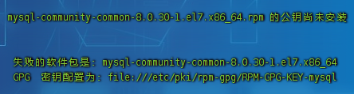
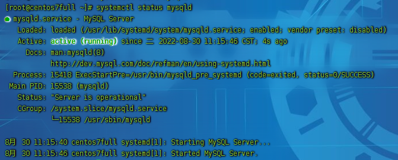
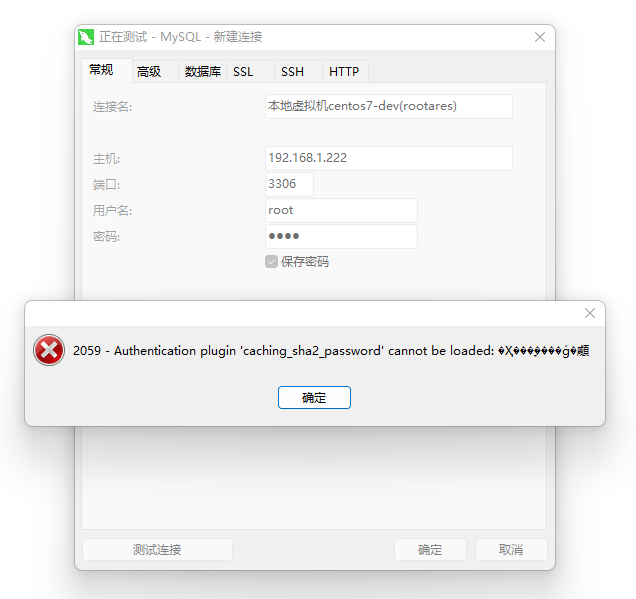
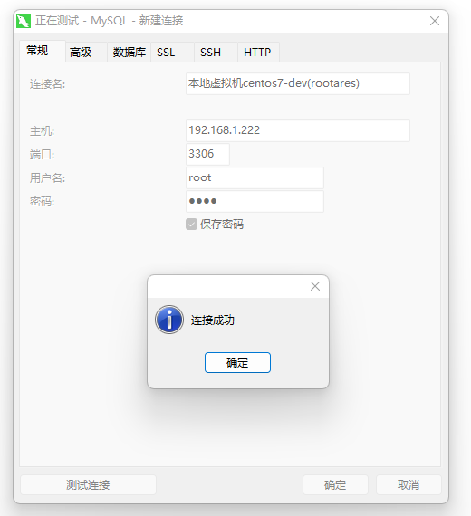

# VirtualBox CentOs7虚拟机环境下安装mysql8.0.30

## `rpm`导入mysql源

```shell
rpm -Uvh https://dev.mysql.com/get/mysql80-community-release-el7-1.noarch.rpm
```

导入源后会在`/etc/yum.repos.d/`目录下生成 `mysql-community.repo` 和 `mysql-community-source.repo`

```shell
[root@centos7full ~]# ls /etc/yum.repos.d
CentOS-Base.repo       CentOS-Media.repo          mysql-community.repo
CentOS-CR.repo         CentOS-Sources.repo        mysql-community-source.repo
CentOS-Debuginfo.repo  CentOS-Vault.repo
CentOS-fasttrack.repo  CentOS-x86_64-kernel.repo
```

## 用`yum`命令安装mysql

```shell
yum --enablerepo=mysql80-community install mysql-community-server
```

### 安装失败,提示公钥尚未安装,类似一下提示



#### 安装公钥
```shell
rpm --import https://repo.mysql.com/RPM-GPG-KEY-mysql-2022
```

## 重新安装
```shell
yum --enablerepo=mysql80-community install mysql-community-server
```

## 设置开机启动, 启动mysql, 查看mysql状态
```shell
systemctl enable mysqld
```
```shell
systemctl start mysqld
```
```shell
systemctl status mysqld
```


## 查看安装后自动生成的`root`账户密码
```shell
grep "A temporary password" /var/log/mysqld.log
```
```shell
2022-08-30T03:15:42.457238Z 6 [Note] [MY-010454] [Server] A temporary password is generated for root@localhost: bJw!pA<k?5wW
```

## 用临时密码登录mysql
```mysql
[root@centos7full ~]# mysql -u root -p
Enter password: 
Welcome to the MySQL monitor.  Commands end with ; or \g.
Your MySQL connection id is 8
Server version: 8.0.30

Copyright (c) 2000, 2022, Oracle and/or its affiliates.

Oracle is a registered trademark of Oracle Corporation and/or its
affiliates. Other names may be trademarks of their respective
owners.

Type 'help;' or '\h' for help. Type '\c' to clear the current input statement.

mysql> 
```

## 修改`root'账户默认密码
```mysql
ALTER USER 'root'@'localhost' IDENTIFIED BY 'new password';
```
### 如果密码太简单会报错,提示新密码不满足密码验证策略
```mysql
ERROR 1819 (HY000): Your password does not satisfy the current policy requirements
```
处理方法: 1.修改密码,适应密码验证策略;2.修改密码验证策略,适应简单密码, 但是貌似修改策略也要先重置密码, 那就先设个复杂的密码,再改下策略,然后再改个简单的密码吧;

### 查看密码验证策略,但是重置密码前该命令用不了
```mysql
mysql> SHOW VARIABLES LIKE 'validate_password.%';
+--------------------------------------+--------+
| Variable_name                        | Value  |
+--------------------------------------+--------+
| validate_password.check_user_name    | ON     |
| validate_password.dictionary_file    |        |
| validate_password.length             | 8      |
| validate_password.mixed_case_count   | 1      |
| validate_password.number_count       | 1      |
| validate_password.policy             | MEDIUM |
| validate_password.special_char_count | 1      |
+--------------------------------------+--------+
7 rows in set (0.01 sec)

```

我用的密码比较简单,所以只修改下密码复杂度和密码长度
#### 密码复杂度`validate_password.policy`,设置为0
```mysql
set global validate_password.policy=0;
```

#### 密码长度`validate_password.length`,设置为4
```mysql
set global validate_password.length=4;
```

#### 改个简单点的密码
```mysql
ALTER USER 'root'@'localhost' IDENTIFIED BY '1234';
```

##配置ssh访问 

###查看mysql用户
```mysql
mysql> use mysql;
mysql> select host, user from user;
+-----------+------------------+
| host      | user             |
+-----------+------------------+
| localhost | mysql.infoschema |
| localhost | mysql.session    |
| localhost | mysql.sys        |
| localhost | root             |
+-----------+------------------+
4 rows in set (0.00 sec)
```
可以看到`root`用户的`host`为`localhost`, 意思`root`用户只能本地访问,将其设置为`%`;

```mysql
mysql> update user set host='%' where user='root';
Query OK, 1 row affected (0.01 sec)
Rows matched: 1  Changed: 1  Warnings: 0
```

刷新权限
```mysql
mysql> FLUSH PRIVILEGES;
```

再次查看
```mysql
mysql> select host, user from user;
+-----------+------------------+
| host      | user             |
+-----------+------------------+
| %         | root             |
| localhost | mysql.infoschema |
| localhost | mysql.session    |
| localhost | mysql.sys        |
+-----------+------------------+
4 rows in set (0.00 sec)
```

###防火墙开放`3306`端口
```shell
[root@centos7full ~]# firewall-cmd --zone=public --add-port=3306/tcp --permanent
success
```

###重启防火墙
```shell
systemctl restart firewalld.service
```

###Navicat连接mysql报错



##Navicat连接mysql报错处理

原因: mysql8的加密方式规则不一样，是 `caching_sha2_password`, 把加密方式改成 `mysql_native_password` 就行了

```mysql
mysql> use mysql;
mysql> select host, user, plugin from user;
+-----------+------------------+-----------------------+
| host      | user             | plugin                |
+-----------+------------------+-----------------------+
| %         | root             | caching_sha2_password |
| localhost | mysql.infoschema | caching_sha2_password |
| localhost | mysql.session    | caching_sha2_password |
| localhost | mysql.sys        | caching_sha2_password |
+-----------+------------------+-----------------------+
4 rows in set (0.00 sec)
```

###修改`root`账户的加密方式
```mysql
ALTER USER '[用户名]'@'%' IDENTIFIED WITH mysql_native_password BY '[密码]';
```

```mysql
mysql> ALTER USER 'root'@'%' IDENTIFIED WITH mysql_native_password BY '1234';
Query OK, 0 rows affected (0.01 sec)
```

```mysql
mysql> select host, user, plugin from user;
+-----------+------------------+-----------------------+
| host      | user             | plugin                |
+-----------+------------------+-----------------------+
| %         | root             | mysql_native_password |
| localhost | mysql.infoschema | caching_sha2_password |
| localhost | mysql.session    | caching_sha2_password |
| localhost | mysql.sys        | caching_sha2_password |
+-----------+------------------+-----------------------+
4 rows in set (0.00 sec)
```

密码简单的话可能报密码策略验证失败的错误

```mysql
ERROR 1819 (HY000): Your password does not satisfy the current policy requirements
```

前面已经修改了策略, 不知道这里为什么又报这个错,查看下策略,又变成默认的了
```mysql
mysql> SHOW VARIABLES LIKE 'validate_password.%';
+--------------------------------------+--------+
| Variable_name                        | Value  |
+--------------------------------------+--------+
| validate_password.check_user_name    | ON     |
| validate_password.dictionary_file    |        |
| validate_password.length             | 8      |
| validate_password.mixed_case_count   | 1      |
| validate_password.number_count       | 1      |
| validate_password.policy             | MEDIUM |
| validate_password.special_char_count | 1      |
+--------------------------------------+--------+
7 rows in set (0.01 sec)
```

按上面改密码验证策略的方法再改一次密码验证策略
```mysql
set global validate_password.length=4;
set global validate_password.policy=0;
```

再次查看密码验证策略
```mysql
mysql> SHOW VARIABLES LIKE 'validate_password.%';
+--------------------------------------+-------+
| Variable_name                        | Value |
+--------------------------------------+-------+
| validate_password.check_user_name    | ON    |
| validate_password.dictionary_file    |       |
| validate_password.length             | 4     |
| validate_password.mixed_case_count   | 1     |
| validate_password.number_count       | 1     |
| validate_password.policy             | LOW   |
| validate_password.special_char_count | 1     |
+--------------------------------------+-------+
7 rows in set (0.01 sec)
```

再次修改账户加密方式
```mysql
mysql> ALTER USER 'root'@'%' IDENTIFIED WITH mysql_native_password BY '1234';
Query OK, 0 rows affected (0.01 sec)
```

Navicat连接下试试,成功了!!




#VirtualBox Anolis8虚拟机环境下安装mysql8.0.36

##rpm导入mysql源
```shell
[root@localhost ~]# rpm -Uvh https://dev.mysql.com/get/mysql80-community-release-el8-1.noarch.rpm
获取https://dev.mysql.com/get/mysql80-community-release-el8-1.noarch.rpm
警告：/var/tmp/rpm-tmp.dQS6JU: 头V3 DSA/SHA1 Signature, 密钥 ID 5072e1f5: NOKEY
Verifying...                          ################################# [100%]
准备中...                          ################################# [100%]
正在升级/安装...
   1:mysql80-community-release-el8-1  ################################# [ 50%]
正在清理/删除...
   2:mysql80-community-release-el7-1  ################################# [100%]
```

导入源后会在/etc/yum.repos.d/目录下生成 mysql-community.repo 和 mysql-community-source.repo

```shell
[root@localhost ~]# ls /etc/yum.repos.d
AnolisOS-AppStream.repo  AnolisOS-Debuginfo.repo         AnolisOS-kernel-5.10.repo  AnolisOS-Source.repo
AnolisOS-BaseOS.repo     AnolisOS-Extras.repo            AnolisOS-Plus.repo         mysql-community.repo
AnolisOS-DDE.repo        AnolisOS-HighAvailability.repo  AnolisOS-PowerTools.repo   mysql-community-source.repo
```

##查询下mysql8.0.36安装包
```shell
[root@localhost ~]# dnf search mysql
上次元数据过期检查：0:10:29 前，执行于 2024年03月08日 星期五 10时04分04秒。
=========================================================== 名称 和 概况 匹配：mysql ============================================================
mysql.x86_64 : MySQL client programs and shared libraries
apr-util-mysql.x86_64 : APR utility library MySQL DBD driver
dovecot-mysql.x86_64 : MySQL back end for dovecot
freeradius-mysql.x86_64 : MySQL support for freeradius
mysql-common.x86_64 : The shared files required for MySQL server and client
mysql-community-client-plugins.x86_64 : Shared plugins for MySQL client applications
mysql-community-debugsource.x86_64 : Debug sources for package mysql-community
mysql-community-icu-data-files.x86_64 : MySQL packaging of ICU data files
mysql-community-server-debug.x86_64 : The debug version of MySQL server
mysql-connector-c++.x86_64 : MySQL database connector for C++
mysql-connector-c++-debugsource.x86_64 : Debug sources for package mysql-connector-c++
mysql-connector-c++-devel.x86_64 : Development header files and libraries for MySQL C++ client applications
mysql-connector-c++-jdbc.x86_64 : MySQL Driver for C++ which mimics the JDBC 4.0 API
mysql-connector-j.noarch : Standardized MySQL database driver for Java
mysql-connector-java.noarch : Standardized MySQL database driver for Java
mysql-connector-odbc.x86_64 : An ODBC 8.3 driver for MySQL - driver package
mysql-connector-odbc-debugsource.x86_64 : Debug sources for package mysql-connector-odbc
mysql-connector-odbc-setup.x86_64 : An ODBC 8.3 driver for MySQL - setup library
mysql-connector-python.x86_64 : Standardized MySQL database driver for Python
mysql-connector-python-cext.x86_64 : Standardized MySQL driver for Python with C Extension
mysql-connector-python3.x86_64 : Standardized MySQL database driver for Python 3
mysql-connector-python3-cext.x86_64 : Standardized MySQL driver for Python with C Extension
mysql-devel.x86_64 : Files for development of MySQL applications
mysql-errmsg.x86_64 : The error messages files required by MySQL server
mysql-libs.x86_64 : The shared libraries required for MySQL clients
mysql-ref-manual-8.0-en-html-chapter.noarch : The MySQL Reference Manual (HTML, English)
mysql-ref-manual-8.0-en-pdf.noarch : The MySQL Reference Manual (PDF, English)
mysql-router-community.x86_64 : MySQL Router
mysql-selinux.noarch : SELinux policy modules for MySQL and MariaDB packages
mysql-server.x86_64 : The MySQL server and related files
mysql-shell.x86_64 : Command line shell and scripting environment for MySQL
mysql-shell-debugsource.x86_64 : Debug sources for package mysql-shell
mysql-test.x86_64 : The test suite distributed with MySQL
mysql-workbench-community.x86_64 : A MySQL visual database modeling, administration, development and migration tool
mysql80-community-release.noarch : MySQL repository configuration for yum
mysqlx-connector-python3.x86_64 : Standardized MySQL database driver for Python 3
pcp-pmda-mysql.x86_64 : Performance Co-Pilot (PCP) metrics for MySQL
perl-DBD-MySQL.x86_64 : A MySQL interface for Perl
php-mysqlnd.x86_64 : A module for PHP applications that use MySQL databases
postfix-mysql.x86_64 : Postfix MySQL map support
python2-PyMySQL.noarch : Pure-Python MySQL client library
python3-PyMySQL.noarch : Pure-Python MySQL client library
python38-PyMySQL.noarch : Pure-Python MySQL client library
python39-PyMySQL.noarch : Pure-Python MySQL client library
qt5-qtbase-mysql.x86_64 : MySQL driver for Qt5's SQL classes
rsyslog-mysql.x86_64 : MySQL support for rsyslog
rubygem-mysql2.x86_64 : A simple, fast Mysql library for Ruby, binding to libmysql
rubygem-mysql2-doc.noarch : Documentation for rubygem-mysql2
=============================================================== 概况 匹配：mysql ================================================================
mariadb-devel.x86_64 : Files for development of MariaDB/MySQL applications
mariadb-java-client.noarch : Connects applications developed in Java to MariaDB and MySQL databases
mariadb-server-utils.x86_64 : Non-essential server utilities for MariaDB/MySQL applications
```

##安装
```shell
[root@localhost ~]# dnf install mysql-community-server
上次元数据过期检查：0:16:27 前，执行于 2024年03月08日 星期五 10时04分04秒。
所有的匹配结果均已经被参数的模块化过滤条件筛除: mysql-community-server
错误：没有任何匹配: mysql-community-server
```

###错误：没有任何匹配: mysql-community-server,解决方法(禁用默认MySQL模块)
```shell
[root@localhost ~]# dnf module disable mysql
上次元数据过期检查：1:19:13 前，执行于 2024年03月08日 星期五 10时04分04秒。
依赖关系解决。
=================================================================================================================================================
 软件包                            架构                             版本                                 仓库                               大小
=================================================================================================================================================
禁用模块配置档案:
 mysql/server                                                                                                                                   
禁用模块:
 mysql                                                                                                                                          

事务概要
=================================================================================================================================================

确定吗？[y/N]： y
完毕！
```

##重新安装
```shell
[root@localhost ~]# dnf install mysql-community-server
上次元数据过期检查：1:19:29 前，执行于 2024年03月08日 星期五 10时04分04秒。
依赖关系解决。
=================================================================================================================================================
 软件包                                          架构                    版本                           仓库                                大小
=================================================================================================================================================
安装:
 mysql-community-server                          x86_64                  8.0.36-1.el8                   mysql80-community                   64 M
安装依赖关系:
 mysql-community-client                          x86_64                  8.0.36-1.el8                   mysql80-community                   16 M
 mysql-community-client-plugins                  x86_64                  8.0.36-1.el8                   mysql80-community                  3.6 M
 mysql-community-common                          x86_64                  8.0.36-1.el8                   mysql80-community                  668 k
 mysql-community-icu-data-files                  x86_64                  8.0.36-1.el8                   mysql80-community                  2.2 M
 mysql-community-libs                            x86_64                  8.0.36-1.el8                   mysql80-community                  1.5 M

事务概要
=================================================================================================================================================
安装  6 软件包

总下载：88 M
安装大小：415 M
确定吗？[y/N]： y
下载软件包：
(1/6): mysql-community-common-8.0.36-1.el8.x86_64.rpm                                                            513 kB/s | 668 kB     00:01    
(2/6): mysql-community-client-plugins-8.0.36-1.el8.x86_64.rpm                                                    1.7 MB/s | 3.6 MB     00:02    
(3/6): mysql-community-icu-data-files-8.0.36-1.el8.x86_64.rpm                                                    2.2 MB/s | 2.2 MB     00:01    
(4/6): mysql-community-libs-8.0.36-1.el8.x86_64.rpm                                                              3.1 MB/s | 1.5 MB     00:00    
(5/6): mysql-community-client-8.0.36-1.el8.x86_64.rpm                                                            2.8 MB/s |  16 MB     00:05    
(6/6): mysql-community-server-8.0.36-1.el8.x86_64.rpm                                                            4.2 MB/s |  64 MB     00:15    
-------------------------------------------------------------------------------------------------------------------------------------------------
总计                                                                                                             5.0 MB/s |  88 MB     00:17     
MySQL 8.0 Community Server                                                                                       3.0 MB/s | 3.1 kB     00:00    
导入 GPG 公钥 0xA8D3785C:
 Userid: "MySQL Release Engineering <mysql-build@oss.oracle.com>"
 指纹: BCA4 3417 C3B4 85DD 128E C6D4 B7B3 B788 A8D3 785C
 来自: /etc/pki/rpm-gpg/RPM-GPG-KEY-mysql-2023
确定吗？[y/N]： y
导入公钥成功
MySQL 8.0 Community Server                                                                                       3.0 MB/s | 3.1 kB     00:00    
file:///etc/pki/rpm-gpg/RPM-GPG-KEY-mysql-2022 的 GPG 公钥(0x3A79BD29)已安装
MySQL 8.0 Community Server                                                                                       1.9 MB/s | 1.9 kB     00:00    
导入 GPG 公钥 0x5072E1F5:
 Userid: "MySQL Release Engineering <mysql-build@oss.oracle.com>"
 指纹: A4A9 4068 76FC BD3C 4567 70C8 8C71 8D3B 5072 E1F5
 来自: /etc/pki/rpm-gpg/RPM-GPG-KEY-mysql
确定吗？[y/N]： y
导入公钥成功
运行事务检查
事务检查成功。
运行事务测试
事务测试成功。
运行事务
  准备中  :                                                                                                                                  1/1 
  安装    : mysql-community-common-8.0.36-1.el8.x86_64                                                                                       1/6 
  安装    : mysql-community-client-plugins-8.0.36-1.el8.x86_64                                                                               2/6 
  安装    : mysql-community-libs-8.0.36-1.el8.x86_64                                                                                         3/6 
  运行脚本: mysql-community-libs-8.0.36-1.el8.x86_64                                                                                         3/6 
  安装    : mysql-community-client-8.0.36-1.el8.x86_64                                                                                       4/6 
  安装    : mysql-community-icu-data-files-8.0.36-1.el8.x86_64                                                                               5/6 
  运行脚本: mysql-community-server-8.0.36-1.el8.x86_64                                                                                       6/6 
  安装    : mysql-community-server-8.0.36-1.el8.x86_64                                                                                       6/6 
  运行脚本: mysql-community-server-8.0.36-1.el8.x86_64                                                                                       6/6 
  验证    : mysql-community-client-8.0.36-1.el8.x86_64                                                                                       1/6 
  验证    : mysql-community-client-plugins-8.0.36-1.el8.x86_64                                                                               2/6 
  验证    : mysql-community-common-8.0.36-1.el8.x86_64                                                                                       3/6 
  验证    : mysql-community-icu-data-files-8.0.36-1.el8.x86_64                                                                               4/6 
  验证    : mysql-community-libs-8.0.36-1.el8.x86_64                                                                                         5/6 
  验证    : mysql-community-server-8.0.36-1.el8.x86_64                                                                                       6/6 

已安装:
  mysql-community-client-8.0.36-1.el8.x86_64                          mysql-community-client-plugins-8.0.36-1.el8.x86_64                         
  mysql-community-common-8.0.36-1.el8.x86_64                          mysql-community-icu-data-files-8.0.36-1.el8.x86_64                         
  mysql-community-libs-8.0.36-1.el8.x86_64                            mysql-community-server-8.0.36-1.el8.x86_64                                 

完毕！
```

##启动mysql服务,设置开机启动,查看状态
```shell
[root@localhost ~]# systemctl start mysqld
[root@localhost ~]# systemctl enable mysqld
[root@localhost ~]# systemctl status mysqld
● mysqld.service - MySQL Server
   Loaded: loaded (/usr/lib/systemd/system/mysqld.service; enabled; vendor preset: disabled)
   Active: active (running) since Fri 2024-03-08 11:35:08 CST; 22s ago
     Docs: man:mysqld(8)
           http://dev.mysql.com/doc/refman/en/using-systemd.html
 Main PID: 9687 (mysqld)
   Status: "Server is operational"
    Tasks: 38 (limit: 49014)
   Memory: 498.1M
   CGroup: /system.slice/mysqld.service
           └─9687 /usr/sbin/mysqld

3月 08 11:35:00 localhost.localdomain systemd[1]: Starting MySQL Server...
3月 08 11:35:08 localhost.localdomain systemd[1]: Started MySQL Server.
```

##查看临时密码
```shell
[root@localhost ~]# grep "A temporary password" /var/log/mysqld.log
2024-03-08T03:35:05.439156Z 6 [Note] [MY-010454] [Server] A temporary password is generated for root@localhost: DhuVjpbc0a_a
```

##使用临时密码登录mysql
```shell
[root@localhost ~]# mysql -u root -p
Enter password: 
Welcome to the MySQL monitor.  Commands end with ; or \g.
Your MySQL connection id is 8
Server version: 8.0.36

Copyright (c) 2000, 2024, Oracle and/or its affiliates.

Oracle is a registered trademark of Oracle Corporation and/or its
affiliates. Other names may be trademarks of their respective
owners.

Type 'help;' or '\h' for help. Type '\c' to clear the current input statement.

mysql> 
```

##修改默认密码
```shell
mysql> ALTER USER 'root'@'localhost' IDENTIFIED BY 'ares';
ERROR 1819 (HY000): Your password does not satisfy the current policy requirements
```

密码太简单会报错,提示新密码不满足密码验证策略,处理方法: 1.修改密码,适应密码验证策略;2.修改密码验证策略,适应简单密码, 但是貌似修改策略也要先重置密码, 那就先设个复杂的密码,再改下策略,然后再改个简单的密码吧;

###查看密码验证策略,但是重置密码前该命令用不了
```shell
mysql> SHOW VARIABLES LIKE 'validate_password.%';
ERROR 1820 (HY000): You must reset your password using ALTER USER statement before executing this statement.
```

###根据实际情况修改密码验证策略

例如,密码复杂度`validate_password.policy`,设置为0;密码长度`validate_password.length`,设置为4

```shell
mysql> set global validate_password.policy=0;
ERROR 1820 (HY000): You must reset your password using ALTER USER statement before executing this statement.
```

还是要先改个复杂点的密码

```shell
mysql> ALTER USER 'root'@'localhost' IDENTIFIED BY 'ARes!@#$1234';
Query OK, 0 rows affected (0.01 sec)
```

##再次修改密码验证策略
```shell
mysql> set global validate_password.policy=0;
Query OK, 0 rows affected (0.00 sec)

mysql> set global validate_password.length=4;
Query OK, 0 rows affected (0.00 sec)
```

改个简单的密码

```shell
mysql> ALTER USER 'root'@'localhost' IDENTIFIED BY 'ares';
Query OK, 0 rows affected (0.01 sec)
```

##配置远程访问

###查看mysql用户
```shell
mysql> use mysql;
Reading table information for completion of table and column names
You can turn off this feature to get a quicker startup with -A

Database changed
mysql> select host, user from user;
+-----------+------------------+
| host      | user             |
+-----------+------------------+
| localhost | mysql.infoschema |
| localhost | mysql.session    |
| localhost | mysql.sys        |
| localhost | root             |
+-----------+------------------+
4 rows in set (0.00 sec)
```

###修改`root`用户的`host`为`%`
```shell
mysql> update user set host='%' where user='root';
Query OK, 1 row affected (0.00 sec)
Rows matched: 1  Changed: 1  Warnings: 0
```

###刷新权限
```shell
mysql> FLUSH PRIVILEGES;
Query OK, 0 rows affected (0.00 sec)
```

连接异常情况参照centos7安装mysql内容
