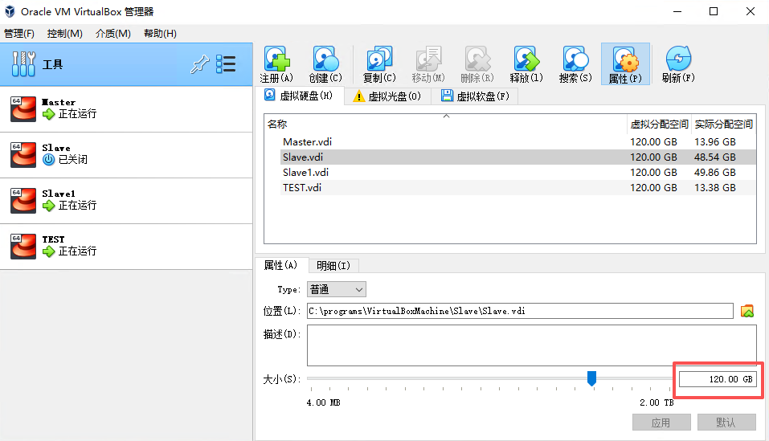

# 什么是virtualBox

VirtualBox 是一款开源虚拟机软件。VirtualBox 是由德国 Innotek 公司开发，由Sun Microsystems公司出品的软件，使用Qt编写，在 Sun 被 Oracle 收购后正式更名成 Oracle VM VirtualBox。Innotek 以 GNU General Public License (GPL) 释出 VirtualBox，并提供二进制版本及 OSE 版本的代码。使用者可以在VirtualBox上安装并且执行Solaris、Windows、DOS、Linux、OS/2 Warp、BSD等系统作为客户端操作系统。已由甲骨文公司进行开发，是甲骨文公司xVM虚拟化平台技术的一部分。

VirtualBox号称是最强的免费虚拟机软件，它不仅具有丰富的特色，而且性能也很优异。它简单易用，可虚拟的系统包括Windows（从Windows 3.1到Windows 10、Windows Server 2012，所有的Windows系统都支持）、Mac OS X、Linux、OpenBSD、Solaris、IBM OS2甚至Android等操作系统。使用者可以在VirtualBox上安装并且运行上述的这些操作系统。 与同性质的VMware及Virtual PC比较下，VirtualBox独到之处包括远端桌面协定（RDP）、iSCSI及USB的支持，VirtualBox在客户端操作系统上已可以支持USB 3.0的硬件装置，不过要安装 VirtualBox Extension Pack。


# 历史背景

VirtualBox最初是以专有软件协议的方式提供。2007年1月，InnoTek以GNU通用公共许可证（GPL）发布VirtualBox而成为自由软件，并提供二进制版本及开放源代码版本的代码。 而在2008年2月，InnoTek软件公司由太阳微系统公司所并购。 在2010年1月，甲骨文公司完成对太阳微系统公司的收购。

# 主要特点

* 支持64位客户端操作系统，即使主机使用32位CPU

* 支持SATA硬盘NCQ技术

* 虚拟硬盘快照

* 无缝视窗模式（须安装客户端驱动）

* 能够在主机端与客户端共享剪贴簿（须安装客户端驱动）

* 在主机端与客户端间建立分享文件夹（须安装客户端驱动）

* 内建远端桌面服务器，实现单机多用户　- 支持VMware VMDK磁盘档及Virtual PC VHD磁盘档格式

* 3D虚拟化技术支持OpenGL（2.1版后支持）、Direct3D（3.0版后支持）、WDDM（4.1版后支持）

* 最多虚拟32颗CPU（3.0版后支持）

* 支持VT-x与AMD-V硬件虚拟化技术

* iSCSI支持

* USB与USB2.0支持

# 安装

在VirtualBox网站下载主机操作系统对应的二进制文件。VirtualBox可以安装在32位和64位操作系统上。在32位主机操作系统上运行64位的虚拟机是可以的，但必须在主机的BIOS中启用硬件虚拟化特性。

运行二进制安装文件将开启一个简单的安装向导，允许用户定制VirtualBox特性，选择任意快捷方式并指定安装目录。USB设备驱动以及VirtualBox host-only网络适配器将一起安装。

# 创建虚拟机

在VirtualBox中创建虚拟机相当简单，很多设置可以按照用户个人的喜好进行配置。一旦安装了客户操作系统并选择了资源和网卡设置，就可以尝试在小环境或开发环境中使用VirtualBox了。
总体来说，在VirtualBox中创建虚拟机分三步：

1. 为创建VirtualBox虚拟机做准备
   首先，命名虚拟机并选择将要运行的客户操作系统类型。此时选择的客户OS会影响之后向导中出现的默认设置。
   接下来，配置计划分配给每个虚拟机的内存大小。VirtualBox不支持内存过量使用，所以不能给一个虚拟机分配超过主机内存大小的内存值。

   最后一个步骤是创建虚拟磁盘并指定虚拟机磁盘文件的类型和大小（见图3）。在Oracle VM VirtualBox中，你可以选择动态扩展的磁盘或者固定大小的磁盘。动态磁盘起始值较小，随着客户操作系统写入数据到磁盘而逐渐增加。对于固定磁盘类型来说，所有的磁盘空间在虚拟机创建阶段一次性分配。之后也可以给虚拟机增加磁盘，或者使用VBoxManage命令行工具增加磁盘大小。

2. 安装VirtualBox客户操作系统
   一旦完成了VirtualBox虚拟机创建向导，就可以开始安装客户操作系统了。为了挂载客户操作系统光盘，选择虚拟机，单击设置，开始编辑虚拟机硬件配置。（1）选择左边面板中“存储”选项.（2）选择“存储”选项下的CD/DVD图形。（3）选择属性视图下带箭头的CD/DVD图形配置虚拟的CD/DVD驱动器。

   客户操作系统安装完成后，应该安装增强功能包，增强功能包包括一些便于集成主机和虚拟机的驱动程序。为安装增强功能包，需要打开虚拟机控制台窗口，在顶部菜单中选择设备，然后选择安装增强功能包，启动一个简单的安装向导。增强功能包安装完成后，会重启虚拟机。

3. 在VirtualBox中设置虚拟机
   虚拟机关闭时，可以编辑虚拟机设置并更改硬件。VirtualBox具有高级硬件设置特性，启用了IO APIC、PAE/NX和嵌套分页。用户还可以修改虚拟CPU的数量—最多支持32个—不用管主机具有的物理CPU的核数。

   最后配置虚拟网卡。VirtualBox允许在一个虚拟机上配置至多四块虚拟网卡。默认的是AMD PCnet-FAST III，大多数操作系统都支持AMD PCnet-FAST III。也可以选择AMD PCnet-PCI II和Intel PRO-1000系列的网卡，以及支持直接存取主机网卡的准虚拟化网卡。

# 模拟环境

## 软件模拟
能够安装多个客户端操作系统，每个客户端系统皆可独立开启、暂停与停止。主端操作系统与客户端操作系统皆能相互通讯，多个操作系统同时运行的环境，也彼此能够同时使用网络。

## 硬件模拟
* VirtualBox支持Intel VT-x与AMD AMD-V硬件虚拟化技术。

* 硬盘被模拟在一个称为虚拟磁盘映像档（Virtual Disk Images）的特殊容器，此格式不相容于其它虚拟机平台运行，通常作为一个系统档存放在主机端操作系统（副档名.vdi)。VirtualBox能够连结iSCSI，且能在虚拟硬盘上运作，此外VirtualBox可以读写VMware VMDK档与VirtualPC VHD档。

* ISO映像档可以被挂载成CD/DVD装置，例如下载的Linux发行版DVD映像档可以直接使用在VirtualBox，而不需烧录在光碟片上，亦可直接在虚拟机上挂载实体光驱。

* 默认上VirtualBox提供了一个支援VESA相容的虚拟显卡，与一个供Windows、Linux、Solaris、OS/2客户端系统额外的驱动程式（guest addition），可以提供更好的效能与功能，如当虚拟机的视窗被缩放时，会动态的调整分辨率。在4.1更支援WDDM相容的虚拟显卡，令Windows Vista及Windows 7可以使用Windows Aero。

* 在声卡方面，VirtualBox虚拟一个Intel ICH AC97声卡与SoundBlaster 16 声霸卡。

* 在以太网接口卡方面，VirtualBox虚拟了数张网络卡：AMD PCnet PCI II、AMD PCnet-Fast III、Intel Pro/1000 MT Desktop、Intel Pro/1000 MT Server、Intel Pro/1000 T Server。

# 网络设置

## VirtualBox提供了多种网络接入模式，他们各有优缺点，用户可以根据自己的需要进行选择:

1. NAT模式：最简单的实现虚拟机上网的方式，无需配置，默认选择即可接入网络。虚拟机访问网络的所有数据都是由主机提供的，访问速度较慢，和主机之间不能互相访问。

2. Bridged Adapter模式：即网桥模式，可以为虚拟机模拟出一个独立的网卡，有独立的IP地址，所有网络功能和主机一样，并且能够互相访问，实现文件的传递和共享。（注： Windows 7系统选择网桥模式时，需要手动安装VirtualBox 的桥接服务驱动。在本地连接的属性选项中，选择“Microsoft网络客户端”点击安装，网络功能类型选择“服务”点击添加，选择从磁盘安装，找到驱动路径“Oracle\VirtualBox\drivers\network\netflt”，选择VBoxNetFlt_m文件安装完成。）

3. Internal模式：即内网模式，虚拟机与外网完全断开，只实现虚拟机于虚拟机之间的内部网络模式，和主机之间不能互相访问，就相当于虚拟机之间架设了一个独立的局域网。

4. Host-only Adapter模式：即主机模式，是所有接入模式中最复杂的一种，需要有比较扎实的网络基础知识才行。前面几种模式所实现的功能，通过虚拟机及网卡的设置都可以被实现。

## 虚拟机参数

1. 虚拟机名称和系统类型：为将要创建的虚拟机命名，要求是唯一的标识，用来区分该虚拟机硬件配置、操作系统、软件等数据。并选择将要安装的操作系统类型和版本，以便VirtualBox自动配置合适的硬件环境；

2. 内存：指定虚拟机可用内存大小，系统会自动分配，也可自行设置；

3. 虚拟硬盘：选择一个虚拟硬盘作为主硬盘，也可以新建一个，第一次创建，默认即可。如果是选择新建，将进入硬盘类型选择界面（VDI：VirtualBox的格式，VMDK：VM虚拟机的格式，VHD：微软VirtualPC虚拟机的格式，HDD：Parallels虚拟机的格式），默认选择VDI即可。另外，几种格式都可以相互转换，网上有相应的转换软件；

4. 硬盘存储类型：分为动态扩展和固定大小两种，其中动态扩展类型最初只需占用非常小的物理硬盘空间，然后根据虚拟机的实际需求动态分配，固定大小类型就是建立时就分配指定的大小给虚拟机使用。后者在性能上有一定优势，但建立时间较长；

5. 摘要：显示虚拟机的各项数据情况，确定后完成虚拟机的创建。

# 扩展虚拟机磁盘 (AnolisOS8)

## 在virtualbox中扩展虚拟机磁盘


## 在linux系统中配置

### 查询当前状况
```shell
[ares@ares-slave ~]$ sudo fdisk -l
Disk /dev/sda：120 GiB，128849018880 字节，251658240 个扇区
单元：扇区 / 1 * 512 = 512 字节
扇区大小(逻辑/物理)：512 字节 / 512 字节
I/O 大小(最小/最佳)：512 字节 / 512 字节
磁盘标签类型：dos
磁盘标识符：0x7a3644b1

设备       启动    起点      末尾      扇区 大小 Id 类型
/dev/sda1  *       2048   2099199   2097152   1G 83 Linux
/dev/sda2       2099200 167772159 165672960  79G 8e Linux LVM


Disk /dev/mapper/ao-root：47.7 GiB，51225034752 字节，100048896 个扇区
单元：扇区 / 1 * 512 = 512 字节
扇区大小(逻辑/物理)：512 字节 / 512 字节
I/O 大小(最小/最佳)：512 字节 / 512 字节


Disk /dev/mapper/ao-swap：8 GiB，8589934592 字节，16777216 个扇区
单元：扇区 / 1 * 512 = 512 字节
扇区大小(逻辑/物理)：512 字节 / 512 字节
I/O 大小(最小/最佳)：512 字节 / 512 字节


Disk /dev/mapper/ao-home：23.3 GiB，25006440448 字节，48840704 个扇区
单元：扇区 / 1 * 512 = 512 字节
扇区大小(逻辑/物理)：512 字节 / 512 字节
I/O 大小(最小/最佳)：512 字节 / 512 字节

[ares@ares-slave ~]$ df -h
文件系统             容量  已用  可用 已用% 挂载点
devtmpfs             4.9G     0  4.9G    0% /dev
tmpfs                4.9G     0  4.9G    0% /dev/shm
tmpfs                4.9G   13M  4.9G    1% /run
/dev/mapper/ao-root   48G  8.8G   39G   19% /
/dev/mapper/ao-home   24G  542M   23G    3% /home
/dev/sda1           1014M  346M  669M   35% /boot
shm                   64M     0   64M    0% /run/containerd/io.containerd.grpc.v1.cri/sandboxes/be56730523d83fdb37b2808898ba6c4ce6d0a4a88ea8a002aceca5b1d371fb7d/shm
shm                   64M     0   64M    0% /run/containerd/io.containerd.grpc.v1.cri/sandboxes/bd60d61554424cf679a9607722f48b63a03306c581f05d3ed7a4906d669c2a65/shm
shm                   64M     0   64M    0% /run/containerd/io.containerd.grpc.v1.cri/sandboxes/6dd77e8bcc860459f31b72b88020d4c26122d5ce6aae61c1a4608fa6d783fac5/shm
shm                   64M     0   64M    0% /run/containerd/io.containerd.grpc.v1.cri/sandboxes/d77b3b355192abb26fc2d1c78f49b5653c98f0c94833aa3f4cd1990837888278/shm
tmpfs                995M   16K  995M    1% /run/user/42
tmpfs                995M  8.0K  995M    1% /run/user/1000
shm                   64M     0   64M    0% /run/containerd/io.containerd.grpc.v1.cri/sandboxes/5abf37b43adee7054f68e1f56c7da4403b010f2d80ef92ac92c5f7e950bca55b/shm
```

### 使用 `parted` 工具扩展 `/dev/sda2` 分区

将第2个分区扩展到磁盘末尾
```shell
[ares@ares-slave ~]$ sudo parted /dev/sda resizepart 2 100%
信息: You may need to update /etc/fstab.

```

### 通知内核重新读取分区表或重启系统
```shell
[ares@ares-slave ~]$ sudo partprobe /dev/sda 
```

### 扩展逻辑卷到最大可用空间的70%
```shell
[ares@ares-slave ~]$ sudo lvextend -l +70%FREE /dev/mapper/ao-root
  Size of logical volume ao/root changed from <47.71 GiB (12213 extents) to <75.71 GiB (19381 extents).
  Logical volume ao/root successfully resized.
```

### 扩展文件系统, `xfs`类型使用`xfs_growfs`命令, `ext4`类型使用`resize2fs`命令
```shell
[ares@ares-slave ~]$ sudo blkid /dev/mapper/ao-root
/dev/mapper/ao-root: UUID="ec592f92-df88-4dc6-adc7-5207da9a5838" BLOCK_SIZE="512" TYPE="xfs"

[ares@ares-slave ~]$ sudo xfs_growfs /dev/mapper/ao-root
meta-data=/dev/mapper/ao-root    isize=512    agcount=4, agsize=3126528 blks
         =                       sectsz=512   attr=2, projid32bit=1
         =                       crc=1        finobt=1, sparse=1, rmapbt=0
         =                       reflink=1    bigtime=0 inobtcount=0
data     =                       bsize=4096   blocks=12506112, imaxpct=25
         =                       sunit=0      swidth=0 blks
naming   =version 2              bsize=4096   ascii-ci=0, ftype=1
log      =internal log           bsize=4096   blocks=6106, version=2
         =                       sectsz=512   sunit=0 blks, lazy-count=1
realtime =none                   extsz=4096   blocks=0, rtextents=0
data blocks changed from 12506112 to 19846144

[ares@ares-slave ~]$ df -h
文件系统             容量  已用  可用 已用% 挂载点
devtmpfs             4.9G     0  4.9G    0% /dev
tmpfs                4.9G     0  4.9G    0% /dev/shm
tmpfs                4.9G   13M  4.9G    1% /run
/dev/mapper/ao-root   76G  9.0G   67G   12% /
/dev/mapper/ao-home   24G  542M   23G    3% /home
/dev/sda1           1014M  346M  669M   35% /boot
shm                   64M     0   64M    0% /run/containerd/io.containerd.grpc.v1.cri/sandboxes/be56730523d83fdb37b2808898ba6c4ce6d0a4a88ea8a002aceca5b1d371fb7d/shm
shm                   64M     0   64M    0% /run/containerd/io.containerd.grpc.v1.cri/sandboxes/bd60d61554424cf679a9607722f48b63a03306c581f05d3ed7a4906d669c2a65/shm
shm                   64M     0   64M    0% /run/containerd/io.containerd.grpc.v1.cri/sandboxes/6dd77e8bcc860459f31b72b88020d4c26122d5ce6aae61c1a4608fa6d783fac5/shm
shm                   64M     0   64M    0% /run/containerd/io.containerd.grpc.v1.cri/sandboxes/d77b3b355192abb26fc2d1c78f49b5653c98f0c94833aa3f4cd1990837888278/shm
tmpfs                995M   16K  995M    1% /run/user/42
tmpfs                995M  8.0K  995M    1% /run/user/1000
shm                   64M     0   64M    0% /run/containerd/io.containerd.grpc.v1.cri/sandboxes/5abf37b43adee7054f68e1f56c7da4403b010f2d80ef92ac92c5f7e950bca55b/shm
```
